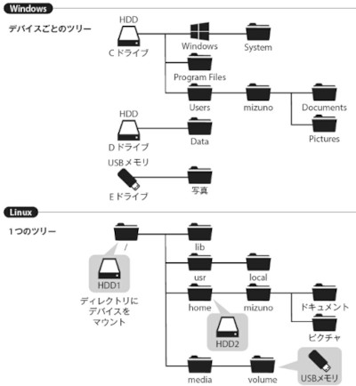
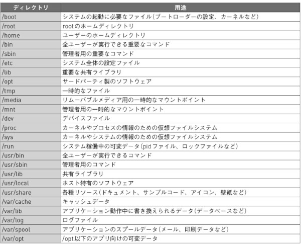
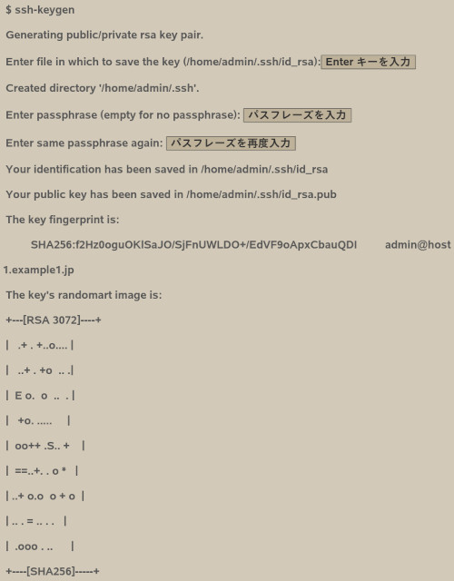

date:2024年4月  

雑誌『Software Design 2024年4月号』  
第1特集　新年度のはじまりに学ぶ！  Linux基礎知識60  
https://gihyo.jp/magazine/SD/archive/2024/202404  

---

＜目次＞  

- [ディレクトリ構造とファイルシステム](#ディレクトリ構造とファイルシステム)
  - [パーティションとファイルシステム](#パーティションとファイルシステム)
    - [パーティション](#パーティション)
    - [ファイルシステム](#ファイルシステム)
    - [LVMを使う](#lvmを使う)
    - [LVMスナップショットを使う](#lvmスナップショットを使う)
    - [RAIDを使う（mdadm）](#raidを使うmdadm)
    - [ファイルとディレクトリ](#ファイルとディレクトリ)
    - [ファイルシステムをマウントする](#ファイルシステムをマウントする)
    - [ファイルシステムを自動でマウントする](#ファイルシステムを自動でマウントする)
    - [UsrMergeについて知る](#usrmergeについて知る)
    - [ハードリンクを理解する](#ハードリンクを理解する)
    - [シンボリックリンクを理解する](#シンボリックリンクを理解する)
- [プロセス管理](#プロセス管理)
  - [プロセスの基本](#プロセスの基本)
    - [プロセスの基本的な属性](#プロセスの基本的な属性)
      - [プロセスID](#プロセスid)
      - [プロセスの状態](#プロセスの状態)
      - [プロセスの親子関係](#プロセスの親子関係)
    - [initプロセス](#initプロセス)
    - [プロセスの終了](#プロセスの終了)
      - [ゾンビプロセス](#ゾンビプロセス)
    - [スレッドとプロセスの違い](#スレッドとプロセスの違い)
      - [カーネルスレッド](#カーネルスレッド)
  - [プロセスの情報](#プロセスの情報)
    - [プロセス一覧を取得：ps](#プロセス一覧を取得ps)
    - [リアルタイムにシステムの情報を見る：top](#リアルタイムにシステムの情報を見るtop)
      - [ヘッダーの見方](#ヘッダーの見方)
      - [プロセス一覧の見方](#プロセス一覧の見方)
    - [プロセス情報を知るためのその他のコマンド](#プロセス情報を知るためのその他のコマンド)
    - [/proc ファイルシステム](#proc-ファイルシステム)
  - [プロセスの操作と制限](#プロセスの操作と制限)
    - [プロセスを終了する：kill](#プロセスを終了するkill)
    - [プロセスの動作の制限方法](#プロセスの動作の制限方法)
      - [優先度を下げる／上げる](#優先度を下げる上げる)
      - [スケジューリングポリシーを変更する](#スケジューリングポリシーを変更する)
      - [I/Oのスケジューリングを変更する](#ioのスケジューリングを変更する)
    - [リソースを制限する](#リソースを制限する)
    - [CGroupsによるリソース制限](#cgroupsによるリソース制限)
- [ユーザー権限とアクセス権](#ユーザー権限とアクセス権)
  - [ユーザー](#ユーザー)
    - [ユーザー名とUID](#ユーザー名とuid)
    - [パスワード](#パスワード)
    - [root](#root)
    - [システムユーザーと一般ユーザー](#システムユーザーと一般ユーザー)
  - [su と sudo](#su-と-sudo)
    - [su コマンド](#su-コマンド)
    - [su の利用制限](#su-の利用制限)
    - [管理者権限が設定されたユーザー（sudoコマンド）](#管理者権限が設定されたユーザーsudoコマンド)
    - [sudo 設定ファイルの編集](#sudo-設定ファイルの編集)
    - [sudo で出力をファイルに書き出す際の注意](#sudo-で出力をファイルに書き出す際の注意)
    - [runuser コマンド](#runuser-コマンド)
  - [ユーザーグループ](#ユーザーグループ)
    - [ユーザーグループとは](#ユーザーグループとは)
    - [グループ定義ファイル](#グループ定義ファイル)
  - [パーミッションと権限](#パーミッションと権限)
    - [パーミッション記号の確認](#パーミッション記号の確認)
    - [パーミッション記号の読み方](#パーミッション記号の読み方)
    - [パーミッションの整数表示](#パーミッションの整数表示)
    - [chmod で権限を変更する](#chmod-で権限を変更する)
      - [記号モード](#記号モード)
      - [数値モード](#数値モード)
      - [別ファイルを参照する](#別ファイルを参照する)
    - [chgrp で所有グループを変更する](#chgrp-で所有グループを変更する)
    - [umask で作成ファイルのパーミッションをコントロールする](#umask-で作成ファイルのパーミッションをコントロールする)
    - [setuid と setgid](#setuid-と-setgid)
    - [sudo 実行の記録を確認する](#sudo-実行の記録を確認する)
- [ネットワーク設定と管理](#ネットワーク設定と管理)
  - [ネットワークの動作確認](#ネットワークの動作確認)
    - [ネットワークインターフェースの状態を確認する](#ネットワークインターフェースの状態を確認する)
    - [ほかのコンピューターとのIP通信を確認する](#ほかのコンピューターとのip通信を確認する)
    - [ルーティングの状態を確認する](#ルーティングの状態を確認する)
    - [名前解決可能かを確認する](#名前解決可能かを確認する)
    - [TCPのポートの使用状態を確認する](#tcpのポートの使用状態を確認する)
  - [ネットワークの設定を行う](#ネットワークの設定を行う)
    - [NewworkManager でネットワークの設定を行う](#newworkmanager-でネットワークの設定を行う)
    - [NewworkManagerのGUI画面](#newworkmanagerのgui画面)
    - [NewworkManagerのテキスト画面](#newworkmanagerのテキスト画面)
    - [NewworkManagerのコマンドラインツール](#newworkmanagerのコマンドラインツール)
    - [Netplan でネットワークの設定を行う](#netplan-でネットワークの設定を行う)
    - [ファイヤーウォールを設定する](#ファイヤーウォールを設定する)
      - [ufw](#ufw)
  - [いろいろなネットワークツールを使用する](#いろいろなネットワークツールを使用する)
    - [SSH でリモートリグインする](#ssh-でリモートリグインする)
      - [ssh-keygen コマンドで公開鍵を作成する](#ssh-keygen-コマンドで公開鍵を作成する)
      - [ssh コマンドでリモートログインする](#ssh-コマンドでリモートログインする)
    - [パケットキャプチャでネットワークの通信を確認する](#パケットキャプチャでネットワークの通信を確認する)

---

# ディレクトリ構造とファイルシステム

## パーティションとファイルシステム

### パーティション

HDD、SSD、USBメモリといったストレージをOSから利用するには、パーティションを作成したうえで、その中にファイルシステムを作る必要があります。  

パーティションとは、ストレージ内に作られた「区画」です。  

1台のストレージを論理的に複数の区画に分割することで、複数のストレージとして扱えるようになります。1台のSSDしか搭載していないWindows PCでも、OS用のCドライブとデータ用のDドライブにドライブが分割されていることがありますが、これは典型的なパーティションの活用例です。ファイルシステムの作成（いわゆるフォーマット）はパーティション単位で行うため、OSを再インストールしたとしてもデータは保持できるというテクニックです。  
ちなみにパーティションを分割しない場合であっても、単一のパーミッションを作成する必要があります。  

パーティションの管理方式には、大きく「MBR」と「GPT」の2種類が存在します。MBRは非常に古い仕様で、制限が色々とあります。またPCの起動方法には従来の「BIOS」モードと、新しい「UEFI」モードがありますが、UEFIで起動する場合は、OSのインストール先はGPTである必要があります。  

一般的なLinuxディストリビューションであれば、インストーラーが自動的にパーティションを切ってくれるため、ユーザーが意識してパーティションを切る必要はあまりないでしょう。しかし、OSインストール後にストレージを追加する場合は、コマンドを用いて手動でパーティションを設定しなければなりません。Ubuntuであれば、GUIアプリの「Gparted」を使うのがお勧めです。  

### ファイルシステム

ストレージ上に記載されているデータは、単純な0と1の羅列です。データにアクセスするには、データが保持されているアドレスを指定して、そこから指定した長さのデータを読みださなければなりません。これを手動で行うのは非常に面倒なので、OSではデータに名前を付け、ファイルという単位でのアクセスを可能にしています。  
この **「ファイル名という抽象的なアクセス手段を提供するしくみ」を「ファイルシステム」** と呼びます。  

ファイルシステムにはさまざまな形式があり、Windowsでは NTFS、Linuxでは ext4/xfs/btrfs など、USBメモリやSDカードでは FAT32/exFAT などがよく使われています。  

### LVMを使う

「LVM」とは Logival Volume Manager の略で、ボリュームを抽象化して扱うLinuxの機能です。  

LVMはディスク上のパーティションを直接使用するのではなく、各パーティションをLVMを構成する「物理ボリューム（PV）」として扱います。1つ以上のPVの集まりは「ボリュームグループ（VG）」というグループにして管理されます。そしてこのVGの中に「論理ボリューム（LV）」を作成します。  
OSからは、このLVが従来のパーティションと同じように扱えます。つまり、ファイルシステムはLV上に作成されます。  

通常のパーティションは、そのストレージ内に収まるサイズでしか作れません。ですが、LVMという抽象的レイヤを挟むことによって、ストレージの大きさという物理的な境界に縛られない、柔軟なパーティション構成を実現できるのです。LVMを使えば「複数のストレージを束ねて大容量ストレージを実現する」「後からストレージを追加して、既存のボリュームに容量を足す」といったことが可能になります。

Ubuntu ServerではデフォルトでLVMを使ってインストールされるようになっています。Ubuntu Desktopでも、インストール時に高度なオプションを指定することでLVMを使用できます。  

### LVMスナップショットを使う

「ある瞬間の状態を記録したもの」を、スナップ写真になぞらえて「スナップショット」と呼びます。  
よく利用されているのが、仮想マシンのスナップショットでしょう。仮想マシンの現在の状態を記録しておくことで、いつでもその状態に「巻き戻す」ことを可能にする技術です。  

LVMにも同様のスナップショット機能があり、ある時点のボリュームやファイルの状態を保存し、自由に巻き戻すことができます。バックアップのようにもみえますが、バックアップに対して次のようなアドバンテージがあります。  

- 動作中のシステムを停止することなく、ボリューム全体の状態を記録できる
- 実際にファイルをコピーするわけではないので、一瞬で作成できる
- 同上の理由により、スナップショット保存先の容量効率がよい

LVMスナップショットは、作成時からのソースボリュームへの変更を監視しており、変更が検出されると、その差分内容をスナップショットボリューム内に記録します。
LVMスナップショットは実際にファイルのコピーを作らないのがメリットの1つですが、これは言い換えると、ストレージの障害などでソースボリュームが読み取れなくなってしまうと、スナップショットの復元もできなくなってしまうことを意味します。そのため、**障害に対するバックアップとしては不適当です**。

### RAIDを使う（mdadm）

「RAID」とは Redundant Arrays of Inexpensive Disks の略で、複数のストレージによって構成された、冗長性を持つ集合（アレイ）のことです。  
複数台のストレージを仮想的な1台のストレージとして扱う技術で、その目的にはストレージの大容量化・高速化・信頼性・耐障害性の向上、などがあります。  
RAIDには「レベル」が存在し、レベルごとに必要なストレージの台数やアレイの容量が異なります。よく使われるRAIDレベルごとの特徴は下記のとおりです。  

| RAIDレベル | ストレージの最小台数 | アレイの容量 | 冗長性 | 特徴 |
| ---- | ---- | ---- | ---- | ---- |
| 0 | 2 | 全ストレージの合計 | なし | 複数のストレージを束ね、データをブロック単位で分散して書き込むことで高速化する。ストライピングとも呼ばれる |
| 1 | 2 | ストレージ1台分 | あり | 複数のストレージに同時に同じ内容を書き込む。ミラーリングとも呼ばれる方式。仮に片方のストレージが故障してもアレイ全体のパフォーマンスが低下しない |
| 5 | 3 | ストレージ2台分 | あり | ストライピングしたアレイに対してデータを分散記録し、水平パリティを利用したデータのエラー訂正機能を備えている。読み出し性能に優れ、書き込み性能は劣る。ストレージ故障時は非常に信頼性が落ちる |
| 6 | 4 | ストレージ2台分 | あり | パリティを2種類作成し、2つのストレージに分散記録する。ストレージ2台までの故障に耐えられ、ストレージが1台故障しても、RAID5のように信頼性が低下しない |

RAID0を除き、ハードウェア障害に対する冗長性を確保する手段として、RAIDは一般的に利用されています。  

RAIDは、専用のコントローラーを使って構築するハードウェアRAID、OS内のソフトウェアによって構築するソフトウェアRAID、の2つに分けられます。Linuxでは、Linux MD（MD）とよばれるソフトウェアRAIDをサポートしています。  

### ファイルとディレクトリ

LinuxもWindowsやmacOSと同様に、ファイルをディレクトリ（フォルダ）で分類して管理します。ディレクトは入れ子になっており、「ルートディレクトを頂点とする階層ツリー構造を取ります。ですが、Linuxのディレクトリツリーには、Windowsと大きな違いが1つあります。それは、**Windowsはストレージ内のパーティションが「ドライブ」となり、ドライブごとに独立したディレクトリツリーを持つのに対し、Linuxはシステム全体で単一のディレクトリツリーを持つ点です**。  

WindowsとLinuxのディレクトリツリーの違い  
  

Linuxをはじめとする、いわゆるUnixライクなOSでは、ツリーを構成する主なディレクトリやその用途が、歴史的な経緯からだいたい決まっていました。たとえば、実行コマンドは「/usr/bin」にインストールする、ユーザーのホームディレクトリは「/home」以下に作成する、といった具合です。ですがこれらはあくまで慣習にすぎず、明文化された規則がありませんでした。そのためにOSによってはファイルの置き場所が微妙に異なり、混乱や不都合を招いていたという歴史があります。
こうした混乱を解消するために定められたディレクトリツリー構造の標準仕様が「Filesystem Hierarchy Standard（FHS）」です。現在的なLinuxディストリビューションのディレクトリツリーは、おおむねFHSに従って構成されています。  

Ubuntuの主要なディレクトリ  
  

FHSにもバージョンがあり、現在のバージョンは2015年6月にリリースされた3.0です。  
[https://refspecs.linuxfoundation.org/fhs.shtml](https://refspecs.linuxfoundation.org/fhs.shtml)  

なお、FHSで定められているディレクトリがすべて存在するわけではありません。また逆に、UbuntuではSnapパッケージシステムのために「/snap」ディレクトリが作られているなど、FHSに定められていないディレクトリも存在します。  

### ファイルシステムをマウントする

Linuxのディレクトリツリーは、あくまで論理的な存在にすぎません。実際にファイルを読み書きするには、ディレクトリツリーにファイルシステムという「実体」を「マウント」する必要があります。　　
通常はOSの起動時にディレクトリツリーの頂点である「ルートディレクトリ」に対し、OSをインストールしたファイルシステムのマウントが行われます。  

マウントは `mount` コマンドで行います。引数としてマウントするパーティションと、マウントポイントを指定します。「-t」オプションでは、マウントするファイルシステムのタイプを指定できます。-tオプションの指定がない場合は、mountコマンドが自動的に対象のファイルシステムを推測するため、省略してもかまいません。  

/dev/sda1 を /mnt/ssd にマウントする例  
```
$ sudo mount -t ext4 /dev/sda1 /mnt/ssd
```

ファイルシステムの情報は `df` コマンドで表示します。  

### ファイルシステムを自動でマウントする

mountコマンドを使って手動でファイルシステムをマウントした場合、OSの再起動後にはもう一度マウントをやり直さなければなりません。そこで、恒久的に使用するストレージはOSの起動時に自動的にマウントするよう設定しましょう。  
自動マウントの設定は、「/etc/fstab」というファイルに記述します。  

### UsrMergeについて知る

FHSにおいて、各ディレクトリの役割が決められていると前述しました。その中で、同じ種類のファイルであっても、その用途によって異なるディレクトリにインストールされるものがあることに気づいたと思います。  
たとえば、全ユーザーが実行できる重要なコマンドは「/bin」に、そうでないコマンドは「/usr/bin」にインストールされるといった具合です。  
この使い分けは歴史的な経緯によるものです。「/bin」にはシステムの起動に必要なコマンドがインストールされます。それ以外のコマンドは「/usr/bin」にインストールされます。この使い分けは、現在においては「インストール先が2ヵ所に分かれており混乱する」「システムによって、同名のファイルでもインストール先が異なり、互換性がなくなる」といったデメリットが目立ってきました。  
そこで「/bin」「/sbin」「/lib」「/lib64」にインストールされるファイルは、すべて「/usr」以下のサブディレクトリにインストールし、代わりに同名のシンボリックリンクを用意するという方式が採用されました。これが **「UsrMerge」** です。これによってすべてのコマンドは「/bin」でも「/usr/bin」でも呼び出すことが可能になり、また過去との互換性も維持されます。現在のUbuntuはUsrMergeがデフォルトで行われた状態でインストールされます。  

ただし1つ注意すべき点があります。ファイルシステム上では2つのディレクトリがマージされ、区別なく使えますが、パッケージシステムは依然として「/bin」と「/usr/bin」を使い分けているという点です。  

### ハードリンクを理解する

ディスク上のデータに対し、ファイル名という抽象化したアクセス手段を提供するのがファイルシステムでした。ですが、ファイル名とデータが常に1:1の関係であるとは限りません。ext4をはじめとするLinuxのファイルシステムでは、同一のデータに対して複数のファイル名（別名）を付けられます。  

Linuxのファイルシステム上のデータは、データの内容自体のほかにも ファイルの種類・オーナー・パーミッション といったメタ情報を持っています。このメタ情報は inode と呼ばれています。inodeはinode番号という固有の番号で識別されます。実はファイル名とはこのinodeに対して付けられた名前なのです。この名前を **「ハードリンク」** とよびます。

ハードリンクは `ln` コマンドで作成します。  
下記の例では、file1.txt というファイルに hardlink1 という別名を付けています。  

```
$ ln file1.txt harlink1
```

file1.txtとhardlink1は別ファイルのように見えますが、inode番号が同じであり、実際には同一のデータを参照しています。

```
$ ls -i -1

5242893 file1.txt
5242893 hardlink1
```

データとしては同じものを参照しているので、片方のファイルを書き換えれば、もう片方の内容も変更されます。  

### シンボリックリンクを理解する

ファイルサーバーの奥深くにあるファイルにすばやくアクセスできるよう、デスクトップにリンクを作ったりするケースはよくあるでしょう。ですが、ハードリンクは異なるファイルシステムをまたいだリンクは作成できません。こうした場合に便利なのが、パス名を指定してリンクする「シンボリックリンク」です。ハードリンクに対して「ソフトリンク」とも呼ばれます。  

シンボリックリンクも `ln` コマンドで作成します。ただし、ハードリンクとは異なり、作成の際に「-s」オプションを使います。  

```
$ ln -s file1.txt symlink1
```

確認してみましょう。lsコマンドに「-l」オプションを付けると、リンクが指しているリンク先のパスが分かります。  

```
$ ls -l
```

異なるファイルシステムをまたいだリンクを作成したい場合や、inodeを直接指定する必要がない場合は、ハードリンクよりもシンボリックリンクのほうが柔軟に扱え、適しています。  
なおシンボリックリンクはパス名でリンクをたどるため、リンク先のファイル名を変更したするとリンクが切れてしまう点に注意してください。

# プロセス管理

## プロセスの基本

「プロセス」とは、実行中のプログラムのことです。  
OSは実行中のプログラムについて、どれだけのCPU、メモリを使っているかなどの情報を管理する必要があります。プロセスは、そうした実行中のプログラムに関する情報をOSがまとめて管理する構造体と見ることもできます。  

### プロセスの基本的な属性

#### プロセスID

プロセスは「PID（プロセスID)」という数値で識別されます。  
たとえば、bashのシェル内であれば、$$という変数に自分自身のPIDが入っています。  
```
$ echo $$
```
ほかにpsコマンドでもPIDを確認できます。この場合はpsコマンド自身のPIDも表示されます。  
```
$ ps
```

#### プロセスの状態

プロセスには代表的な状態があります。  

- R 実行可能（実行中も含む）
- S 中断可能なスリープ
- D 中断不可能なスリープ
- T 停止中（一時停止）
- Z ゾンビ状態

#### プロセスの親子関係

あるプロセスAからプロセスBを起動したとします。このとき、プロセスAが「親プロセス」、プロセスBが「子プロセス」という親子関係になります。  
psコマンドに `-o ppid`（ParentProcess ID）を付けて実行すると、親プロセスのPIDが出力されます。  
```
$ ps -o ppid
```
また、親子関係を把握するには `pstree` というコマンドも便利です。プロセスの親子関係をツリー状に表示します。  
```
$ pstree
```
親プロセスのPIDを指定して表示することもできます。  
```
$ pstree -p PIDを指定
```

### initプロセス

一番上のそれ以上親がいないプロセスを「initプロセス」と呼びます。  
OSは、OS自身の初期化処理のあとにこのプロセスを最初に起動します。initプロセスがほかのさまざまなプロセスを起動していくことで、ログイン画面が表示されたり、sshで接続できるようになったりしていきます。  
かつては、 /sbin/init にそのプログラムが置かれており、プログラム名もinitでした。しかし、現在では多くのディストリビューションで `systemd` の採用が進み、その実体は `/lib/systemd/systemd` になっています。`pstree` コマンドで確認してみましょう。  

### プロセスの終了

プロセスが終了すると、親プロセスにそのことが通知されます。親プロセスは、それを受けて子プロセスの終了ステータスを取得します。

#### ゾンビプロセス

通常、子プロセスが終了した場合、親プロセスはその終了ステータスを受け取ります。では、ここで親プロセスが終了ステータスを受け取らなかったらどうなるのでしょうか？  
答えは、「ゾンビプロセス」という状態になります。プロセスが終了したものの、その終了ステータスが親プロセスに受け取られていない状態を示します。ステータスは `Z` となり、COMMAND部分は「 コマンド名 <defunct>」と表示されます。  

### スレッドとプロセスの違い

プロセスと似たもののとして「スレッド」があります。スレッドはプロセスの中にあるもので、同じプロセスの中でメモリ空間を共有しながら、CPU上で実行中のアドレスなど実行の状態が違うというものです。  

#### カーネルスレッド

特殊なプロセスの一種として「カーネルスレッド」があります。  
これは、OSのコア部分であるカーネルの中で動くスレッドです。カーネルは、たとえばキーボードの入出力、画面の描画、ネットワーク通信、ファイルの書き出しなどさまざまな仕事を同時にしています。これを1つのスレッドで行うのは無理がある、ということでカーネル内でもスレッドを使っているというわけです。  
カーネルスレッドは `ps` コマンドの出力上では、その名前が [] で囲まれています。とはいえ、[] で囲まれた名前の実行ファイルを作れば、psの出力上はカーネルスレッドのように見せかけることもできてしまうので、[] で囲まれた名前がカーネルスレッドであるかは目安でしかありません。

## プロセスの情報

プロセスの情報を取得するさまざまな方法について見ていきます。  

### プロセス一覧を取得：ps

`ps` コマンドはプロセスの情報を取得する基本的なコマンドです。  
psはその歴史的経緯からか、3種類のオプションの指定方法が混在していて複雑な作りになっています。まずは、すべてのプロセスについて多くの情報を出力するコマンドを覚えて、それから不都合があればドキュメントを見るというものでよいでしょう。  
`aux`　もしくは `-eF` オプションをおすすめします。  
```
$ ps aux
```
```
$ ps -eF
```

最近では `procs` というpsの代替えコマンドがRustで作られています。ただ、どこの環境にでもあるコマンドではなく、インストールが必要になるかもしれません。  

### リアルタイムにシステムの情報を見る：top

`ps` は起動された時点のプロセスの情報を取得するコマンドですが、経時的な変化を見るのに使えるのが `top` コマンドです。  
topコマンドは、起動すると出力を定期的に更新しながら表示します。上部にはロードアベレージや、CPUの使用状況、メモリやswapの使用状況が表示され、その下に各プロセスの状態が列挙されます。  

参照にしたサイト  
[https://qiita.com/k0kubun/items/7368c323d90f24a00c2f](https://qiita.com/k0kubun/items/7368c323d90f24a00c2f)  

#### ヘッダーの見方  

load average  
```
top - 08:42:47 up 2min,  2 users,  load average: 2.76, 0.76, 0.27
#     現在時間 サーバーの  ログイン                 1分   5分   15分
#              稼働時間   ユーザー数               間の単位時間あたりの待ちタスク数
```

Tasks  
```
Tasks: 110 total,   7 running, 103 sleeping,   0 stopped,   0 zombie
#      合計タスク数   稼働中       待機中        停止タスク    ゾンビタスク
```

CPU  
```
Cpu(s): 77.1%us,  8.4%sy,  0.0%ni,  0.1%id, 14.3%wa,  0.0%hi,  0.2%si,  0.0%st
#       user      system    nice     idle   I/O wait hardware  software  steal
#                                                    interrupt interrupt
```
- us：通常のプロセスのユーザーランド（OS内のカーネル以外）での実行時間の比率。
- sy：カーネル内での実行時間。
- ni：優先度の低いプロセスのユーザーランド実行時間。
- id：waにカウントされていないアイドル時間。
- wa：I/Oの完了を待っているプロセスがある場合のアイドル時間。
- hi：カーネル内での実行時間。
- si：カーネル内での実行時間。
- st：仮想マシン（VM）上でのみカウントされる数値で、VMのホスト側に「持っていかれた」CPU時間を指します。VM側としてはCPUを不本意に使えなかった時間になります。


Memory / Swap  
```
Mem:  15144564k total,  1178112k used, 13966452k free,    28300k buffers
Swap:        0k total,        0k used,        0k free,   289928k cached
```
- buffers：mallocなど、バッファとして利用されているメモリ量
- cached：キャッシュとして利用されているメモリ量（ファイルシステムのキャッシュ）

#### プロセス一覧の見方

| PID | USER | PR | NI | VIRT | RES | SHR | S | %CPU | %MEM | TIME+ |
| ---- | ---- | ---- | ---- | ---- | ---- | ---- | ---- | ---- | ---- | ---- |
| PID | ユーザー | 優先度 | 相対優先度 | 仮想メモリ | 物理メモリ | 共有メモリ | 状態 | CPU使用率 | メモリ使用率 | 実行時間 |

- NI：Nice value。相対優先度。0が基準で、負だと優先度が高く、正だと優先度が低い。
- VIRT：Virtual Image。確保された仮想メモリ全て。スワップしたメモリ使用量を含む。
- RES:：Resident size。スワップしていない、使用した物理メモリのサイズ。
- SHR:：Shared Mem size。他のプロセスと共有される可能性のあるメモリのサイズ。
- S:：Process Status。プロセスのステータスを表す。

### プロセス情報を知るためのその他のコマンド

プロセスの状況を確認するコマンドは、前述のpsやtop以外にたくさんあります。  
プロセスの親子関係をさっと見るには `pstree` 、指定したパターンにマッチするプロセス名を持つPIDを表示するには `pgrep` 、カラフルにリアルタイムに表示するには `htop` などがあります。  

### /proc ファイルシステム

さて、psやtopはいったいどこから情報をとってきているのでしょうか？これらの情報は `/proc` にマウントされている procファイルシステムから取得しています。  
/procディレクトリを見てみると、たくさんの数字のディレクトリがあります。これらのディレクトリはそれぞれプロセスに対応していて、プロセスのPIDがディレクトリになっています。  

あるプロセスの環境変数を見たい場合は `/proc/{PID}/environ` で見ることができます。環境変数で設定を行うプログラムで、うまく設定が入っているかを確認できます。  

## プロセスの操作と制限

### プロセスを終了する：kill

ターミナルで起動中のプロセスは `Ctrl + C` で終了できます。  
それ以外のプロセス、たとえばGUIのプロセスやターミナルなしで動作中のサーバープロセスなどを終了するにはどうしたらよいでしょうか？こういう場合は、`kill` コマンドを使うことができます。  

### プロセスの動作の制限方法

多くのプロセスを動かす場合、一部のプロセスの動作を制限したいことがあります。  
たとえば、バックアップを行うプロセスがあまりにCPUやI/Oを使ってしまって、本来動かしたいサーバープロセスが遅くなると困ってしまいます。そこで、指定したプロセスの動作を制限して、ほかのプロセスへの影響が少なくなるような設定ができます。  

#### 優先度を下げる／上げる

最も単純で古くからある機構としては、「プロセスの優先度」があります。優先度は  
　高優先度 -20 ～ 19 低優先度  
までの設定があります。  

#### スケジューリングポリシーを変更する

アグレッシブにプロセスの実行を制御する方法として「スケジューリングポリシー」の変更があります。これを変えることで、OSがプロセスを実行する方法が変わります。  
スケジューリングポリシーは `schedtool` コマンドで設定・確認できます。たとえば  
```
$ schedtool -D -e cmd コマンド名
```
とすれば、指定したコマンドをIDLEポリシーで動かせます。  

#### I/Oのスケジューリングを変更する

CPUだけでなく、I/Oにもスケジューリングがあり、デバイスへのI/Oの出され方を制御されています。  
I/Oのスケジューリングは `ionice` コマンドで変更できます。たとえば  
```
$ ionice -c 3cmd コマンド名
```
とすると、I/OのIDLEクラスでコマンドを実行できます。  

### リソースを制限する

システムのリソースはCPU、I/Oだけではありません。もちろんメモリもそうですが、開くファイルの数やプロセスの数などもOSのメモリを消費するため、有限のリソースです。したがって、これらのリソースにも制限をかけることができます。  
リソース制限には以下の2つの値があります。  

- hard limit：soft limitの上限値
- soft limit：ユーザーが引き上げられるリソース制限値

現在のリソース制限（soft limit）の一覧は以下のコマンドで見ることができます。  
```
$ ulimit -a
```

hard limitの制限は以下のコマンドで見ることができます。  
```
$ ulimit -aH
```

これらの制限のデフォルトは `/etc/security/limits.conf` や `/etc/security/limits.d/` 下のファイルで設定されています。  

### CGroupsによるリソース制限

ulimitはプロセスやユーザー単位でリソースの制限をしていましたが、昨今では柔軟にさまざまなリソースの制限を書ける方法として CGroups（Control Groups）が使われます。これはプロセスのグループを作ることができて、そのグループに対して、さまざまな制限をかけることができるものです。  
たとえば、あるグループ全体でCPU、メモリをどれだけ使えるか、デバイスにアクセスできるか、などを制御できます。  

CGroupsの設定は `/sys/fc/cgroup` 下にmountされるファイルシステムから行います。  

# ユーザー権限とアクセス権

## ユーザー

### ユーザー名とUID

ログインして利用できるユーザーは、人間がわかりやすい「ユーザー名」と計算機として管理しやすい「ユーザーID」があります。Linuxが見ているのはじつはユーザーIDのみで、コマンドなどがIDとのひも付けを参照してユーザー名を表示しているだけです。  
インストールしたてのLinuxであれば、`/etc/passwd` ファイルでユーザー名とユーザーIDのひも付けがされます。（本章ではNISやLDAPなどの外部認証は扱いません）  

ユーザーIDはシステム上ではユニークである必要があります。  
じつは、同じユーザー名を異なるユーザーIDにできてしまいますが、管理が面倒になるので同じユーザー名が存在しないようにしましょう。  

### パスワード

Linuxにログインするときは、ユーザー名を入力したあとにパスワードを入力します。ユーザー名とパスワードの組み合わせをシステムが確認してログインを許可します。これを「認証」と呼びます。  

インストールしたてのLinuxであれば、ユーザーとパスワードの組み合わせは `/etc/passwd`、`/etc/shadow` に記載があります。  

/etc/passwdを確認してみると、1行ごとに「:」区切りで、次のようになっています。  

1. ユーザー名
2. パスワード（xで記載されていると暗号化されている）
3. ユーザーID（UID）
4. グループID（UID）
5. 本名 or コメント（オプションで、空でも可）
6. ホームディレクトリ

暗号化されたパスワードは、/etc/shadowから参照することになります。shadowも１行ごとに「:」区切りで記載されています。  

1. ユーザー名
2. 暗号化されたパスワード
3. 最後にパスワードを変更した日（1970年1月1日からの日数表記）
4. パスワード変更可能になるまでの日数（0は制限なし）
5. パスワード変更必須になるまでの日数
6. パスワード変更有効期限までに警告が来る日数
7. 有効期限後アカウント利用不能になるまでの日数
8. アカウントが使用できなくなるまでの日数（1970年1月1日からの日数表記）
9. 予約フィールド

なお、`/etc/shadow-` というファイルも存在しますが、これはバックアップファイルになります。  

昨今のクラウドなどに構築したLinuxだとパスワードを入力せずに「なんとか鍵」を使ってログインするケースもあります。  

### root

`root` は、Linuxではシステム管理者が利用するユーザーです。**管理者なので、システム上でなんでもできる最強ユーザー**です。  
**最近ではなるべくrootにログインしない風潮になっています**。Ubuntuでは2004年の最初のリリースからrootユーザーを無効にして sudo コマンドの利用を推奨しています。Fedoraでは2019年の34からSSH経由でのrootログインを禁止、2022念リリースのRHEL9から同様にrootのSSHログインが標準禁止になっています。  

`sudo` コマンドは、一般ユーザーに管理者利用コマンドの全部（または一部）を利用可能にするコマンドです。  

### システムユーザーと一般ユーザー

Linuxではサーバー用途でもデスクトップ用途でも起動時にいくつかのプロセスが起動しています。それらのプロセスの内、SMTPサーバーやHTTPサーバーは専用のユーザーがシステムに用意され、起動やファイル読み書きに利用されます。これが「システムユーザー」です。ユーザーIDは1000以下の整数が設定されます。  
Ubuntuの場合、1から99までがあらかじめ決められたシステムユーザー、100から999までが追加用システムユーザーのIDとして定義されています。`/etc/adduser.conf` の FIRST_UID、LAST_UID に記述があります。  

一般ユーザーは、Linuxにログインして利用するユーザーです。ユーザーIDは1000からの整数がユーザー作成時に設定されます。作成時にIDを指定することもできます。  

## su と sudo

### su コマンド

Linuxでは、システム管理者はrootを利用し、作業用ユーザーは一般ユーザーとしてログインして利用します。しかし、作業用ユーザーも時には管理者の権限が必要になることがあります。そのときに管理者になる1つの方法が `su` コマンドの利用です。  

suコマンドは引数に指定したユーザーになれます。ユーザーを指定しない場合はrootが指定されたことになります。rootを含めて別のユーザーに替わる際は、そのユーザーのパスワードを入力する必要があります。  

```
$ su -
Password:       // rootのパスワード入力を要求されます

#               // プロンプトが「$」から「#」になりました。rootユーザーに替わっています
```

suコマンドを使う際は「-」か「--login」オプションを使うことも覚えておきましょう。このオプションはユーザーを切り替えて起動するシェルを「ログインシェル」として動かします。  

ユーザーがLinuxを使う前の「login:」でユーザー名とパスワードを入力したあとに起動するのが「ログインシェル」です。ログインシェルは環境変数の設定などを行います。  

suコマンドも「-」「--login」オプションを付けることで、替わるユーザーの環境変数を設定しなおしてシェルを起動します。これにより、rootであれば使えるコマンドのPATHなどの管理者用環境が利用できます。

### su の利用制限

suコマンドは変更するユーザーのパスワードさえわかれば、比較的自由にユーザー変更、コマンドの実行ができてしまいます。suコマンドを実行できるユーザーの利用制限を設定しましょう。  

suは `PAM` という認証機構を利用します。`/etc/pam.d/su` に利用制限に関する設定があるので試してみましょう。

### 管理者権限が設定されたユーザー（sudoコマンド）

管理者ユーザーであるrootを複数の人間で共有すると、rootユーザーのパスワードを共有することになります。パスワードが漏れてセキュリティインシデントの原因になることもありますし、誰がrootを使って作業したのかを把握することが難しくなります。rootを共有する代わりに `sudo` コマンドを使いましょう。  

sudoは別のユーザーになりかわってコマンドを実行します。「sudo -u ユーザー コマンド」の形式で実行します。「-u ユーザー」を指定しない場合はrootとしてコマンドを事項します。  

```
例：管理者しか見えないログを見る
$ sudo tail -f /var/logmesseage
```
```
例：user001ユーザー権限でtouchコマンドを実行
$ sudo -u user001 touch /tmp/hoge.txt
```

### sudo 設定ファイルの編集

sudoの設定ファイルには `/etc/sudoers` と `/etc/sudo.conf` があります。利用に強く影響するのが/etc/sudoersです。  
/etc/sudoersファイルは専用の編集コマンド `visudo` があるので積極的に利用しましょう。visudoは設定ファイルに間違いがあれば保存時に警告してくれます。  

### sudo で出力をファイルに書き出す際の注意

sudoを使ってコマンドを実行し、その出力をファイルに書き出した際に、書き込む先にも権限が必要なことがあります。  

以下は、「Permission denied」が出てしまう例です。
```
$ sudo mkdir test-dir

$ sudo grep root /etec/shadow >test-dir/test.txt

-bash:test-dir/test.txt: Permission denied
```
これは、grepコマンドはsudoで実行していますが、test-dirがroot権限のため、>test-dir/test.txtにはsudoが届いていないのでファイルを作成し書き込むことができないためです。  

以下は、sudoで書き出す対処案になります。  
```
$ sudo sh -c "grep root /etec/shadow >test-dir/test.txt"    // 案1

$ sudo grep root /etec/shadow | sudo tee test-dir/test.txt  // 案2
```
案1は実行するコマンドすべてを「"」で囲んでコマンド文字列として読ませる `sh -c` を使う方法です。  
案2は `grep` の出力を `tee` コマンドにパイプで入力する方法です。  

### runuser コマンド

`runuser` コマンドは管理者権限で別のユーザーとしてコマンドを実行します。「runuser -u ユーザー名 コマンド」で実行します。  
sudoの実行で行き詰った場合はrunuserの採用も検討してみましょう。  

## ユーザーグループ

### ユーザーグループとは

ユーザーを1人以上まとめたグループを作成できます。  
最近のLinuxディストリビューションでは、とくにグループを指定せずにユーザーを作成するとユーザー名と同じグループを作成します。1人グループがその時点で作成されます。  

### グループ定義ファイル

Linuxでのグループ定義ファイルは `/etc/group` です。  

/etc/groupファイルを1行だけ抜粋すると次のような記載になっています。  
```
adm:x:4:syslog,hoge
```
「:」区切りになっていて、内容は左から次のようになります。  

1. グループ名
2. パスワード
3. グループID
4. グループメンバー

グループにもパスワードが設定できます。暗号化されたパスワードは /etc/gshadow に記載されています。  

## パーミッションと権限

### パーミッション記号の確認

ファイルやディレクトリのパーミッションは `ls` コマンドに「-l」オプションを付けて実行すれば確認できます。  

```
$ ls -l
```

パーミッション表示の区分けは以下のようになります。  

| 区分け1 | 区分け2 | 区分け3 | 区分け4 |
| ---- | ---- | ---- | ---- |
| - | rwx | rwx | rwx |

- 区分け1：「d」ディレクトリ、「-」ファイル、「l」シンボリックリンク、「b」ブロックデバイス、「c」キャラクタデバイス、「s」ソケットファイル、「p」名前付きパイプ
- 区分け2：ファイルの所有者の許可表示
- 区分け3：所有グループの許可表示
- 区分け4：ほかのユーザーに対する許可表示

パーミッションはlsコマンドのほかに `stat` コマンドでも確認できます。  

### パーミッション記号の読み方

パーミッション表示にある「rwx」は、読み込み、書き込み、実行、の許可を表します。  

- r：ファイルの場合は内容を見ることができる。ディレクトリの場合は配下を一覧表示できる。
- w：ファイルの場合は書き込みができる。ディレクトリの場合は配下にファイルやディレクトリを作成・変更・削除できる。
- x：ファイルの場合は実行できる。ディレクトリの場合はcdで移動できる。

コマンドを使っているとよく見る「permission denied」の原因はこれらの権限が設定されていないことが原因です。  

### パーミッションの整数表示

パーミッション記号をビットとして見ることで整数表現することがあります。  

| 記号 | 意味 | 8進数表記 |
| ---- | ---- | ---- |
| r-- | 読み込み可 | 4 |
| -w- | 書き込み可 | 2 |
| --x | 実行可 | 1 |
| -wx | 書き・実行可 | 3 |
| rw- | 読み・書き可 | 6 |
| r-x | 読み・実行可 | 5 |
| rwx | 読み・書き・実行可 | 7 |

これを所有ユーザー、所有グループ、その他ユーザー、で組み合わせて表記します。  
たとえば「-rw-r--r--」は「644」となります。  

### chmod で権限を変更する

ファイルやディレクトリのパーミッションの変更は `chmod` コマンドを利用します。  
chmodコマンドの引数として対象ファイル、ディレクトリと併せて設定するパーミッションを指定します。　　

#### 記号モード

- a：すべてのユーザー（all）
- u：所有ユーザー（user）
- g：所有グループ（group）
- o：その他のユーザー（others）
- +：権限追加
- -：権限削除
- =：指定したもの以外は削除

たとえば、ファイルに実行権限を追加する場合は以下のようになります。  

```
$ chmod +x ファイル名
```

対象ユーザー指定の「u」「o」「g」を指定しない場合は「a」が暗黙に指定されたことになります。  

#### 数値モード

パーミッションの整数表示に書いた8進数表記を利用してパーティションを設定します。  
数値は4桁で表現し、「chmod 0744 ファイル名」のように実行します。  

- 1桁目：suid(4)、sgid(2)、sticky(1)の属性を指定します。省略された場合は「0」があるとみなされます。
- 2桁目：所有ユーザー
- 3桁目：所有グループ
- 4桁目：その他ユーザー

#### 別ファイルを参照する

別ファイルのパーミッションを参照して設定することもできます。  
`chmod` コマンドに「--reference=参照する別ファイル名」を付与して設定します。  

以下の例では、bbb.txtファイルのパーミッションが変更されます。  

```
$ chmod --reference=aaa.txt bbb.txt
```

### chgrp で所有グループを変更する

chownコマンドで所有グループも変更できますが、所有グループのみを変更する `chgrp` コマンドもあります。  

```
$ chgrp 所有グループ名 aaa.txt
```

### umask で作成ファイルのパーミッションをコントロールする

`umask` はログイン時に設定されています。現在の状態は `umask` コマンドで確認します。  

Ubuntuではumaskのデフォルトが `002` で設定されています。  
ファイルは666で作成されるところですが、「666-002=664」となるので「rw-rw-r--」で作成されます。  

umaskコマンドで一時的に値を変更することができます。
```
$ umask 022
```

ログイン時に反映されるようにしたい場合は、`~/.profile` に `umask 022` がコメントアウトされているので、これを有効にする・変更して調整します。  

### setuid と setgid

実行ファイルのパーミッションには、読み・書き・実行のほかに `setuid`、`setgid` というフラグもあります。  
実行ファイルのパーミッション実行フラグの内、所有ユーザー・所有グループに「s」を付けます。これが付いている実行ファイルは、一般ユーザーに代わりファイル所有者の権限で実行されます。  

例としてpasswdコマンドのパーミッションを見てみましょう。  

```
$ ls -l /bin/passwd

-rwsr-xr-x 1 root root 59976 Feb 6 21:54 /bin/passwd
```

なお、setuidフラグはバイナリファイルにのみ有効です。  
以下のように権限を設定します。  

```
$ chmod u+s 実行ファイル名
```

setgidフラグは同じように所有グループ権限で実行されます。  

### sudo 実行の記録を確認する

システム管理を担当している場合、いつ誰が何をsudoコマンドで実行したかというのは履歴として持っておきたいものです。  
sudoの実行履歴はログに残っていますので、適切にログを保管し、何かあったときのために備えましょう。  

例として `journalctl` コマンドでsudoの実行履歴をリアルタイムで見てみましょう。

```
$ journalctl -f /usr/bin/sudo
```

# ネットワーク設定と管理

## ネットワークの動作確認

### ネットワークインターフェースの状態を確認する

ip コマンドは、Linuxのネットワークインターフェースの状態を確認したり、IPアドレスなどを設定したりするためのコマンドです。  
`ip addr show` コマンドは、ネットワークの状態を表示するコマンドです。省略して `ip a` と入力しても構いません。  

```
$ ip a

1: lo: <LOOPBACK,UP,LOWER_UP> mtu 65536 qdisc noqueue state UNKNOWN group default qlen 1000
    link/loopback 00:00:00:00:00:00 brd 00:00:00:00:00:00
    inet 127.0.0.1/8 scope host lo
       valid_lft forever preferred_lft forever
    inet6 ::1/128 scope host 
       valid_lft forever preferred_lft forever
2: ens160: <BROADCAST,MULTICAST,UP,LOWER_UP> mtu 1500 qdisc fq_codel state UP group default qlen 1000
    :
    :
```

上記の例では、 `lo` と `ens160` という2つのネットワークインターフェースが表示されています。  
`lo` は「ローカルループバック」と呼ばれる特殊デバイスで、自分自身と通信するためのネットワークインターフェースです。`127.0.0.1' というIPアドレスが割り当てられています。  

### ほかのコンピューターとのIP通信を確認する

ほかのコンピューターとIPを使って通信できることを確認するには `ping' コマンドを使います。  
pingコマンドはIP上で動作するICMP（Internet Control Message Protocol）というプロトコルを使用しています。  

pingコマンドの引数には、通信先のIPアドレスを指定します。

以下は192.168.156.102のコンピューターと通信が行えるかを確認する例です。

```
$ ping 192.168.156.102
```

pingコマンドは停止しない限りずっと通信のテストを行い続けますので、`Ctrl + C`を入力して停止してください。  

### ルーティングの状態を確認する

`ip route` コマンドは、ルーティングの設定を表示するコマンドです。  
異なるネットワークに接続されているコンピューターと通信するには、ルーターを経由して相手先のネットワークと通信を行う必要があります。ルーティングが正しくないと、同じLAN内のコンピューターとは通信ができても、別のネットワークのコンピューターとは通信が行えません。ルーティングの設定を確認するときにip routeコマンドを使用します。  

```
$ ip route

default via 192.168.156.2 dev ens160 proto dhcp metric 100 
192.168.156.0/24 dev ens160 proto kernel scope link src 92.168.156.101 metric 100 
```

上記の例では、default via の設定は、通信先が同じネットワークではない場合にデフォルトでルーティングを行わせるルーターを指定しています。192.168.156.0/24は、自分自身が接続しているLANのネットワークアドレスです。  

### 名前解決可能かを確認する

我々がインターネットを使用する場合には、宛先の指定は通常はIPアドレスではなく名前で行います。名前からIPアドレスに変換することを「名前解決」と呼びます。  
名前解決が正しく行えるか確認するには `dig` コマンドを使用します。digコマンドの引数として名前を指定すると、その名前からIPアドレスに名前解決を行います。  

下記は、digコマンドを使用してgihyo.jp（技術評論社が管理するサイト）の名前解決を行った例です。  

```
$ dig gihyo.jp

; <<>> DiG 9.18.18-0ubuntu0.22.04.2-Ubuntu <<>> gihyo.jp
;; global options: +cmd
;; Got answer:
;; ->>HEADER<<- opcode: QUERY, status: NOERROR, id: 48214
;; flags: qr rd ra; QUERY: 1, ANSWER: 3, AUTHORITY: 0, ADDITIONAL: 1

;; OPT PSEUDOSECTION:
; EDNS: version: 0, flags:; udp: 65494
;; QUESTION SECTION:
;gihyo.jp.			IN	A

;; ANSWER SECTION:
gihyo.jp.		300	IN	A	172.67.22.15
gihyo.jp.		300	IN	A	104.22.58.251
gihyo.jp.		300	IN	A	104.22.59.251

;; Query time: 12 msec
    :
    :
```

### TCPのポートの使用状態を確認する

Linuxをサーバーとして使用する場合、さまざまなサービスを起動して、それらのサービスがそれぞれ別のTCPポートで待ち受けを行います。どのようなポートが待ち受けをしているかを確認することで、何が動作しているかの把握や、余計なサービスが動作していないかを確認できます。  
`ss` コマンドでポートの状態を確認します。  

```
$ ss
```

ssコマンドはオプションでさまざまな情報を表示できるので、いろいろと試してみましょう。  

## ネットワークの設定を行う

以前のLinuxでは設定ファイルが細かく分かれており、それぞれを修正する必要がありましたが、最近では `NetworkManager` というソフトウェアを使用して統合的に設定を変更できます。  

### NewworkManager でネットワークの設定を行う

NewworkManagerは大きく分けて3種類の設定方法があります。  

1. NewworkManagerのGUI画面
2. NewworkManagerのテキスト画面
3. NewworkManagerのコマンドラインツール

### NewworkManagerのGUI画面

使用しているディストリビューションやデスクトップ環境によって異なります。設定アプリ（Settings）からネットワークの設定を選ぶことでNewworkManagerの設定を行うのが一般的です。  

### NewworkManagerのテキスト画面

`nmtui` コマンドを実行すると、テキスト画面用のNewworkManager設定画面を呼び出すことができます。  

### NewworkManagerのコマンドラインツール

`nmcli` コマンドを使用します。オプションを付けて使用します。  

### Netplan でネットワークの設定を行う

Ubuntu Serverでは、NetworkManagerではなく `Netplan` というしくみを使ってネットワークの設定を行っています。  

### ファイヤーウォールを設定する

Linuxでは、パケットフィルタリング機能を使って、許可している条件に合わないネットワークのパケットはすべて遮断するファイヤーウォール機能が利用できます。この機能は、Linuxカーネルの `netfilter` として実装されています。  
netfilterを動作させるためのしくみとして、`nftables`（旧 iptables）が用意されています。nftablesを操作するための `nft` コマンドも用意されていますが、複雑になるため直接設定を行わず、`ufw` や `firewalld` などのフロントエンドのソフトウェアで設定を行います。  

#### ufw

`ufw` はUbuntuなどで使用されているフロントエンドです。操作するには ufw コマンドを使用します。  

`ufw status verbose` コマンドで状態を確認できます。

```
$ ufw status verbose

Status: inactive    // 無効（非アクティブ）状態
```

デフォルトでは無効（非アクティブ）になっているので、`ufw enable` コマンドで有効にできます。  

```
$ sudo ufw enable
```

## いろいろなネットワークツールを使用する

Linuxを使ったシステム構築で役立つネットワークツールの使い方の紹介です。  

### SSH でリモートリグインする

**「SSH」は、リモートログインやファイルのコピーなどが行える暗号化された通信プロトコルです。**  
接続の認証にはパスワード認証も使えますが、より安全な公開鍵認証を使うことが推奨されます。  

#### ssh-keygen コマンドで公開鍵を作成する

`ssh-keygen` コマンドを実行して、公開鍵認証に使用する公開鍵と、対になる秘密鍵を生成します。

 

> 「パスフレーズ」とは？  
> パスワードの一種で、10文字以上の長文のパスワードのことです。  

ユーザーのホームディレクトリに .ssh ディレクトリが作成されます。  
- id_rsa ：秘密鍵
- id_rsa.pub ：公開鍵

公開鍵は、接続したいコンピューター（サーバー等）に設置します。  
接続したいコンピューターがLinuxの場合、通常は `/home/【接続したいユーザー名】/.ssh/` に公開鍵を置きます。  

#### ssh コマンドでリモートログインする

`ssh` コマンドでリモートログインして、公開鍵認証で接続認証を行えるかどうかを確認します。  
秘密鍵id_rsaに設定したパスフレーズの入力が要求されるので、正しく入力すると接続したいコンピューター側に設置した公開鍵と組み合わせて公開鍵認証が行われて接続できます。  

```
$ ssh ユーザー名@IPアドレスもしくはホスト名
```

### パケットキャプチャでネットワークの通信を確認する

パケットキャプチャをすることでどのような通信を行っているかを確認することができます。  
パケットキャプチャを行うには 「Wireshark」がよく使用されます。OSには標準でインストールされていないことがほとんどなので、インストールして使用します。  

---
Obsidian tag:  
#book-summary  
