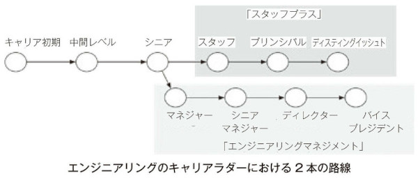

date:2024年3月  

書籍『スタッフエンジニア マネジメントを超えるリーダーシップ』  
https://www.amazon.co.jp/dp/429607055X

---

＜目次＞  

- [概要](#概要)
- [キャリアパス](#キャリアパス)
- [スタッフエンジニアの役割](#スタッフエンジニアの役割)
- [スタッフになるための情報源](#スタッフになるための情報源)
  - [書籍](#書籍)
- [スタッフエンジニアの管理（マネージャー向け）](#スタッフエンジニアの管理マネージャー向け)
  - [スポンサーとフィードバック](#スポンサーとフィードバック)
  - [スタッフエンジニアに自分は手本であると意識させる](#スタッフエンジニアに自分は手本であると意識させる)
  - [定期的な面談](#定期的な面談)
- [スタッフエンジニアのストーリー](#スタッフエンジニアのストーリー)
  - [元CircleCI社のスタッフエンジニア](#元circleci社のスタッフエンジニア)
  - [Voicy株式会社のスタッフエンジニア](#voicy株式会社のスタッフエンジニア)
  - [サイボウズ株式会社のエンジニアリーダー](#サイボウズ株式会社のエンジニアリーダー)

---

# 概要

まず、ここでいう「スタッフ」は、「社員」「一般社員のエンジニア」ではありません。  
Staffには「参謀」といった意味もあり、**「スタッフエンジニア」は「エンジニアのリーダー」 および「幹部の補佐役」** として米国では定着している役職です。

この本は、マネジメント職につくのではなく、技術を武器に「生涯現役のエンジニアでありたい」という人に向けてテクニカルリーダーシップのキャリアパスを歩んでいくための「指針」と「あり方」を示しています。

本書は2部構成になっており、
- 第1部：スタッフエンジニアの役割とあり方
- 第2部：現役のスタッフエンジニアのインタビュー
となっています。  

> なお、本書の巻末にある解説に書いてあるおすすめの読み方は、第2部のインタビューを2～3人分読んでから第1部を読み進める、とのこと。現役のスタッフエンジニアのインタビューの共感を胸に第1部を読むことで、スタッフエンジニアに求められる役割が自然と腑に落ちるでしょう、とのこと。

# キャリアパス

多くの企業はエンジニアのためにキャリアパスを2本用意していることが多いようです。

1. エンジニアリングマネジメント
2. テクニカルリーダーシップ
 
テクニカルリーダーシップへの道には「シニアエンジニア」「スタッフエンジニア」「プリンシバルエンジニア」などといった名前のさまざまな中継点があります。

この書籍で使われる役職名  

# スタッフエンジニアの役割

1. エンジニアリングリーダーシップ
2. メンターおよびスポンサーとしての役割
3. 接着剤になる

以下はスタッフエンジニアとしての発展の要石となります。逆に誤った動きをすれば、キャリアにブレーキがかかることにもなります。

- 重要なことに力を注ぐ
- エンジニアリングの戦略を立てる
- 技術品質を管理する
- 権威と歩調を合わせる
- リードするには従うことも必要
- 絶対に間違えない方法を学ぶ
- 他人のスペース（余地）を設ける
- ネットワークを構築する

なお、本書を読んだ限りでは「スタッフエンジニア」は技術特化型のエンジニアではなく、マネジメント寄りのテクニカルリーダーという印象を受けました。

# スタッフになるための情報源

自分だけの力でスタッフエンジニアになった者はいません。スタッフエンジニアになるには、貪欲なまでの読書や協力なネットワークづくりが欠かせません。

## 書籍

エンジニアの多くはあまり本を読まないようですが、（著者が本書を執筆するにあたって声をかけた）スタッフエンジニアは例外なく、貴重な情報源として「メンター」と「書籍」を挙げました。

具体的な問題に関してはブログ記事や講演をリソースとして挙げるが、大きな意味では書籍によって考え方を改めることが多いようでした。

# スタッフエンジニアの管理（マネージャー向け）

## スポンサーとフィードバック

もしあなたがスタッフエンジニアに毎日のように指示を与えているのであれば、彼らの使い方を間違っていると言えます。逆に週に1度もフィードバックを与えていないのであれば、成長を遅らせています。

スタッフエンジニアの活動にスポンサーとして力を貸さないのであれば、彼らから率先力を奪うことになるでしょう。

## スタッフエンジニアに自分は手本であると意識させる

エンジニアたちは、マネージャーに対してと同じように、スタッフエンジニアにも注目し、どんな態度や行動が評価され、何が容認されるか学ぼうとします。

優れた手本を示すことで、ポジティブな組織を作ることができます。会社全体のロールモデルとして育って初めて、彼らはリーダーとしての役割を担い続けることができます。

## 定期的な面談

定期的な面談を欠かさない方がいいでしょう。相手が会って話すことを要求してくるタイプではないときは、特に注意が必要です。

# スタッフエンジニアのストーリー

日本語訳版のみ収録されている日本人の方のストーリー（インタビュー）が個人的にはかなり参考になりました。

## 元CircleCI社のスタッフエンジニア

チームによってスタッフプラスの働き方は違うが、基本的には手を動かします。人をマネジメントする必要も責任もありません。 **ただ、チームとその周りに対する責任はあり、自分個人の成果を上げていくだけでなく、チームや、もっと大きなエンジニアリング全体の価値を高める成果を出すことが求められる役割** でした。

ほかのエンジニアを支援すると同時に、影響を与える振る舞い、働き方を要求されます。メンターになることも推奨されていました。

評価されるのが個人ではなく、チーム単位の成果になるので、周囲とコミュニケーションをとることが増えます。ほかのチームとやりとりすることも増えます。なので、自分一人でチケットをとってプロジェクトを進めるだけでは完結しなくなります。

コードを書く時間は減った半面、読む時間がとても増えます。社内のそれまで見ていなかったところを見ながら問題点を見つけ、その解決方法を考える時間も増えます。

（スタッフエンジニアを目指す人に向けて）
普段から少しずつ目指す役割を担当してみたり、小さなプロジェクトでもいいので役割を買って出るという積み重ねが大事ではないでしょうか。

## Voicy株式会社のスタッフエンジニア

Voicyのエンジニアのキャリアステップとしては、エンジニアリングマネージャー、技術に特化したテックリード、PMやTPdMなどの企画や管理側、を目指す3つに分かれています。テックリードはスペシャリストの役割のため、いわゆる部下はいません。

個々のエンジニアのキャリアを考えるのはエンジニアリングマネージャーの役割で、 **テックリードとして求められるのは、エンジニアリング組織全体の開発力の向上、組織文化の形成など。これにはソースコードのレビューも含まれます。チームを超えてレビューして技術的な問題がないかチェックしたり、技術が足りていないところがあれば教えたりもします。**

求められるのは、エンジニアの開発生産性を上げるための支援。技術を教えることで、エンジニアひとりひとりの平均的なレベルを上げる活動です。

自分でコードを書いてシェアすることもありますが、設計の過程を共有するように気を付けています。ほかのメンバーがテックリードの働き方を見て、真似て、結果的に成長してもらうためです。

（スタッフエンジニアとして技術の道を究めたい人に向けて）
事業、プロダクト、組織の3つを意識することが大切です。

事業に関しては、なぜそれをつくるのか、何をつくるのか、を実行に移すときに、技術的に可能なのか、本当に必要なもの、逆に不要なものは何か、を見極める人が求められます。そこでビジネス領域を理解したうえで、今必要な技術を選ぶのがテックリードです。

プロダクトに関しては、 **品質を維持する仕組みを継続的につくっていくことが重要です。つくったらそれで終わりではなく、何年も運用していくためにつくればつくるほど技術的負債が蓄積していきます。負債をどのタイミングで返済するか、まだ返済しなくていいから事業を進めようとか、そこを見極めるためにしっかり動けるかどうかが問われます。**

組織については、**いっしょに働くエンジニアメンバーの働きやすさに貢献できるかが大事。それには自分が使っている技術や手がけてきた作業を言語化し、公開すること。** 具体的には、体系的なドキュメントの執筆、社内向け勉強会の開催、社外のカンファレンスへの登壇、などを進んでやること。

## サイボウズ株式会社のエンジニアリーダー

リーダーになると、きちんと意思決定ができる人間なのだとみられるようになります。また、全体の技術レベルが上がるように後輩を育ててほしいとも期待されます。

（エンジニアリーダーになるためのアドバイス）
上から振ってくる仕事をやるだけのような人もいるが、それよりは、やりたい仕事を自分から取りにいくほうがいいです。

製品の変更プロジェクトでは、何を意図して書かれたのかわからない古いコードがたくさんあって、それを読み解くのに苦労する。テキトーなコードや仕様があると、それを直すのは難しい。仕様をおざなりに決めるのは本当にヤバいことなのだと実感する。なので、仕様を書くときには、ベストを尽くすべき。

時間がなくてテキトーに決めてしまうこともあると思います。しかし、そういうことをしていると、あとで振り返ってみても、学びがありません。 **ベストを尽くしたうえでの失敗なら、どこで失敗したかを振り返って学べます。** だからアーキテクチャを決めるときはベストを尽くしましょう。

