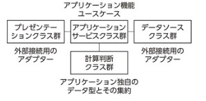

# SoftwareDesign 2025年5月号 クラス設計の鉄則

## ドキュメント概要

以下のまとめです。

雑誌『Software Design 2025年5月号』  
第2特集 もう一度学び直す クラス設計の鉄則 堅牢で変更に強いコードを作り上げる技術  
[https://gihyo.jp/magazine/SD/archive/2025/202505](https://gihyo.jp/magazine/SD/archive/2025/202505)  

- 読了日: 2025年05月
- 注意事項:「著者」は、雑誌記事を書いたAuthorの方を指します

---

## 第1章 クラス設計再入門

この章は、モジュール性・関心の分離・依存関係の3点を中心に、クラス設計の基本的な考え方と実践的な手法を解説しています。

堅牢で変更に強いコードを作り上げるための、**クラス設計の基本**を学びましょう。

### ソフトウェアシステム構築の基本課題

ソフトウェアシステムの構築では、複雑さの整理と、修正・拡張のしやすさが大きな課題になります。

大規模なシステムは小さな部品に分割して組み立て、変化に柔軟に対応できる設計が求められます。そのための仕組みが「クラス」です。

### 設計を考えるときの視点

全体をわかりやすく整理し、変更容易性を確保するためのクラス設計の視点は、次の3つを意識することが役に立ちます。

- モジュール性
- 関心の分離
- 依存関係

### モジュール性

「モジュール性」とは、システム全体が独立性の高い部品の組み合わせで構成されている度合いです。

モジュール性の高いシステムには次の特徴があります。

- ひとつひとつの部品（モジュール）の役割が明確
- 部品と部品の接続方法が明確
- 部品の交換や追加が容易

クラスは、ソフトウェアをモジュールに分割する手段の1つです。

大きなプログラムを役割が明確なクラスに分解し、クラス間の接続方法を定義します。クラス間の接続方法とは、具体的にはメソッド呼び出しです。

#### 大きな泥団子

クラスを分割しても、ただメソッドを呼び出し合うだけではモジュール性は高まりません。

クラスとメソッド呼び出しでシステムを構築しても、構造がわかりにくく変更が困難なシステム、つまりモジュール性が低いソフトウェアになってしまうことはめずらしくありません。**大きな泥団子**と呼ばれるような、構造がわかりにくく変更が困難なシステムです。

こういうモジュール性の低いシステムでは、クラスの役割がはっきりしません。クラスとクラスの関係がわかりにくく、密接に関係するコードが異なるクラスに分散し、同じ機能のコードが複数のクラスに重複したりしています。その結果、ソフトウェアの修正や拡張はやっかいで危険な作業になります。

#### モジュールとしてのクラス

プログラムをモジュールに分割するアプローチはさまざまなスタイルがあります。

手続き的なプログラミングであれば、モジュールの基本単位は、一連の操作手順を処理の順番に記述した「手続き」です。手続きから手続きを呼び出す構造で全体を組み立てます。

関数的なプログラミングでは、モジュールの基本単位は、副作用のない（数学的な意味での）「関数」です。関数と関数を組み合わせて（合成して）新たな関数を定義することで全体を組み立てます。

```text
補足：「副作用のない（数学的な意味での）関数」について

数学でいう「関数」は、同じ入力に対して必ず同じ出力を返すものです。たとえば、f(x) = x + 1 なら、xに3を入れたら必ず4が返ってきます。何回やっても結果は変わりません。

プログラミングでも「副作用がない関数」というのは、入力が同じなら出力も必ず同じで、関数の外の状態（変数やファイルなど）を変えたりしない関数のことを指します。

つまり、「数学的な意味での関数」とは、「入力と出力が一対一で決まっていて、他の影響を与えない関数」という意味です。
```

オブジェクト指向プログラミングでは、基本のモジュール単位は「クラス」です。**クラスは関連するデータとロジックを1つのモジュールとしてまとめるためのしくみ**です。

関連するデータとロジックをひとかたまりにする、クラスを使ったモジュール化の利点は次のとおりです。

- どのように分割し整理するかの方針に一貫性がある
- 同じデータに対する操作が1つのモジュールに集まり、異なるモジュールでの重複がなくなる
- あるデータに関連した変更の影響範囲が狭い範囲に限定される

### 関心の分離

モジュール性の高いクラスを設計するために役に立つ視点が**関心の分離**です。

ソフトウェアシステムは多種多様な関心事の集まりです。さまざまな関心を切り離し、1つのクラス（1つのモジュール）では1つの関心事だけを扱うようにすることで、クラスの役割が明確になり、クラス間の関係も単純になります。

#### 計算判断と入出力を分離する

クラス設計でもっとも実践的かつ重要な関心の分離は「計算判断」と「入出力」の分離でしょう。

たとえば、「金額」「数量」「日付」は、業務的に複雑なルールを持つことが多いデータ型です。計算判断ロジックを、このような業務上のデータの種類ごと、つまり金額クラス、数量クラス、日付クラスごとに分けて整理することで、複雑なロジックが整理され扱いやすくなります。

これに対し、入出力を扱うロジックの整理は計算判断クラスほど簡単ではありません。入出力を扱うクラスの設計を難しくする原因には次の課題があります。

- 入出力操作をどういう視点でグループ化するか
- プログラム外部との入出力に伴う障害や不安定性をどう扱うか
- フレームワークや入出力用のライブラリとの依存性

入出力を扱うクラスをどう設計するかは、第2章で取り上げます。

#### アプリケーション独自のデータ型を作る

プログラミング言語に標準で用意されているデータ型（整数や文字列）だけを使っていると、あちこちに似たようなロジックが記述されます。

金額も数量もint型として扱っていると、金額に関するロジックと数量に関するロジックを判別しにくくなります。標準のデータ型だけでロジックを記述する方法は危険です。たとえば、金額と数量を足してしまったり、日数を渡すべきメソッドに人数を渡してしまったりしてしまう間違いを防止できません。

クラスを使ってアプリケーション独自のデータ型を定義すると、このような問題の発生を防げます。合計金額を扱うクラス、単価を扱うクラス、人数を扱うクラス、個数を扱うクラス、予定日を扱うクラス、というような、アプリケーション独自のデータ型をクラスを使って定義します。

#### 関係ないものを見えなくする

関心を分離するためには「可視性」のコントロールも重要な設計課題です。関心のあるものだけを見えるようにし、別の関心事は見えないようにします。

たとえば、Javaでは、public、default（修飾子無し）、protected、privateのアクセス修飾子を使って、可視性をコントロールできます。

アクセス可能な範囲（見える範囲）は可能な限り狭く設定します。ほんとうに公開が必要なものだけをpublicに指定します。

適切に関心を分離できているクラスやパッケージでは、publicを使う箇所は限定されます。**publicを使う箇所が増えてきたら、関心の分離がうまくいっていない可能性があります**。

### 依存関係

クラス同士の依存関係は、変更容易性に大きく影響します。変更がやっかいで危険になるのは、依存関係が複雑でわかりにくいからです。

クラス同士の依存関係には、暗黙的な依存関係と、明示的な依存関係があります。

- 暗黙的な依存関係：同じ処理をするコードが複数のクラスに重複しているような場合
- 明示的な依存関係：クラスの参照関係としてコード上に表れている関係

#### 暗黙的な依存関係

暗黙の依存関係は、変更をやっかいで危険にする元凶です。コードの重複や、関連するコードが複数のクラスに分散している状況です。

プログラムが大きくなると、全体を見渡して重複や分散を発見し改善することが難しくなります。実際に変更してみた結果、そういう重複や分散を発見することがあります。しかし、そういう見つけ方は、場当たり的で時間がかかる割には、ごく一部の改善になりがちです。

関連するコードの重複や分散をあらかじめ防ぐ方法の1つが、アプリケーション独自のデータ型です。アプリケーションでどのような種類の値を扱うかは、要求分析など設計の初期の段階からいろいろ見つかります。業務的に関心がある値は「請求金額」「割引率」「有効期限」など業務で使われる言葉として発見できます。そういう用語のすべてがデータ型になるわけではありませんが、アプリケーション独自のデータ型の有力な候補です。

こういうデータ型の候補を、開発の早い段階からクラスとして定義しておきます。どういうロジックやメソッドを実装すべきかは、まだあいまいな段階であっても、ロジックの仮の置き場所としてクラスを作成します。そういうロジックの置き場所を事前に用意することで、コードの重複や分散のかなりの部分が予防できます。

開発が進むにつれ、仮置きのクラスにロジックが集まってくると、コード量が増え、コードが乱雑になり、クラス名やメソッド名と記述内容が一致しなくなります。しかし、これは悪い状況ではありません。**良い設計を見つけるための手がかりが手元に集まっている**ので、設計の問題点やその改善方法を具体的に判断できます。

このような段階のクラスの設計をどう改善するかの具体的な方法は第3章で説明します。

#### 明示的な依存関係

あるクラスから別のクラスを利用する依存関係は、メソッドの呼び出し関係として、ソースコード上に明示されます。最近の高機能なエディタや開発ツールを使えば、過度に複雑になっている依存関係を検出したり、可視化したりすることが簡単にできます。

全体の構造がわかりにくく、変更容易性が低いプログラムになってしまう依存関係の典型的な問題は大きく2つです。

- 依存関係の多さ
- 不安定な依存関係

##### 依存関係の多さ

依存しているクラスが、同じパッケージのクラスであれば、あまり大きな問題ではありません。依存関係のあるクラスを変更するときに、変更の影響範囲が同じパッケージ内のクラスに閉じていれば、関心の分離とモジュール化がうまくできていると判断できます。

それに対し、異なるパッケージへの参照が多いクラスは問題です。変更の影響範囲が、複数のパッケージに広がると、変更の影響範囲の確認や変更作業が大変になります。

依存関係が多いクラスは、メソッドが長くなり、クラスが大きくなります。そのようなメソッドやクラスのどのような点に注目し、どのように設計を改善するかは、第3章で取り上げます。

##### 不安定な依存関係

クラスとクラスの依存関係の実体はメソッドの呼び出しです。コード上は安定した呼び出し関係に見えても、実行時に、その関係が不安定になることがあります。

たとえば数量の足し算をするメソッドを考えてみましょう。

`int add(int 増分) {...}`

このメソッドを使った呼び出し関係は、不安定です。Javaであれば、引数の増分は、負の値でもよいし、最大約21億を渡すこともできます。メソッドが返す値は、マイナス約21億からプラス約21億までの可能性があります。

実際のアプリケーションの適切な数量計算はもっと狭い範囲に限定されます。たとえば「注文数量」は1以上で最大100未満でなければならない、というような業務上の決め事があったりします。int型を使うこのメソッドでは、その制限を守っていません。実行時に、間違った値の混入や不適切な計算結果が発生する可能性があります。

数量が1以上で100未満であることが保証されているアプリケーション独自のデータ型としてQuantityクラスを定義したとします。数量の足し算は次のように表現できます。

`Quantity add(Quantity 増分) {...}`

引数の値の範囲も、計算結果の値の範囲も、業務の決め事どおりになっていることを保証できます。このメソッドは呼び出す側と呼び出される側の関係が明確で、かつ、動作が安定します。

このようなメソッドの仕様を明確にする設計方法は「契約プログラミング」と呼ばれる設計技法の一種です。

契約プログラミングとは、メソッドを呼び出す側が守るべき制約条件（事前条件）と、メソッドを提供する側が守るべき制約条件（事後条件）を、明確に定義することを重視する設計技法です。

メソッド呼び出しの仕様（事前条件と事後条件）をできるだけ厳格に制限することが、ソフトウェア全体の構造をわかりやすくし、実行時の挙動を安定させます。

### 第1章のまとめ

クラス設計の基本は、次の3つの視点を意識することです。

- モジュール性
- 関心の分離
- 依存関係

## 第2章 迷わないクラス設計の指針

この章では、モジュール性、関心の分離、依存関係の視点を実践的なアプリケーション開発におけるクラス設計で活用する方法と、現代的なクラス設計の指針について解説します。

### アプリケーションの関心事とクラス設計

第1章で説明したとおり、ソフトウェアの多種多様な関心事を適切に分離することは、クラスの重要な役割です。それでは、アプリケーションを構築するためのさまざまな関心事を分離するためには、どのようなクラス設計が役に立つでしょうか。

関心の分離の基本方針、そしてクラスを使ったモジュール化と依存関係の整理の指針として参考になるのが、アプリケーションアーキテクチャです。アプリケーションアーキテクチャとは、アプリケーションソフトウェアの構造や設計の枠組みを定義した設計モデルです。

よく知られたアプリケーションアーキテクチャとしては

- 多層アーキテクチャ
- ポートとアダプター（ヘキサゴナルアーキテクチャ）
- オニオンアーキテクチャ
- クリーンアーキテクチャ

などがあります。これらのアーキテクチャのスタイルは、強調する点や考え方に異なる点があります。しかしいずれのスタイルも、関心の分離の観点では、アプリケーションの関心事を次の4つに分類しているという点でほぼ同じです。

- 計算判断
- アプリケーションサービス
- プレゼンテーション
- データソース

それぞれの分類をクラスとして設計すると、図1のような構造になります。

図1：



なお、これらの関心事の分類は、それぞれのアーキテクチャスタイルにおいて異なる用語で表現されています。表1にその違いを整理しています。

表1 関心事の分離とアプリケーションアーキテクチャの用語の対応：

| 関心事                   | 概要                                         | 対応する用語                              |
|--------------------------|----------------------------------------------|-------------------------------------------|
| 計算判断                 | 業務ルールに基づく計算ロジックや判定ロジック | ドメインモデル、エンティティ、ビジネスロジック |
| アプリケーションサービス | アプリケーション機能の提供                   | ユースケース                              |
| プレゼンテーション       | 外部からのリクエストの受付                   | プライマリーアダプター                    |
| データソース             | データベース操作や外部との通信               | セカンダリーアダプター                    |

#### 依存関係とクラス設計の順序

アプリケーションの4つの関心事をクラスとして実装する場合、クラス間の依存関係は次のように設計します。

- 計算判断クラスはほかの関心事のクラスに依存しない
- アプリケーションサービスクラスは計算判断クラスに依存し、プレゼンテーションクラスとデータソースクラスには依存しない
- プレゼンテーションクラスとデータソースクラスは、アプリケーションサービスクラスに依存する

```mermaid
flowchart TD
    計算判断クラス
    アプリケーションサービスクラス
    プレゼンテーションクラス
    データソースクラス

    アプリケーションサービスクラス -.依存.-> 計算判断クラス
    プレゼンテーションクラス -.依存.-> アプリケーションサービスクラス
    データソースクラス -.依存.-> アプリケーションサービスクラス
```

依存関係は設計の順番に影響します。先に依存される側のクラスを設計し、依存する側のクラスは、依存されるクラスがすでにある状態で設計します。

つまり適切なクラス設計は

1. 最初に計算判断クラスを設計
2. 次にアプリケーションサービスクラスの設計
3. その後でプレゼンテーションクラスとデータソースクラスを設計

という順序になります。

#### 計算判断クラスの設計

入出力では、プログラム外部とのやりとりが発生します。それに対し、計算判断はプログラム内部に閉じた関心事です。そのため計算判断は、ほかの関心事に依存しない、完全に独立した関心事として扱うことが可能です。また、そのようにクラスを設計すべきです。

計算判断クラスの設計の基本は、アプリケーション独自のデータ型の設計です。アプリケーションで扱うさまざまな値の種類ごとに、値を表現するデータとそのデータを操作するロジックを1つにまとめたクラスを設計します。値の種類とは、たとえば、金額、数量、単価、割引率、予定日、有効期限などです。

そして、複雑な業務ロジックを表現するために、これらのアプリケーション独自のデータ型を組み合わせた、計算判断集約クラスを設計します。

計算判断クラスは、次のような計算や判定のメソッドを提供します。

- 足し算、引き算、掛け算、割り算
- 同値判定、大小判定、有効範囲（最少、最大）

汎用のデータ型であれば、これらの計算用のメソッドをすべて用意することが基本です。それに対して、アプリケーション独自のデータ型を表現する計算判断クラスではこれらをすべて用意せず、アプリケーションに必要なメソッドだけに絞って実装します。この必要なメソッドの特定が、計算判断クラスを設計するときの中心課題です。

計算判断クラスは、内部のインスタンス変数の状態を変更しない、不変なクラスとして設計することが基本です。

#### アプリケーションサービスクラスの設計

アプリケーション機能やユースケースを実現するアプリケーションサービスクラスは、ほかの関心事を統合する役割のクラスです。異なる関心事を1つのクラスで扱うことになるため、設計に注意が必要なクラスです。

たとえば、顧客登録のアプリケーションサービスを実装する1つのクラスに、次のような関心事が混在しているとします。

- 顧客登録リクエストを受け取る
- 顧客登録の可否を判断する
- 登録が可であれば、データベースに記録する
- 登録の完了を依頼者に通知する

アプリケーションサービスクラスがこれらの関心事のすべての詳細を抱え込むと、巨大なクラスになり、理解することも、変更することも難しいクラスになります。

それを防ぐためには、関心を分離するためのさまざま工夫を組み合わせることが必要です。上記の例をベースに、その工夫の具体例を紹介します。

まず、外部からの顧客登録リクエストを受け取る処理の詳細は、別クラスに切り離します。これは、次の項で説明するプレゼンテーションクラスになります。

顧客登録の可否を判断するロジックの詳細は、計算判断クラスで実装します。アプリケーションサービスクラスは、顧客登録を判断するクラスのインスタンスを生成して判断用のメソッドを実行し、その判断結果を受け取るようにします。

データベースへの書き込みの詳細は、データソースクラスに切り離して実装します。アプリケーションサービスクラスは、データソースクラスにデータベース操作を任せます。依頼者への通知も、通知用のデータソースクラスに任せます。

データソースクラスは、データベース設計や通信プロトコルの実装などに強く依存します。アプリケーションサービスクラスの設計をデータソースクラスの設計に合わせてしまうと、異なる関心事がアプリケーションサービスクラスに混在してしまいます。

さらに、明確に関心を分離するために、データソースクラスの実装とデータソースクラスが提供すべき機能の定義を分離します。JavaやC#であれば、提供すべき機能をinterfaceで定義し、データソースクラスはそのinterfaceの実装クラスとして設計します。そして、interfaceの設計は、アプリケーションサービスクラスにとって、どんな機能が必要かという視点だけで設計します。そうすることでデータベース操作や通信の実装の関心事との分離を実現します。

このような技法を組み合わせることで、アプリケーションサービスクラスは、処理の流れの要点だけを表現した、わかりやすいクラスになります。

アプリケーションサービスクラスのメソッドが増えてきた場合、あるいは、設計方針として記録と参照の関心事を分離したモジュール化をしたい場合は、記録系の機能と参照系の機能を別のアプリケーションサービスクラスに分けることも選択肢の1つです。

アプリケーションサービスクラスは、さまざまな関心事を組み合わせているため、機能の修正や追加をするときに、このクラスにif文や計算式を追加することが、もっと手っ取り早い選択肢になりがちです。しかし、これを繰り返すと設計が劣化します。

#### プレゼンテーションクラスの設計

プレゼンテーションクラスは、アプリケーションサービスクラスが提供する機能を外部から利用するためのアダプターです。関心の分離の視点では、外部との入出力手段に関係する関心事をこのクラスに閉じ込めて、アプリケーションサービスクラスに影響を与えないことが重要な役割です。

プレゼンテーションクラスの役割は、次の3つです。

- 外部からのリクエストの受付
- アプリケーションサービスクラスのメソッドの実行
- 実行結果を外部へ返却

プレゼンテーションクラスの重要な役割が「変換」です。たとえば、HTTPのpostメソッドをアプリケーションサービスクラスのregister()メソッドの呼び出しにマッピングします。そしてHTTPリクエストの内容を、アプリケーションサービスクラスのメソッドが要求する引数の型（事前条件）に適合するように変換して、メソッドを呼び出します。メソッドの実行結果の型をHTTPレスポンスの形式に変換します。

#### データソースクラスの設計

アプリケーションサービスクラスの設計で説明したように、データソースクラスは、データソースが提供すべき機能を定義したinterfaceを実装するクラスです。

データソースクラスには2種類あります。

- データベース操作クラス
- 通信アダプタークラス

##### データベース操作クラス

データベース操作クラスは、データを管理するためのデータベース操作用のクラスです。どう実装するかはデータベース操作用のフレームワークやライブラリに強く依存します。

そういう設計の制約の中で、データベース操作クラスの中心的な役割は、オブジェクトモデルとデータモデルの変換です。そしてそれ以外の関心事をこのクラスに持ち込まないようにします。

##### 通信アダプタークラス

通信アダプタークラスは、通信を使って外部のデータソースにアクセスする手段を提供するクラスです。現代のアプリケーションでは、外部が提供するWeb APIを利用したり、非同期メッセージングのしくみを使った通知などを実装したりする機会が多いでしょう。

通信アダプタークラスの基本的な役割は次の2つです。

- 外部モデルと内部モデルの変換
- 通信処理

外部モデルと内部モデルの変換は、オブジェクトモデルとデータモデルの変換よりも、複雑になることが一般的です。外部のアプリケーションは、それぞれの事情に特化した独自のモデルで設計されています。異なるアプリケーション間の連携は、本質的に異なる2つのモデルをなんらかの方法で整合させることが必要になります。この変換の複雑さは、変換専用のクラスを用意して関心事を分離するほうがよいでしょう。

#### 現代的なクラス設計

1980年代から2000年くらいまでの設計手法と、現代のクラス設計はいくつかの点で大きく変わってきています。

原因はいろいろあります。とくにスマートフォンとモバイル通信の発展は、この傾向を加速しています。そして、ソフトウェアを継続的に発展させることがあたりまえになり、変更容易性が重要になりました。クラウドサービスの発展も大きな変化です。膨大なデータの記録、転送、計算処理の単位あたりのコストが急激に低下しました。このような状況の変化により、クラス設計の考え方も変化してきています。

##### 可変より不変を選ぶ

クラス設計では、オブジェクトの内部状態（インスタンス変数）を変更可能にするか、変更不可にするかの2つの選択肢があります。

かつて、メモリが高価で使用量の制限が厳しかった時代は、内部状態を変更可能にするクラス設計が主流でした。メモリに割り当てたインスタンス変数を上書きしながら使い回すことによってメモリの使用量を抑えることに、当時はそれなりの価値がありました。しかし、内部状態の変化は、プログラムの実行時の動作をわかりにくくし、挙動を不安定にしがちです。コードも複雑になります。

一方、内部状態を不変にすると、設計が単純になり、挙動が安定します。メモリやCPUのコストが劇的に低下した現代では、内部状態を不変にすることによるメリットが重視されるようになってきました。

クラスを不変（イミュータブル）に設計する基本的な方法は次のとおりです。

- オブジェクト（クラスの生成時）にすべてのインスタンス変数を適切な値（状態）に設定する
- インスタンス変数を変更するメソッドやロジックを実装しない
- 異なる状態が必要なときは、別のインスタンスを生成する（計算結果や変換結果として別のインスタンスを生成して返す）

計算判断クラスでは、可変より不変を選ぶのは、鉄則と言ってよいでしょう。アプリケーションサービスクラス、プレゼンテーションクラス、データソースクラスは、その特性上、そもそも可変の状態を持たない設計にすることが基本です。

##### エンティティより値を選ぶ

分析やモデリングでは、現実世界の物事で、IDや管理番号を使って個体を識別できる対象をエンティティ（実体）と呼ぶことがあります。代表的なエンティティとして「顧客」「商品」「注文」があります。

現実世界の実体のごく一部の側面をデジタルデータとして扱っていた時代のソフトウェア設計では、「エンティティをそのままクラスとして設計する」というアプローチにそれなりの合理性がありました。

しかし、ありとあるゆる活動のデジタル化が進んだ現代では、エンティティに関係するありとあらゆるデータを1つのクラスで扱うことは、現実的ではありません。エンティティのさまざまな側面ごとに、別々のクラスとして表現することが必要です。エンティティの特定の側面を表現した値をインスタンス変数として持ち、その値を使った計算判断ロジックをそのクラスに集めます。

##### 継承よりコンポジションを選ぶ

オブジェクト指向プログラミングが普及し始めた時代は「継承」というしくみがオブジェクト指向プログラミングの特徴として重視されていました。継承のしくみをうまく使うことが、クラス設計の重要なスキルと考えられていました。しかし、オブジェクト指向プログラミングが広がるととともに、継承の欠点も明らかになってきました。簡単に言えば、継承は変更容易性にマイナスに働くことが多い、ということがわかってきたのです。

継承は、ベースとなるスーパークラスと、それを継承したサブクラスの密結合を生み出します。スーパークラスの変更が、どのようにサブクラスに影響が及ぶかを把握することは簡単ではありません。また、サブクラスを変更するためには、スーパークラスの知識が必要です。

それを避ける方法が、コンポジション（合成）です。コンポジションとは、複数のクラスで共通に使いたいデータとロジックを1つにまとめたクラスを作成して利用する、という設計パターンです。コンポジションは、継承の代替手段というよりはもっと一般的な設計技法です。関心事が混在し肥大化したクラスの関心を分離し、モジュール性を向上させるための基本的な技法です。

実装を再利用したい場合は、継承ではなくコンポジションを選ぶことを検討しましょう。継承でなければうまくいかないケースはまれです。

##### 継承よりサブタイピングを選ぶ

継承の代替手段として、サブタイピングを使う方法もあります。サブタイピングとは、複数のクラスを同じグループとして扱う方法です。クラスのグループをスーパータイプ（共通の型）として、interfaceを使って定義します。このinterfaceを実装することで、グループに属するクラス（サブタイプ）であることを表現します。サブタイピングは、実装に依存しないため、実装を継承することに起因する問題を防げます。

### 第2章のまとめ

この章では、第1章で説明したモジュール性、関心の分離、依存関係の3つの視点を、具体的なクラス設計に適用するやり方と、アプリケーションを構築するための次にあげるクラスの種類ごとに基本的な設計方針を説明しました。

- 計算判断クラス
- アプリケーションサービスクラス
- プレゼンテーションクラス
- データソースクラス

また、現代的なクラス設計の指針も説明しました。

- 可変より不変を選ぶ
- エンティティより値を選ぶ
- 継承よりコンポジションを選ぶ

## 第3章：設計の落とし穴対策

ソフトウェアは変化を続け、時とともに設計も劣化します。この章では、設計の劣化を検知する方法と、コードの整頓から本格的なクラス設計の改善まで、継続的に改善する基本を解説します。

この章は、2冊の本の内容をもとにしています：

- [『リファクタリング』](https://www.amazon.co.jp/dp/4274224546)：既存コードの設計を改善するための古典的名著
- [『Tidy First?』](https://www.oreilly.co.jp/books/9784814400911/)

### 乱雑なコードを整頓する

プログラマーであれば、コードのわかりにくさや変更の大変さとして、設計の劣化をなんとなく感じることも多いでしょう。

しかし、違和感を覚えるコードでも具体的に何が問題で、どこから手をつけ、どう直せば適切な設計に改善できるかは簡単にはわからないことも多いでしょう。

『Tidy First?』では15の整頓手法が取り上げられています。その中から、次の内容を紹介します。

- 実行されないコードは削除する
- 小さく分ける
- 順番を整える
- コードで説明する

#### 実行されないコードは削除する

コードの量が増えてくると、実行されていないコードがいつの間にか紛れ込みます。ある時点では必要だったコードでしょう。しかし、現在はそのコードが実行されることはありません。

このようなコードに気がついたら「必ず」削除してください。実行されないコードを放置している限り、いつまでたっても良い設計ができるようにはなりません。

実行されないコードを削除すれば、残りのコードも読みやすくなります。不要なコードは、不要な関心事です。

#### 小さく分ける

コードを読みながら、意味の区切りを見つけたら、空白行を追加しましょう。意味の異なるグループの切れ目に空白行を追加して関心事が異なることを可視化します。

前処理、主処理、後処理などでグループ分けできそうであれば、積極的に空白行を入れて意味の切れ目をコード上で明確に表現します。ちょっとしたことですが、関心の分離の実践です。

空白行を追加すれば、コードの構造が可視化されます。コードの構造が見えてくれば、より本格的な設計改善への道筋が見つかります。

たとえば、リスト1のようなインスタンス変数のグループは、別のクラスに切り離す候補になります。そのグループのインスタンス変数だけを使っているロジックを、独立した関心事として、別のクラスに切り分ける、というような設計改善です（リスト2）。

リスト1：

```cpp
class Customer {
　String firstName;
　String lastName;
　String postalCode;
　String city;
　String address;
　String telephone;
　String mailAddress
```

リスト2　空白行で構造を可視化：

```cpp
class Customer {
　String firstName;
　String lastName;

　String postalCode;
　String city;
　String address;

　String telephone;
　String mailAddress
```

空白行で区切ったインスタンス変数のグループを、PersonNameクラス、Addressクラス、ContactMethodクラスに分け、関連するロジックを適切なクラスに配置することで、関心の分離やモジュール性が向上します。

#### 順番を整える

##### メソッドの順番

クラスは、メソッドの集合です。メソッドをどのような順番で記述しても、正常に動作します。しかし、コードを読むのは人間です。人間にとって、書かれている順番はコードの理解に大きく影響します。

- 関連するメソッドは近くに並べる
- そのクラスを特徴づける重要なメソッドを前に持ってくる

メソッドの並べ方に意味を持たせることで、クラスの目的や、どこに何が書いてあるかが理解しやすくなります。

メソッドの順序に気を配っていないクラスは、意図が読み取りにくく、また、変更時に間違いが起きやすくなります。

##### if文の位置

少し複雑な順番の整理として、if文の位置があります。

メソッドの主たる処理の対象ではない特殊な条件をif文で除外する場合、そのような条件判定をメソッドの先頭に移動します。特殊な条件を主たる処理から切り離すことで、メソッドの意図が明確になります。関心の分離の小さな実践例です。

#### コードで説明する

コードで説明できるものは、できるだけコードで説明します。

計算式が入り組んできたら、部分的な計算ごとに計算式を分け、計算結果を変数に代入します。変数名で計算式の意図を説明します（説明用変数）。

定数も、静的な変数として名前を付けて表現します（説明用定数）。

単純な変数名を使い、意味をコメントで説明するやり方よりは、変数名を意味のある名前に変更し、コメントは削除したほうがわかりやすいコードになるでしょう。コードで表現できていることを、コメントで重複して記述すれば、そのコメントはノイズになります。削除しましょう。

### コードのいやな臭いとクラス設計の改善

設計改善の候補は次のようなクラスです。

- 長いメソッドを持つクラス
- 大きなクラス
- データだけのクラス、ロジックだけのクラス

このようなクラスは、モジュール性、関心の分離、依存関係に改善すべき問題を抱えています。このようなクラスの設計を変更し、変更前と変更後の違いを実感することを繰り返すと、良いクラス設計を感覚的につかめるようになります。良いクラス設計をするためには、このような感覚的な判断力が役に立ちます。

### 長いメソッド

1つのメソッドを読むときに画面をスクロールするような長さのメソッドは、複数の関心事が混在しています。関心の分離を検討しましょう。

長いメソッドにありがちな、次の状況を考えてみます。

- 引数が多い
- if文のネスト構造が深い
- ループのネスト構造が深い

#### 引数が多い

引数が多いメソッドは異なる関心事が混在している可能性が高いメソッドです。このようなメソッドの関心事を分離するリファクタリング技法として「引数のクラス化」や「メソッドのクラス化」が役に立ちます。

- 引数のクラス化
- メソッドのクラス化

メソッドのクラス化は、関連するデータとロジックを1つにまとめてクラスにする、というクラス設計の基本を実践的に学ぶために、とてもよい手法です。

```mermaid
flowchart TD
  A[新しいクラスを作って対象のメソッドをまるごとコピーする]
  B[メソッドが使っていた元クラスのインスタンス変数を新しいクラスのインスタンス変数として宣言する]
  C[コピーしたメソッドの引数をインスタンス変数に追加し引数は削除する]
  D[参照エラーになったメソッド内の変数をインスタンス変数への参照に変更する]
  E[すべてのインスタンス変数を引数に持つコンストラクタを作成する]
  F[元のクラスのメソッド変更]
  G[新しく作ったクラスのコンストラクタに必要なインスタンス変数と引数を渡してオブジェクトを生成しメソッドを呼び出す]

  A -.以降は新しいクラスでの作業.-> B
  B --> C
  C --> D
  D --> E
  E --> F
  F --> G
```

#### if文のネスト構造が深い

if文やswitch文が入れ子になった分岐構造は、理解が難しく、変更がやっかいで危険です。関心をうまく分離できていないコードにありがちな状況です。

事前処理や事後処理に切り出せる分岐条件を見つけて、主たる分岐構造の前後に分離することで、元の複雑な分岐構造を、主たる分岐構造と補助的な条件分岐に分離します。

#### ループ処理のネスト構造が深い

ループ処理のネスト構造も、if文のネスト構造と同じように、事前処理や事後処理を分離したり、下請けメソッドで全体と部分の分離をしたりすることが役に立ちます。

### 大きなクラス

大きなクラスは、間違いなく、複数の関心事が混在しています。大きなクラスの分割は、関心を分離し、モジュール性を向上するための基本活動の1つです。

> 最近の高機能エディタや開発支援ツールを使えば、一定数を超えたインスタンス変数を持つクラスや、依存関係の多いクラスを簡単に見つけられます。そういう機能を活用して、設計改善の候補となるクラスを特定しましょう。  
> 例：  
> VS Codeの拡張機能「CodeMetrics」  
> Visual Studio「コードメトリクス」機能

大きなクラスの分割では、次の視点が役に立ちます。

- インスタンス変数に注目する
- 依存関係（import文など）に注目する

#### インスタンス変数に注目する

インスタンス変数が多いクラスを見つけたら、個々のメソッドが、どのインスタンス変数を使っているかを調べます。メソッドがどのインスタンス変数を参照しているかを調べると、同じインスタンス変数を使うメソッドのグループを発見できます。

インスタンス変数のグループと、それを参照するメソッドのグループは、強く関係するデータとロジックです。この関係を新しいクラスとして独立させます。

#### 依存関係に注目する

クラスとクラスの依存関係が複雑になるほど、変更がやっかいで危険になります。依存関係が簡単になれば、変更の影響を狭い範囲に閉じ込めやすくなります。

複雑な依存関係を改善するために、とくに注目すべきは、ほかのパッケージへの依存数（import文などの数）です。ほかのパッケージへの参照が多い状況は、依存関係が複雑で、関心の分離がうまくいっていないということです。

パッケージの依存数（import文）に注目して依存関係を改善する方法は、基本的にはインスタンス変数が多いクラスの改善方法と同じです。import文をグループに分け、メソッドとimport文の関係を調べます。特定のimport文を参照するメソッドのグループを特定し、そのメソッドのグループと該当するimport文を新しいクラスとして抽出することを検討してください。

### データだけのクラス、ロジックだけのクラス

クラス設計の基本は、関連するデータとロジックを1つにまとめることです。この考え方から見れば、データだけのクラスやロジックだけのクラスは良いクラス設計ではありません。

データだけのクラスは、そのクラスのデータを使っているほかのクラスのロジックを見つけてください。そのロジックを、データを持つクラスに移動します。あるいは、ロジックを持つクラスにデータを移動します。

ロジックだけのクラスは、メソッドのクラス化を検討してみましょう。引数をインスタンス変数に持つクラスを設計することで、関連するデータとロジックを独立したクラスに切り離し、関心を分離できます。ロジックだけのクラスで、同じ引数のパターンを持つメソッドは、同じクラスのメソッドになります。

### クラス設計を実践的に学ぶ

この章で紹介した内容は、言葉として覚えるだけでは役に立ちません。

目の前のコードを対象に、コードに表れた設計を注意深く観察し、実際に手を動かしてコードを変更し、その結果、どのようにモジュール性、関心の分離、依存関係が変化したかを体験することが重要です。

## 自分的まとめ

- クラスは小さく
- 関連するデータとロジックを1つのクラスに
  - データだけのクラス、ロジックだけのクラスも作らない
- アプリケーション独自のデータ型を作る
- publicを使う箇所が増えてきたら、関心の分離がうまくいっていない
- 計算判断クラス、アプリケーションサービスクラス、プレゼンテーションクラスおよびデータソースクラスの順で設計
  - 計算判断クラスの設計
    - アプリケーション独自のデータ型クラス
    - アプリケーションに必要な計算判断の結果を表現するクラス
    - 内部のインスタンス変数の状態を変更しない、不変なクラス
- 使わないコードは削除する
- 小さく分ける方法
  - まずは空白行で分ける
  - 空白行で分けたら、クラスに分けられるか検討
- メソッドの定義の順番
  - 似た機能は近くに置く
  - 重要な機能は前に持ってくる
- コードに意味を持たせる。コメントで説明しようとしない

---
Obsidian tag:  
#book-summary  
