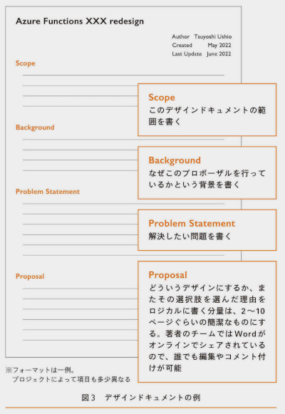
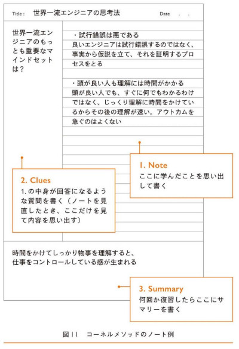

date:2023年12月  

書籍『世界一流エンジニアの思考法』  
https://www.amazon.co.jp/dp/B0CKSZV5DQ/  

---

＜目次＞  

- [この本の概要](#この本の概要)
- [この書籍のターゲット](#この書籍のターゲット)
- [世界一流エンジニアは何が違うのだろう？](#世界一流エンジニアは何が違うのだろう)
  - [生産性の高さの違い](#生産性の高さの違い)
  - [メンタルモデルを使って仮説を立て証明する](#メンタルモデルを使って仮説を立て証明する)
  - [「理解に時間をかける」を実践する](#理解に時間をかけるを実践する)
      - [著者がやったこと](#著者がやったこと)
      - [小さなドキュメントをコードの前に書く](#小さなドキュメントをコードの前に書く)
      - [頭の中に「メンタルモデル」をつくる](#頭の中にメンタルモデルをつくる)
      - [「偉大な習慣を身に着けたプログラマ」になる](#偉大な習慣を身に着けたプログラマになる)
- [アジャイル](#アジャイル)
- [アメリカで見つけたマインドセット](#アメリカで見つけたマインドセット)
  - [リスクや間違いを快く受け入れる](#リスクや間違いを快く受け入れる)
  - [不確実性を受け入れよう](#不確実性を受け入れよう)
  - [「思考回路」を形づくる実践](#思考回路を形づくる実践)
  - [「結果を出す」から「バリューを出す」へ](#結果を出すからバリューを出すへ)
- [脳に余裕を生む情報整理・記憶術](#脳に余裕を生む情報整理記憶術)
  - [「アウトプット」至上主義が上達を阻害する](#アウトプット至上主義が上達を阻害する)
  - [自分だけの時間を確保する](#自分だけの時間を確保する)
  - [「書く」すすめ](#書くすすめ)
  - [頭の中のみで整理する](#頭の中のみで整理する)
  - [コードを「読み物」として扱う](#コードを読み物として扱う)
- [コミュニケーションの極意](#コミュニケーションの極意)
  - [ディスカッションで鍛えられる](#ディスカッションで鍛えられる)
- [生産性を高めるチームビルディング](#生産性を高めるチームビルディング)
  - [「サーバントリーダーシップ」とは何か](#サーバントリーダーシップとは何か)
  - [納期を急かさない](#納期を急かさない)
  - [失敗に寛容な職場がチャレンジ精神を生む](#失敗に寛容な職場がチャレンジ精神を生む)
- [仕事と人生の質を高める生活習慣術](#仕事と人生の質を高める生活習慣術)
  - [ワークライフバランス](#ワークライフバランス)
  - [整理の技術](#整理の技術)
- [AI時代をどう生き残るか？](#ai時代をどう生き残るか)

---

# この本の概要

著者が世界一流のエンジニアなのではなく、著者が「世界一流と思えるエンジニアたちと一緒に仕事をして感じたこと、思ったこと」をまとめている書籍です。  

# この書籍のターゲット
 
- エンジニアとして成功を目指している人
- 自分の要領の悪さにガッカリしている人
- もっとできるようになりたい人
- グローバルな市場で自分の値打ちを高めたい人

とくにグローバル企業のスピード感で技術導入を目指すビジネスパーソンや企業にこそ、生産性を加速するための西洋文化のマインドセットを学んでほしいとのこと。  

# 世界一流エンジニアは何が違うのだろう？

## 生産性の高さの違い

開発の仕方において日本のような「標準」ルールは存在せず、全員がコンピュータサイエンスの知識があることが前提になっているので自分の頭で考えて行動し、判断していく体制だ。  

## メンタルモデルを使って仮説を立て証明する

よくあるプログラムの不具合の原因究明ですが、いきなり手を動かさない。  
まずは・・・  

1. 事実（データ）を1つ見つける
2. いくつかの仮説を立てる
3. その仮説を証明するための行動をとる。

むやみやたらに試行錯誤するのではなく、まず自分の頭のメンタルモデルを使って仮説を立て証明する。（※メンタルモデルについては後述）  

思いつきでいろいろなパターンを試して正解を探していると、とても時間がかかる上、新しい知識を何も学んでいない。試行錯誤は「悪」である。  

## 「理解に時間をかける」を実践する

どんなに頭がいい人でも理解には時間がかかるもの。  
「早くできるように頑張る」ということが最終的な生産性をむしろ下げている。  

たとえば、実装方法をググって調べたり、ChatGPTに聞いて、コピペに近いことをしたほうが「成果」は出る。 しかしそんなやり方では毎回調べることになるし、根本を把握していないからトラブルに弱く、結局は効率が悪い。  

「基本的な構造から把握した知識」は、参考書を見たりググったりせずとも、いつでもどこでも即座に仕えて、応用範囲が広い。似た課題における問題解決にも強い。  

- その構造をつかんで、人に説明できること
- いつでもどこでも即座に取り出して使えること
- 知見を踏まえて応用がきくこと

（著者は）誰もが知っている「基礎」が身についていなかった。「基礎」練習は「誰でもできる」ことだが、習得には時間がかかる。基礎的なことに時間をかけて理解する大切さは、プログラミングでもまったく同様だった。  

#### 著者がやったこと

- 定時後や週末に、プログラミングの基礎を学ぶ
- C#の言語仕様を勉強する
- LeetCode（コーディング面接の準備のための学習サイト）を一番簡単なレベルから毎日やる
- 初歩の学習を「簡単だ」と馬鹿にせず、本当に一からやり直した。

「理解は時間がかかるもの」として、急がず、徹底的に理解する習慣をつけていった。  

#### 小さなドキュメントをコードの前に書く

手を動かす前に理解を深めるもう1つの方法として、デザインドキュメント（Design document）を最初に書く、というコツがある。何冊にもなるような「設計書」を書くのではなく、ワード数ページぐらいで設計のアイデアと大まかな仕様を書いた、すごく小さなドキュメント。  

一流エンジニア曰く「ドキュメントはコードを書く前に書くんだ。だって、コードを書いた後にドキュメントだけ書くなんて退屈だろ？」  

- ドキュメントを書くことで自分の頭が整理される。抜けていた視点などに気づくことができる。
- 考えているときに書けば、自動的に"ドキュメント"になるので、それをシェアするだけですむ。あとでまとめて退屈なドキュメントを書かなくてよい。

**＜デザインドキュメントの例＞**

  

> NOTE: Googleでもデザインドキュメントを書く習慣があるようです <https://tkybpp.hatenablog.com/entry/2020/08/03/090000>  
 
#### 頭の中に「メンタルモデル」をつくる

メンタルモデルとは、人々が世界を理解し、予測し、解釈し、新しい状況に適用するための、自己の心の中のイメージや理論のこと。  

> NOTE: 著者が当時のマネージャーから薦められた書籍 
ガブリエル・ワインバーグ著『超一流が実践する思考法を世界中から集めて一冊にまとめてみた。』  
> 世界中のいろいろな分野から集められた思考のフレームワークが紹介されている。こうしたフレームワークは、自分の思考の偏りをなくしたり、幅を広げるきっかけになるだろう。  

自分の業種・業態にあった思考の枠組みを学んだり、経験したりして、自分なりの脳内イメージをつくり上げることができれば頭の中で考えを整理したり、問題発見に至るプロセスが大幅に高速化する。ホワイトカラーの仕事の場合、仕事の9割は考えることなので、この効果は総統に高いだろう。  

#### 「偉大な習慣を身に着けたプログラマ」になる

結局のところ、シンプルな日々の積み重ねが一番強い。  
かのケント・ベックは言った。「私は偉大なプログラマではなく、偉大な習慣を身につけたプログラマだ」と。  

> NOTE: ケント・ベック  
> エクストリーム・プログラミングの考案者でアジャイルマニフェストの起草者の一人。デザインパターン、テスト駆動開発に関する本を書いた。

# アジャイル
アジャイルとは以下の考え方を重視する開発手法。

- 計画に従うよりも変化に対応する
- プロセスとツールよりも個人とのコミュニケーション
- 包括的なドキュメントよりも動作するソフトウェアを重視する

ソフトウェア開発では、ソフトウェアを作らない段階で要件定義するのはとても難しいため、手戻りが発生した際のロスが大きいウォーターフォールは正直向いていない。ウォーターフォールは工程管理がしやすいので日本では重視されていたが、著者がアメリカの様々なシステム開発の現場を見た中で採用しているところは1つもなかった。  

今やアメリカでは、アジャイルやスクラムの進め方が「常識」としてソフトウェア開発の場で浸透しているが、日本での導入はまだまだ進んでいない。  

> NOTE:  
> マイクロソフトのソフトウェアプロセスの専門家サム・グッケンハイマーは、顧客から開発プロセスについて以下の質問をされた。  
> 顧客：「ウォーターフォールとアジャイルのメリット・デメリットは何ですか？」  
> サム：「ウォーターフォールは一切メリットがないのでやめておきなさい」  

ソフトウェアの開発手法として、そもそもウォーターフォール自体が向いていない。  

# アメリカで見つけたマインドセット

## リスクや間違いを快く受け入れる

- 間違いを厳しく批判したり懲罰したりしない
- 失敗から学ぶ態度
- Fail Fast（早く失敗する）
- 全員に「現状維持」や「標準」を要求せず、臨機応変が推奨される

失敗によるフィードバックを重視している。誰がやってもうまくいくようなことを無難に実施してミスがなくても、それは評価の対象にならない。むしろチャレンジしないほうが、会社の将来のリスクを高める。成功しようがしまいが、まずはやってみて、早くフィードバックを得て、早く間違いを修正していく。「Fail Fast」の精神。この考えはアジャイルやDevOpesなどすべてのモダンな開発手法に共通する思想だ。  

「リスクや失敗」を恐れる体質は、生産性の面で劇的な低下をもたらしてしまう。  

失敗したくないと、ともかく慎重になってしまうからだ。時間をかけている間にライバルはどんどん次に進んでしまう。検討ばかりして、さっさとやらないことの方が最大のリスクだ。  

少なくとも変更がしやすいソフトウェアの世界は、アジャイルのように早く実装して、早くフィードバックを得る方式のほうが合理的だ。  

> NOTE:  
> しかし「早くやるのはいいけど、ちっとも進捗せず、同じ失敗ばかりを繰り返す人（チーム）もいるじゃないか！」と思う人もいるかもしれない。そこへの回答は「評価」だと思う。  
> 多くの米国企業では、普段の業務において細かいことを言わない。最初に会社と合意したゴール、つまり大まかなKPI（重要業績評価指標）を達成していたら、途中で失敗しようが、人より不器用だろうが何だろうがとくに問題にはならない。KPIが達成しなければ、1年の評価のタイミングで、給料が下がったりクビになったりする。ただそれだけの話だ。  
> ちなみにマイクロソフトの場合は、「何ができるか」でエンジニアとしてのランクは明確に定義されていり、自分のランクによって給与は決定される。給与を上げたかったら1つ上のランクの仕事をしてKPIを達成する。するとマネージャーがランク上げ候補者にノミネートしてくれる。  

「失敗に学ぶ思考の習慣」は生産性を飛躍的に高めてくれる。「早く失敗」できるように考える。  

開発の現場では、とくに「フィードバックが遅い」というのが致命的な問題になる。ウォーターフォールだと、実際のフィードバックを受けるまでの時間が長く、手戻りのロスも大きい。最初から「正しい方法」がわかっている人はいない。正しい方向性を早く見つけた者が勝つ世界。  

## 不確実性を受け入れよう

「計画通り」にいかないことは決して「失敗」ではない。むしろ、スピーディーに軌道修正をかけている柔軟性のほうがはるかに大切だ。

Q（品質） C（コスト） D（納期） + S（スコープ）は、トレードオフの関係にある。  
納期を短縮したければ、品質を落とすか、お金をたくさん払うか、提供する物量（スコープ）を減らすか、のいずれかだ。  

ソフトウェアの場合は変更が多いので、当初の計画通りにはまずいかない。最初の段階で計画したコストの3倍になる確率も十二分にある。進捗の「実績」だけで状況判断し、「納期」を固定したまま「スコープ」を出し入れするのが現実的だ。  

さほど問題になりもしない納期とリリース機能を守るために、プログラマの生活や健康を犠牲にしてまで取り組むことは、中長期的には疲弊して生産性が低下してしまうことになるので、マネジメント的に効率が悪い。  

「**今回できたのだから、次回もこれぐらいできるよね**」と、無理が積み重なる悪循環に陥りがちだ。チームの状態が上層部や周りに伝わらず、問題点も改善されない。  

チームのリソースを超えているときは、現実を見て「物量を減らし、より大きな価値を生み出す工夫」が必要だ。  

## 「思考回路」を形づくる実践

1. 日本では「なるはやで」とか「明日までに」というオーダーで仕事を依頼されることが多いが、海外ではそうした火急の依頼は「マネジメント能力の欠如」と見なされる。納期を割る確率が高い賭けをしているようなものだし、依頼先にも相当な負荷をかける。  
そもそも納期にどれくらいバリューがあるかを冷静に考える。「たくさん物量をこなすこと＝生産性が高い」わけではない。生み出すものの「価値」にフォーカスするマインドを身につけよう。  
2. 「無理を承知で」のお願いの連鎖はみんなの疲弊を生み、チームや組織の業務改善に全くつながらない。**あなたが無理をしてプロジェクトの帳尻を合わせてしまうことが、実は問題点を先送りにし、チームとしてパフォーマンスを下げているのかもしれない**。  
3. 「計画の変更」は悪ではない。現実をみて、フィードバックを受けて納期や仕様が変わっていくのはむしろ「善」ということだ。  
日本人はそうした変化を管理能力のなさと決めつけたり、責任を問う空気が強いが、それは逆につくり出すものを凡庸にし、生産性を下げ、働く人々のモチベーションを下げる要因ともなっている。

## 「結果を出す」から「バリューを出す」へ

取り組みの中で得た学びのシェアこそが十分バリューであり、会社にとっての財産なのだ。  

# 脳に余裕を生む情報整理・記憶術

## 「アウトプット」至上主義が上達を阻害する

AIに書いてもらったり既存のコードをコピペしてすぐにアウトプットを出せたとしても、中身を理解していないからコントロールできている感はないし、その後何度も調べることになり、応用が利かない。  
作業ばかりが続くので、自分が知らないことや、新しいことのキャッチアップなどもできない、つまり「成長していない」ということになる。  

**技術は地味な積み重ねにこそ真価が宿る。「何かを身につける」のは、決して即席ではできない**。  

技術を徹底的に理解し、理解した情報の整理をして、すぐに取り出せるレベル1（ググらなくても実装できる）の状態にしてこそ、長い目で見たさいの生産性は上がる。  

## 自分だけの時間を確保する

何かを変えたいときは、「住むところ」「付き合う人」「時間配分」のいずれかを変えるべき。それ以外は意味がない。  
住むところ、付き合う人を変えられないのであれば、時間配分を工夫して変えるしかない。

## 「書く」すすめ

人に説明可能な状態にもっていく訓練として最良の手段の1つは、ブログを書いてみることだ。  
プログラミングの上達のコツは「新しい技術を学んだら、ブログを書く。サンプルコードはそのまま使うのではなく、自分なりに変えたものをつくる」だ。つまり、人に説明可能なレベルで記述することが理解を深め、記憶を定着させるのに非常に有効な手段なのだ。  

**＜コーネルメソッド式のノート＞**

  

3つに区分けして書く。たったこれだけのことが、仕事においてかなり有効だ。最初からアウトプットを意識したこの記述の仕方だと、理解のレベルが自然と深くなり、驚くほど記憶の定着率が高まる。  

## 頭の中のみで整理する

「後で人に説明する」ことを意識するだけでも、集中力や記憶力が向上する。  

- 日頃から人に伝えることを前提とした準備をしておくと、なにか聞かれた際の工数削減にも直結する。
- 時間を惜しまず他の人にシェアできる形式で文章を書いて、リンクひとつでシェアできるようにしておく。必要に応じてそのリンクをシェアするだけで何か聞かれた際の作業が終了する。

## コードを「読み物」として扱う

ソフトウェアが正しく動作するだけでなく「読んだ人がどう感じるか？」を意識しながらコードを書く必要がある。  
コードもまた「読み物」だ。  

# コミュニケーションの極意

## ディスカッションで鍛えられる

ディスカッションは「どちらが正しいか」はどうでもよく、「自分の考えを自分なりに深めるための行為」なので、初心者こそやったほうがいい。コツは「間違えたら恥ずかしい」という感覚は一切捨てること。自分の知らないことを恥じない、知らないことは進んで聞くという精神。  

「知らないものは知らない」「間違えているものは理解が浅い」だけ。  

十分に納得できないことはあっても、「自分の理解を助けてくれてありがとう」といったノリであること。感謝の気持ちを忘れない。楽しんだもの勝ち。  

# 生産性を高めるチームビルディング

## 「サーバントリーダーシップ」とは何か

「サーバントリーダーシップ」と呼ばれるタイプのマネジメントが主流になっている。  

従来型は「コマンドアンドコントロール」。リーダーが部下に指示を出し、部下の状況を把握、確認、管理するやりかた。  

サーバントリーダーシップの場合、リーダーは「ビジョン」と「KPI」を示す。実際にどのように動くかは、チームが主体的に考えて意思決定していく。  
サーバントリーダーシップ制のもとでマネージャーが重視するのは、各メンバーのメンタル面だ。いかにメンバーが幸せに働けるかに高い関心を寄せ、エンパワーしてくれるのだ。  

**リーダーの役割はサポートすること**。  

メンバーがどこかで詰まっている状態になっていたら、ブロックされているものを取り除く。中長期的にどうキャリアアップしていけるか、相談に乗って支援もする。  

## 納期を急かさない

プログラマーたちがきちんと理解して実装できるようになれば、次からは開発が速くなる。だから（著者が在籍した会社では）マネージャーとしては急かさないことによって「未来への投資」をしているようにも見えた。  

## 失敗に寛容な職場がチャレンジ精神を生む

結局自分の能力を上回る領域にチャレンジするからこそ「失敗」は起こる。  
未知に挑むのは恐怖感があるが、各人がそれを繰り返すことで、実力もぐんぐん向上していく。そのためには（チャレンジした場合は）失敗しても寛容であるチームの空気感が重要になってくる。  

# 仕事と人生の質を高める生活習慣術

## ワークライフバランス

一流エンジニア曰く「生産性を上げるためには学習だよ。だから、僕は仕事を定時くらいで切り上げて、自分のやりたいトピックを勉強したり試したりする。」  

生産性を上げる秘訣は「学習」なのだ。**仕事ばかりしていては短期的なアウトプットは上がったように見えても、根本的な生産性が上がらない**。  

## 整理の技術

片付けや掃除によって生活空間に秩序が生まれたことで、仕事においても「整理され、検索せずにすぐに取り出せる状態になっていること」。そこまでやって「完了」と捉えるようになった。これは仕事にコントロール感が生まれる強力な足がかりとなった。  

- 「成果を出す人というのは、あらゆる点で整理整頓が行き届いている」
- 「身の回りの整理」→「情報の整理」→「頭の中の整理」の流れで整理力を高める大切さ

自分がどこに情報を置いたか記憶する癖をつける。  

- 新しいことを学んだらブログを書く。
- ブログを書くとき、サンプルコードをそのままではなく、少し変えて試してみる。

# AI時代をどう生き残るか？
 
※この項目については、著者の予想であり、大体がこういうのは当たらないことが多いのでスルーしました。  

