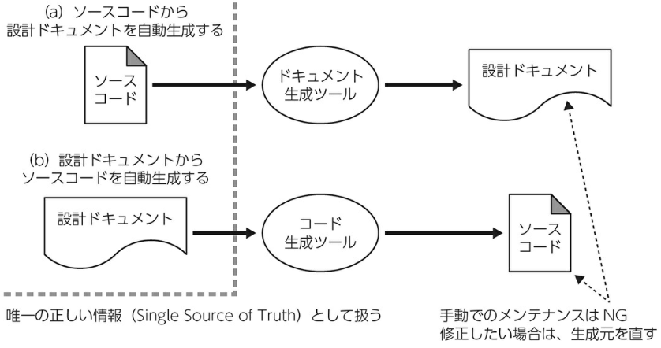
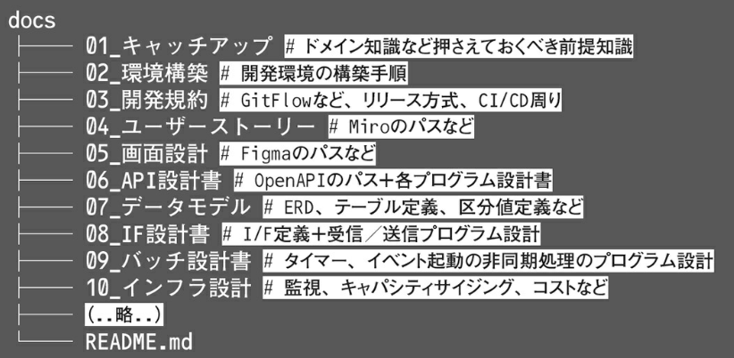
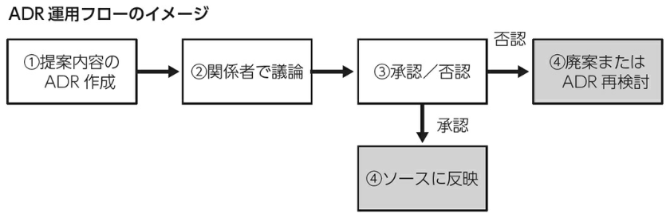
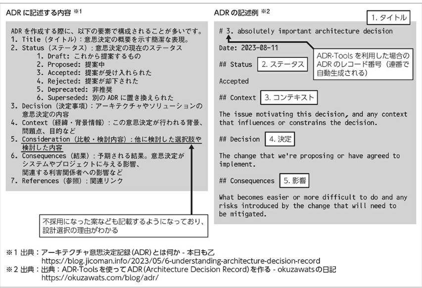
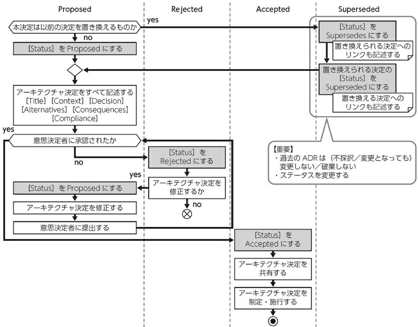
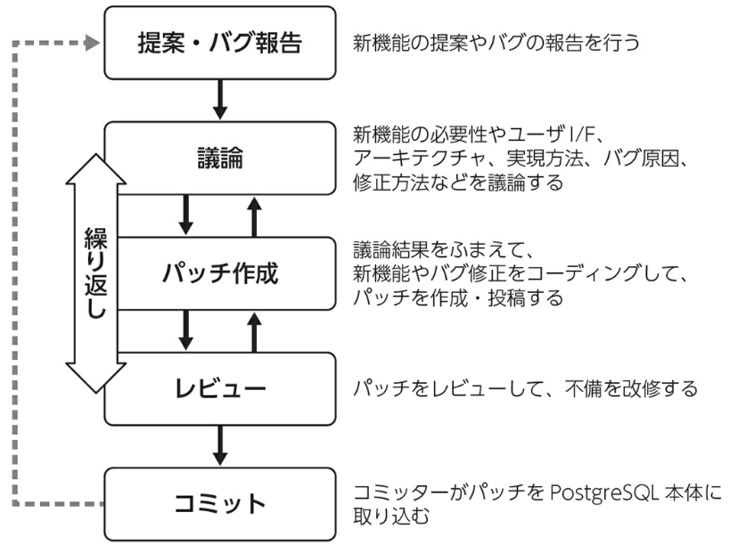

date:2024年10月  

雑誌『Software Design 2024年10月号』  
第1特集 再考 設計ドキュメントの課題 二重管理しない、陳腐化させない  
https://gihyo.jp/magazine/SD/archive/2024/202410  

---

＜目次＞  

- [概要](#概要)
- [第1章：受託開発における設計ドキュメントの課題と解決案](#第1章受託開発における設計ドキュメントの課題と解決案)
  - [チームそれぞれで異なる設計ドキュメントに対する考え方](#チームそれぞれで異なる設計ドキュメントに対する考え方)
  - [設計ドキュメントの難しさ](#設計ドキュメントの難しさ)
    - [ソースコードとの同期](#ソースコードとの同期)
  - [設計書ドキュメントのGit管理のすすめ](#設計書ドキュメントのgit管理のすすめ)
  - [Git管理に向かない設計ドキュメント](#git管理に向かない設計ドキュメント)
  - [設計ドキュメントの価値を上げるために](#設計ドキュメントの価値を上げるために)
  - [まとめ](#まとめ)
- [第2章：ADRを活用してドキュメントとコードの一致を実践](#第2章adrを活用してドキュメントとコードの一致を実践)
  - [直面した問題](#直面した問題)
    - [問題点：開発物が散乱している](#問題点開発物が散乱している)
    - [問題点：開発の背景がわからない](#問題点開発の背景がわからない)
    - [問題のまとめ](#問題のまとめ)
    - [問題解決に向けて](#問題解決に向けて)
  - [ADR (Architecture Decision Records)](#adr-architecture-decision-records)
    - [ADRとは](#adrとは)
    - [ADRは何を書くもの？](#adrは何を書くもの)
    - [ADRの作成方法](#adrの作成方法)
    - [ADRの運用](#adrの運用)
    - [ADRの導入効果および弊害](#adrの導入効果および弊害)
    - [ADRの導入に際して注意すること](#adrの導入に際して注意すること)
- [第3章：設計書なしでも各人が疎結合で開発できるために](#第3章設計書なしでも各人が疎結合で開発できるために)
    - [筆者たちのチームの設計手法変遷と生じた課題](#筆者たちのチームの設計手法変遷と生じた課題)
    - [課題解決の検討](#課題解決の検討)
    - [フロントエンドとバックエンドのチーム分割」の効果](#フロントエンドとバックエンドのチーム分割の効果)
  - [設計書を書かない設計工程](#設計書を書かない設計工程)
- [第4章：「コードがドキュメント」を地で行く開発スタイル](#第4章コードがドキュメントを地で行く開発スタイル)
  - [「コードがドキュメント」を地で行くには](#コードがドキュメントを地で行くには)
    - [開発者全員がコードを読み書きできる](#開発者全員がコードを読み書きできる)
    - [きれいなコードが書ける](#きれいなコードが書ける)
    - [コードレビューが必須](#コードレビューが必須)
    - [レビュアーを開発チーム内のメンバーに限定しない](#レビュアーを開発チーム内のメンバーに限定しない)
    - [テストコードも必ず書く](#テストコードも必ず書く)
    - [採用と育成に時間をかける](#採用と育成に時間をかける)
  - [ドキュメントはいっさい書かない、わけではない](#ドキュメントはいっさい書かないわけではない)
    - [READMEファイル](#readmeファイル)
    - [画面設計書](#画面設計書)
    - [作業手順書](#作業手順書)
    - [補足ドキュメントとコードコメント](#補足ドキュメントとコードコメント)
    - [外部向けのAPIドキュメント](#外部向けのapiドキュメント)
    - [ER図](#er図)
    - [タスク管理ツールのチケットURLとコミットメッセージ](#タスク管理ツールのチケットurlとコミットメッセージ)
    - [注釈](#注釈)
- [第5章：OSS開発のドキュメント事情](#第5章oss開発のドキュメント事情)
  - [PostgreSQL開発プロジェクトのケース](#postgresql開発プロジェクトのケース)
    - [PostgreSQLの設計情報](#postgresqlの設計情報)
    - [設計情報以外にコードの理解を容易にするしくみ](#設計情報以外にコードの理解を容易にするしくみ)
    - [まとめ](#まとめ-1)
  - [OSS開発プロジェクトにはヒントがたくさん](#oss開発プロジェクトにはヒントがたくさん)

---

# 概要

ITエンジニアにとってドキュメントは悩ましい問題です。関係者との合意形成や情報共有のために必要なものの、コードができあがってくると、コードと同期をとって保守しなければならない気が重い存在となります。  
世の中には、「ドキュメントはなくせない」とする現場がある一方で、「エンジニアならコードを読めばいい」とする現場もあります。  

ドキュメントを作る/作らないどちらにも利点と欠点がありますが、それぞれの現場ではどのように利点を活かし、欠点を補っているのでしょう。本特集では、いくつかの開発現場におけるドキュメントとの付き合い方を紹介します。  

# 第1章：受託開発における設計ドキュメントの課題と解決案

※この章は内容をだいぶ端折りました  

## チームそれぞれで異なる設計ドキュメントに対する考え方

とくに大規模な開発体制を取る場合、それをリードするアーキテクトは非常に優秀なことが多いです。彼ら彼女らは設計ドキュメントからソースコードを自動生成するなどのしくみを整え品質と生産性向上を目指します。  

一方で、10名にも満たないような規模感では、開発メンバーのスキルセットのばらつきも抑えられるため、難解になりやすい自動生成などのしくみや、独自仕様になりがちな設計ドキュメントを避け、より少ない設計ドキュメントで開発を行うこともあり得ます。  

そのほかの要因として、メンバーの入れ替わりが激しいと想定されるケースなどでオンボーディングコストを少しでも下げたい場合や属人性を下げたいケースは、短期的な開発生産性を下げてでも設計ドキュメントを重視することがあります。  

## 設計ドキュメントの難しさ

### ソースコードとの同期

設計ドキュメントの扱いで困ることに、「ソースコードと同期を取れず、陳腐化してしまう」ということがあります。これは設計ドキュメントをもとに実装されたソースコードを、何かしらの理由で修正した際に、設計ドキュメント側の修正が漏れ、不整合になった状態を指します。ソースコードと設計ドキュメントのどちらが正なのか、更新日時やコミットログから確認する手間も増えます。  

「たかだか設計ドキュメントの修正をしなかっただけ、『意識の問題』でしょう」と甘く考える人も多いです。その認識自体は間違っていないのですが、現実的に「ビジネス的に最優先での対応が必須で、設計ドキュメントはあとで直す」といった姿勢を取る開発者を完全にゼロにすることは難しく、とくに開発規模が大きくなるとなおさらです。全員が高い意識を持たなければ保てないしくみは誤っています。マーフィーの法則に「失敗する余地があるなら、失敗する」という経験則がありますが、腐る余地があるものは必ず誰かが腐らせるのです。また、「あとで直す」という言葉は信じてはなりません。経験上、ごく限られたケースのみでした。  

こういった非生産的なやりとりを避けるため、次の方針を採用することが重要です。

1. 設計ドキュメントにも保守コストがかかることを理解し、できる限り余計なものを作成しない
2. 作成フローを一方通行にすることで、ソースコードと設計ドキュメントのダブルメンテナンスを避ける
3. 設計ドキュメントとソースコードの整合性を取るため、レビューや静的解析のチェックで同期を取る

2.の方法には次の方法があります：  

1. ソースコードから設計ドキュメントを自動生成する
2. 設計ドキュメントからソースコードを自動生成する

1.では「ソースコード」、2.では「設計ドキュメント」が **唯一の正しい情報(Single Source of Truth)** となります。初期段階だけでなく、CIなどで再生成して問題ない作りにしなければなりません。

自動生成の例：  

## 設計書ドキュメントのGit管理のすすめ

ソフトウェア設計も漸進的な進化をすることが当たり前な時代となりました。そのため、Markdownベースのテキストファイルで設計ドキュメントを構成し、ソースコードと同様に Git 管理する発想に向かうのは自然でしょう。これには次のようなさまざまな利点があります。  

- Pull Requestベースのレビューフローを設計ドキュメントにも適用できる
- 同一Pull Requestでソースコードと設計ドキュメントをマージでき、履歴管理をきれいにできる
- 開発で利用するサービスを減らせるため、認知負荷を下げることができる
- コーディング、設計ドキュメントともにVisual Studio Code（VS Code）などのエディタで完結できる
- CI/CDでフォーマッター、リンター、コード生成を組み込み効率化を図りやすい

## Git管理に向かない設計ドキュメント

Markdownで巨大な表形式のコンテンツを扱うことは難しく、Excelの操作性に軍配が上がります。ある程度であればMarkdown上にHTMLの `<table>` タグを書くことで緩和できますが、大量に必要となる場合は無理せずExcelなどで管理するほうがよいでしょう。

## 設計ドキュメントの価値を上げるために

設計ドキュメントの体系を決めておくとよいでしょう。

設計ドキュメントの体系例：  

## まとめ

開発者から見ると「設計ドキュメントをなるべく書かないことが正義」という方法に傾きがちですが、契約／組織の形態によってはマネージャーやアーキテクトの立場から必要と判断することがあります。  

本章では、このときにGit管理と相性が良いMarkdownなどのテキストベースで設計ドキュメントを構築するメリットを説明しました。さらに中長期的な視点で見ると、テキストベースで作成すると生成AIなどに学習させやすいことがあり、将来の布石にもつながります。唯一の正しい情報（Single Source of Truth）などの原則をよく守り、健全な設計ドキュメントを育てていきましょう。

# 第2章：ADRを活用してドキュメントとコードの一致を実践

## 直面した問題

### 問題点：開発物が散乱している  

設計ドキュメントが最新化されておらず、ソースコードと対応していない。  

問題の背景：  
修正・改修方針は、メールやチャット、Teamsなどといったコミュニケーションツールを使い、そのやりとりの中で決定していた。そこで決定した内容が該当チケットや該当設計ドキュメントに反映されず、ソースコードのみが修正されていた。

### 問題点：開発の背景がわからない

ソースコードを読み解いていると、プログラムの動きは理解できるが、「いくつか実装方式が考えらえる中で、なぜ該当の実装を選択したのか（もっと効率的な実装があるのに）」がソースコードからは判断できず、当該の設計ドキュメントにも記載がない。  
なぜ、その実装方法を選択したのかを理解することは、今後、製品を保守していくうえで発生する、機能改造、リファクタリング、バグ改修を実施するうえでとても重要です。  

### 問題のまとめ

技術的負債は可視化して定期的に返済していくことが重要で、金銭的負債と同様に返済しなければ利子が増大し、返済不能(ソフトウェアの場合はメンテナンス不能)となります。  

ソフトウェアのライフサイクルの期間中は、開発メンバーの入れ替わりや体制そのものの変更が発生することが想定されます。そのため、開発メンバーの入れ替わりや体制変更に備え、設計方針や設計ドキュメントのメンテナンスも、ソースコードと同様に、最新化されていることがとても重要です。  

- 設計ドキュメントがアップデートされておらず、ソースコードと食い違いが発生しているため、保守や機能改善で使えない
- 設計ドキュメントやナレッジがWiki、メール、チケットなどに散乱しており、最新状況がわからない状態になっている
- アーキテクチャ選択の理由が設計ドキュメントやソースコードから判断できない
- アーキテクチャ選択した理由やスペック、制約事項などに関する履歴がないため、今後、保守や機能強化することが困難であることが想定される

### 問題解決に向けて

現状整理をおこなう  

- 成果物の棚卸
- 課題の整理

課題の整理をおこなう

例：
- 成果物の管理方式の違いの解消
- 設計ドキュメントの最新化
  - ソースコードと同じように、設計ドキュメントの承認ワークフロー
- アーキテクチャ選択の背景の記録
  - ADRの導入。開発者ごとに記載粒度に幅が出てしまうので、フォーマットを決めて強制的にルール化できるしくみを検討

## ADR (Architecture Decision Records)

### ADRとは

ADRとは、ソフトウェア開発やシステム開発において、アーキテクチャに関する重要な意思決定を記録するための文書です。なぜその決定が行われたのかを説明し、将来同じ問題に直面した際にその背景を理解・議論するためのものです。  
ADRは、2022年にはアーリーアダプターであったのが、2023年にはアーリーメジャーに移行しています。このことから、近年注目されている技術といえます。  

ADRの書式は通常はテキスト形式で、MarkdownかAsciidocで記述することが多いようです。  

### ADRは何を書くもの？

特定のアーキテクチャの決定およびアーキテクチャ決定の履歴をとるためのものです。ADRは要件(≒機能)ごとに起票します。  
**ADRを運用する際に重要なのは履歴を取ることです。アーキテクチャが変更になったとしても、過去のADRは廃棄せずに残しておくことが重要です。**  

ADRのテンプレート：  

### ADRの作成方法

テキスト形式で作成されることが多いため、テキストエディタで作成することも可能ですが、運用・保守を考慮すると [ADR-Tools](https://github.com/npryce/adr-tools)  を活用するほうがよいでしょう。  

ADR-ToolsはADRを管理するためのCLIツールです。  

### ADRの運用

筆者がADRを導入した理由：

1. 設計ドキュメントが最新化されて、ソースコードと同期がとれている状態にしたい
2. ナレッジを一元的に管理したい
3. アーキテクチャ選択の背景を開発メンバー全員が認識する必要がある
4. 設計ドキュメントは保守やその後の追加開発などにも使用するので、アーキテクチャの見直しや、スペックの拡大、制限緩和・制限撤廃など仕様の見直しが発生した場合の履歴を残しておきたい

ちなみに、1.および2.のみの改善であれば、Gitを活用することにより設計ドキュメントとソースコードの同期は実現できます。しかし、長期にわたり運用・保守することを考慮すると、開発要員や体制の変更などは不可避であり、3.と4.も併せて考慮する必要があったため、ADRの導入が必要不可欠であると考えました。  

運用フローの例：  

  

### ADRの導入効果および弊害

筆者が参加するプロジェクトにてADRを導入して1年が経過し、ADRの導入効果および弊害についてを説明。  

<導入効果>  

- 開発メンバー全員がアーキテクチャの重要性を認識するようになった。
- 後に履歴として参照できるため、当時の開発の経緯がわかり、保守や機能拡張などの見通しがよくなった。これにより、ある決定に対して下された決定理由がわからず、繰り返し議論するといった不要なアーキテクチャ議論を削減できた。
- 新規の開発メンバーが入職した際、開発の経緯などの説明もスムーズになった。
- ソースコードと設計ドキュメントが一元管理でき、常に最新化を保った状態にあるので、保守資料として活用できるようになった。

<弊害>  

- つねにADRの起票・承認フローが発生するので開発のオーバーヘッドが発生する。

ただし、運用・保守まで考慮したソフトウェアのライフサイクルを考慮すると十分に費用対効果があると考えらる。  

### ADRの導入に際して注意すること

Gitでの管理の場合、プロジェクトの体制によってはアクセス権がなく、Gitにアクセスできないない場合などもあるので注意が必要です。  

WikiなどでADRを運用する場合、手軽に参照・更新が必要な反面、ソースコードとADRなどの設計ドキュメントとの同期状態を保つための運用をコントロールする必要があります。

# 第3章：設計書なしでも各人が疎結合で開発できるために

##「設計書を書かない設計工程」導入のきっかけ

### 筆者たちのチームの設計手法変遷と生じた課題

当初はフロントエンドとバックエンドに分かれて開発を行っていた。頻繁に小規模な機能追加や改修を行うかたちになり、1人で1案件を担当し全員がフルスタックエンジニアとしてフロントエンドとバックエンド両方の開発を行うようになっていき、案件リリースを優先するあまり設計工程を省略しがちな状況になってしまった。  

実装時のルールがあいまいになり、ソースコードが複雑化かつ肥大化してしまった。新規開発では実装後にコードを読めば仕様がわかる状態になっていることが多くそれほど問題ではなかったが、改修ではあいまいな状態が影響して回収するたびに分岐や処理が増え、実装後にコードを読んでも仕様の把握が難しくなってしまった。  
また、フロントエンドとバックエンドの両方を担当することで自由度が高くなり、フロントエンドで実装すべき表示に関する処理を担当者の得意領域のバックエンドで実装するなど、実装時の手軽さを優先してしまったこともプログラムコードの複雑化の原因となった。  

### 課題解決の検討

課題は主に設計手法に起因しており、解決のためには設計手法を改善するしかありません。プログラムコードの複雑化を防ぐには、機能設計やデータ設計、プログラム設計などを実施し、機能をどのようなしくみで、どこに実装するのかを明確にする必要があります。  
しかし、設計書を作成するとなると、作成作業に時間がかかるだけでなく、設計書の内容を最新に保つことにも時間がかかります。たとえば、インターフェース項目の型が誤っていた場合、プログラム修正に併せて設計書も修正するという手間が発生してしまいます。ほかにも、修正漏れが発生すると再発防止のためにチェックリストを作成し運用するなど、芋づる式に作業ルールが増えてしまうという負のサイクルに陥るケースもあります。そして、そこまでコストを掛けて作成した設計書であっても、案件終了後に見返すことはほとんどありません。  

そこから、コストをかけず開発スピードも落とさずに設計できる方法を考えて、「設計書を書かない設計工程」を導入することにしました。「設計書を書かない設計工程」とは次のような複数の取り組みから、設計書を書かずとも混乱なく開発を進めていけることを指しています。

・アプリケーション外部のドキュメントに設計情報を記載しない
・単一責任原則によりアプリケーション構造をシンプルに保つなどの開発ルールを定める
・ドキュメントではなく、アプリケーション部品の標準化を行う

また、メンバーのスキルセットと体制の不一致や、開発プロセスにも起因した課題でもあるため「フロントエンドとバックエンドのチーム分割」を行いました。

### フロントエンドとバックエンドのチーム分割」の効果

フロントエンドとバックエンドを一括して担当していたときは、テストコードを書くのがおっくうだったり、業務やデータパターンを考慮した動作や異常系の動作確認もおろそかになったりすることがありました。 
これは、フロントエンドを開発しているときに、画面操作でバックエンドの動作確認ができてしまうため、ある程度テストをした気になってしまい、テストコードを書くモチベーションが低下していったことが要因の1つと考えています。  
今回の取り組みにより担当範囲が局所的になったことで、テストコードを書くことが容易になり、確認パターンも多くなり品質が向上しました。

## 設計書を書かない設計工程

1. OpenAPIの導入：OpenAPIを導入しただけでは開発が速くなったり正確になったりしません。あわせてしくみを導入しました。
   - OpenAPI Typescript Codegen
   - Committee
   - Committee::Rails
2. 内部アーキテクチャ改善：MVCフレームワークから、オニオンアーキテクチャへ移行。単一責任原則。
3. スケルトン実装によるコンポーネント設計
4. デザインシステム導入

# 第4章：「コードがドキュメント」を地で行く開発スタイル

本章では、従来の一般的な受託開発において必要不可欠とされていたドキュメントをなくした開発スタイルを紹介します。

## 「コードがドキュメント」を地で行くには

### 開発者全員がコードを読み書きできる

開発者全員がコードを読み書きできる。「仕様書は書けますがコードは書けません」というエンジニアはいません。

### きれいなコードが書ける

いくら開発スピードが速くてもぐちゃぐちゃで誰も読めないコードができあがってしまってはドキュメントの意味をなしません。  
わかりやすく、美しく、シンプルなコードが書けることが当然のように求められます。  

### コードレビューが必須

自分がいくらきれいだと思っていても、ほかの開発者が首をかしげるようなコードを書いていては意味がありません。mainブランチにマージできるのは、ほかの開発者が太鼓判(承認ボタン)を押したコードだけです。  

妥協しないコードレビュー[^1]

### レビュアーを開発チーム内のメンバーに限定しない

プルリクエストを作成すると、社内の情報共有ツールに自動的に通知が飛びます。コードレビューは基本的に誰がやってもOKです。  

「えっ、でも仕様がよくわかってないとちゃんとコードレビューできないのでは？」と心配する人もいるかもしれません。
ですが、これは実は逆なんです。開発チーム外のメンバーがレビューすると「事前知識がない状態でそのコードを読んだときに、ちゃんと仕様が理解できるか」とか「このコードをもし自分が保守すると言われたら、ドキュメントなしで保守できる自信があるか」といった観点でレビューできます。
つまり、「コードを仕様書として読めるかどうか」が承認の基準になり、コードの品質がより向上するのです。  

### テストコードも必ず書く

何度も書いているとおり、コードはドキュメントです。それに加えて、テストコードもまたドキュメントです。  
メソッドの単体テストがあればそのメソッドの仕様が明確になりますし、E2Eテストはユーザーから見た具体的なユースケースを確認するのに役立ちます。  
可読性と網羅性の高いテストコードはそれだけで十分ドキュメントの役目を果たします。  

### 採用と育成に時間をかける

「コードがドキュメント」を地で行こうとすると、スキルの高い開発者を集めないと実現できません。  

開発者を集めることは難しい問題であり、簡単に解決できる銀の弾丸はありません。そのため、次のような「時間と手間がかかるアプローチ」を取っています。  

- 採用に時間をかけて本当にスキルの高いプログラマーだけを採用する
- 育成に時間をかけてスキルの高いプログラマーに育て上げる

つまり、「人手が必要だから」という理由で現場に参加するハードルを安易に下げないことが大事です。逆に言うと、一定のハードルを越えた人たちだけで開発チームを作れば、「コードがドキュメント」を地で行くことができるというわけです。  

## ドキュメントはいっさい書かない、わけではない

何がなんでも絶対にドキュメントは書かないぞ！というスタンスでやっているわけではありません。必要であれば適宜ドキュメントは作ります。ですが、あくまで「必要に応じて」です。会社として「このドキュメントは必ず作成するように」と決まりがあるわけではないので、どういうドキュメントを残すのかは基本的に開発者の裁量で決まります。
とはいえ、どのプロジェクトでもある程度同じ傾向にあるので、その具体例をいくつか紹介します。

### READMEファイル

システムの概要や本番環境・テスト環境のURL、開発環境のセットアップ方法など、途中から参加した開発者がまず知りたい情報は開発リポジトリのREADMEファイルに記述します。  

### 画面設計書

画面設計をするときは何かしら視覚的な情報があったほうが議論しやすいので、簡易的な画面設計書を作成します。  
開発が進んで目の前に動く画面が現れれば、それを見ながら議論ができます。よって、作成した画面設計書が継続して更新されることはありません。  

### 作業手順書

作業はなるべく自動化するようにしていますが、ものによっては自動化しづらい作業もあります。そうした作業は手順書やチェックリストを作り、それを見ながらミスや抜け漏れがないように注意しながら作業します。  

### 補足ドキュメントとコードコメント

巨大なSQLや複雑な外部連携処理など、「これはコードを読むだけではさすがに理解しづらいのでは」と思われるケースでは別途補足ドキュメントを作成することがあります。  
そして、コード内にコメントとしてそのドキュメントへのURLを載せておきます。  

### 外部向けのAPIドキュメント

外部向けのWeb APIを提供する場合は、利用者に向けて情報伝達をしなければならないのでAPIドキュメントを作成します。  
ただし、ソースコードから自動生成するようにします。  

### ER図

場合によっては、テーブル間の関連をER図として視覚的に確認したいときもあります。

### タスク管理ツールのチケットURLとコミットメッセージ

コミットメッセージに開発チケットのURLを残しておくと、その機能がどういう背景や目的で実装されたのかあとから追いやすくなります。  

### 注釈

[^1]: 妥協しないコードレビュー https://logmi.jp/tech/articles/330193  

# 第5章：OSS開発のドキュメント事情

設計思想や実装の意図をどうやって伝えているか  

## PostgreSQL開発プロジェクトのケース

PostgreSQLの開発では、コアチームメンバーやコミッターが独裁的に方向性を決めることはありません。すべての技術的な方針はオープンな場で議論され、コミュニティ内で合意を得ながら進める文化が根付いています。  

PostgreSQL開発のフロー：  

### PostgreSQLの設計情報

設計書を事前に作成してから開発を進めるという手順はとっていません。しかし、設計情報が記録されないわけではありません。ソースコメントやREADMEファイル、ドキュメントを通じて設計情報を提供し、これにより開発済みの機能やコード、アーキテクチャを将来の開発者が理解しやすいようにしています。

<ソースコメント>  
ソースコードには設計情報が詳しく記載されています。プロセスや関数、変数、処理の概要、引数や戻り値の意味、注意点など、コードを理解するために必要な情報が含まれています。とくに重要なのは、なぜそのようなロジックやコードが採用されているのかという、コードを一見しただけではわからない理由や背景がソースコメントで説明されている点です。PostgreSQLのソースコードには、十分で正確なソースコメントが求められており、パッチを提案する際にソースコメントが不足していると、レビューで指摘されます。

<READMEファイル>  

アーキテクチャ上の重要なポイントについて、ソースコメントだけでは書ききれない場合など、READMEファイルにまとめられることもあります。  
たとえば、インデックスのB-treeに関するREADMEファイルには、どの論文をベースに実装されているか、どのようなアルゴリズムが使われているか、そしてVACUUMなどのPostgreSQL特有の設計について詳細な情報が記載されています。ロックマネージャに関するREADMEファイルには、ロックの種類、内部構造、デッドロックの検出方法や性能改善に関する情報が詳しく説明されています。  

### 設計情報以外にコードの理解を容易にするしくみ

作成した本人以外の開発者がそのコードを読み理解しやすくするため、次のような工夫も施されています。  

わかりやすい命名：関数名、変数名、プロセス名などは、その名前から処理の概要が想像できるように名付けられている。この命名については、パッチレビュー時にコメントがつくこともある  

コード整形ツール：PostgreSQL専用のコード整形ツール（pgindent）があり、ツールを使用してコードを見やすい状態に整形している  

詳細なコミットログ：コミットログには、一言で終わらせずに、改修内容、目的、効果、注意事項、設計上の考慮点などが詳しく記載される。これにより、あとで改修内容を振り返りやすくなっている。関連するコミットのIDや議論したメーリングリストへのリンクも記載され、改修の背景を追跡しやすくなっている  

### まとめ

PostgreSQLコミュニティではソースコメントによる設計情報の記録など、開発者がコードを理解しやすく、スムーズに開発を進められるような工夫・しくみが施されています。このような取り組みが、30年以上の歴史を持つPostgreSQLが現在も積極的に開発され、進化し続けている理由の1つと言えます。

## OSS開発プロジェクトにはヒントがたくさん

企業内のプロジェクトとは異なる考え方や方法だとしても、必要となる設計思想や影響などをさまざまな方法で記載して残しています。とくに、多くの人が関わり、長く使われているソフトウェアでは、その傾向が強いようです。  

設計と実装やユーザー向けドキュメントなどを一体として管理していること、レビューアーなどの権限と責任を有する開発者が変更内容を俯瞰的に確認してフィードバックしていることなどは、みなさんのプロジェクトでも役立つ知見ではないでしょうか。  

OSS開発の現場では、プロジェクトの進め方という観点でも多くの人の英知が反映されています。多くのプロジェクトがオープンな形で進めていますので、ぜひその様子を見てみてください。みなさんのプロジェクトでも活かせるヒントがたくさんあるはずです。  

