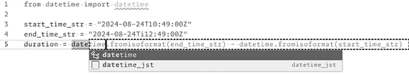
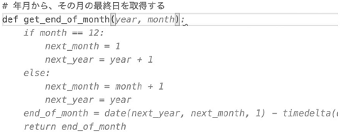
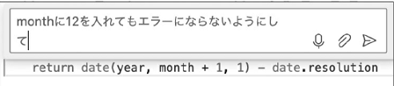
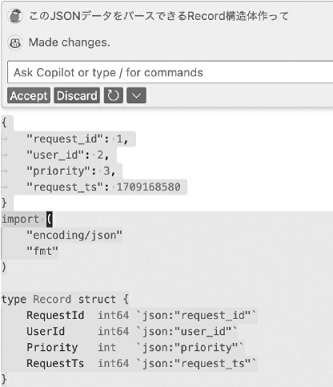
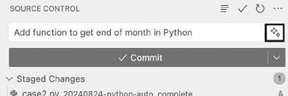

date:2024年10月  

雑誌『Software Design 2024年11月号』  
第1特集 はじめてのAI駆動開発  
[https://gihyo.jp/magazine/SD/archive/2024/202410](https://gihyo.jp/magazine/SD/archive/2024/202411)  

---

# 目次

- [目次](#目次)
- [GitHub Copilot](#github-copilot)
  - [GitHub Copilot とは](#github-copilot-とは)
  - [導入](#導入)
  - [コード提案](#コード提案)
  - [コード補完](#コード補完)
  - [Copilotが参考にする情報](#copilotが参考にする情報)
  - [関数名やコメントが最大のヒント](#関数名やコメントが最大のヒント)
  - [チャットで指示する](#チャットで指示する)
    - [例 エラーを修正する指示](#例-エラーを修正する指示)
    - [例 番号を振りなおす指示](#例-番号を振りなおす指示)
    - [例 JSONデータテキストから構造体・クラスを出力する](#例-jsonデータテキストから構造体クラスを出力する)
    - [例 マークダウン内の画像を横幅50%のimgタグに置き換える](#例-マークダウン内の画像を横幅50のimgタグに置き換える)
    - [専用コマンド](#専用コマンド)
    - [チャットの活用のポイント](#チャットの活用のポイント)
  - [コミットメッセージの生成](#コミットメッセージの生成)
  - [ターミナルコマンド生成](#ターミナルコマンド生成)
  - [Copilot活用の注意点](#copilot活用の注意点)
- [生成AIを使用する際のポイント](#生成aiを使用する際のポイント)
- [AI駆動開発の将来](#ai駆動開発の将来)
  - [LLMの技術進化](#llmの技術進化)
  - [開発サイクル全体の高速化](#開発サイクル全体の高速化)
  - [課題](#課題)
    - [著作権の取り扱い](#著作権の取り扱い)
      - [生成された成果物の著作権](#生成された成果物の著作権)
    - [再現性](#再現性)
    - [セキュリティ](#セキュリティ)
      - [脆弱性のあるコードの生成](#脆弱性のあるコードの生成)
    - [責任の所在](#責任の所在)
  - [章のまとめ](#章のまとめ)

# GitHub Copilot

## GitHub Copilot とは

GitHub社が提供するAIペアプログラマーサービスです。  
「AIペアプログラマー」とあるように、生成AIでソフトウェア自体を生成させるのではなく、ユーザーの開発を **補助するため** のサービスとして位置づけられています。  

## 導入

契約には2タイプあります。  

- 個人 (Individuals)
- 会社等の組織 (Business)

Businessを利用すると、組織のニーズに対応したデータ管理ポリシーや利用規約をOrganization単位で適用し、「Chat」や「CLI」などの機能を機能単位で利用できます。  

Organizationでは、公開コードと一定以上一致するコードは補完しない「Suggestions matching public code (duplication detection filter)」という機能が使えます。意図せずオープンソースを組織のコードに巻き込み、ライセンスを侵害するリスクを排除できるため、これをオンにしておくとよいでしょう。  

## コード提案

簡単な例ですが、Pythonで、2つの日付の文字列start_time_str、end_time_strから、その間の秒数durationを求めるコードを書いてみます。  
ひとまず、次のように記述します。  
```
start_time_str = "2024-08-24T10:49:00Z"
end_time_str = "2024-08-24T12:49:00Z"
duration = 
```
この続きのコードを `date` と記述すると、Copilotは実装を、変数名などの前後のコードから提案します。



図のように薄い色でエディタ上に表示されます。この提案を受け入れる場合には [Tab] を押します。

## コード補完

Pythonで入力した年月の月末を取得する関数get_end_of_monthを実装しようとします。  
関数名の定義をdef get_end_of_month(とまで入力すると  



図のように提案が表示されます。関数名から推測して関数内の実装がまるっと提案されています。  

ただし、通常のコード補完と異なり、AIによる推論であるため、コンパイルエラーや実行エラーがないコードであることを保証していません。

## Copilotが参考にする情報

Copilotは、カーソルの前後のコードを読み取り、学習した公開コードのコーディングパターンを利用して推論します。編集中のコード以外にも、同じディレクトリのほかのファイルや、現在別のタブで開いているファイルの内容が参照されます。すでに実装済みのコードと同じパターンの処理を実装する場合、そのファイルを開いておくと近いコードになるように提案してもらいやすくなります。

## 関数名やコメントが最大のヒント

関数や変数の定義名を記述する際に、その名前が実装に具体的であれば、Copilotはその意図を理解して提案を行います。よって定義名を丁寧に付けることは効果的です。

処理の前や、関数にコメントを付けると、そのコメントの意図を読み取ってくれます。最終的に残さないコメントをCopilotのために記述し、実装後に過剰なコメントを削除するのも有用です。  

例:  
```
# 時刻間の時間を秒数で求める
duration: int = 
```
 ↓ 補完
```
duration: int = (datetime.fromisoformat(end_time_str) - datetime.fromisoformat(start_time_str)).total_seconds()
```

## チャットで指示する

Win: [Ctrl]+[I] でチャット  

編集箇所にカーソルを移動したり、範囲選択した状態でチャットを開いて指示します。  

Win: [Ctrl] + [Enter] で確定  
提案が適切ではない場合、さらに指示を出すことも可能  

### 例 エラーを修正する指示

  

### 例 番号を振りなおす指示

列挙型に後から列挙が増えた場合、1から順に振っていた数値をずらす必要があります。  
Enumクラスの全体を選択し、「採番し直して」と指示できます。  

### 例 JSONデータテキストから構造体・クラスを出力する

JSONデータのテキストからGo言語の構造体を出力させる例です。  


「IDにはuint型を使って」などの希望がある場合、一度確定したうえで、チャットで追加の指示を出しましょう。  

このテクニックは、プログラム言語を他のプログラム言語に変換させることにも使えます。  

### 例 マークダウン内の画像を横幅50%のimgタグに置き換える

マークダウンで画像を表示する場合  
```

```
といったように記述しますが、GitHubのマークダウンの仕様には画像の横幅に関する記法が存在しておらず、HTMLのimgタグで記述する必要があります。この書き換えについて量が多いと面倒に感じることがあるかもしれません。  

このとき、ファイル全体を選択したうえで、「画像をimgタグを使って横幅50%になるように記述し直して」と指示すると、すべての書き換えを行ってくれます。  

### 専用コマンド

チャット機能にはコマンドが用意されています。

```
# テストを作成する
/tests

# ドキュメントコメントを作成する
/doc

# 発生しているエラーを修正する
/fix
```

### チャットの活用のポイント

- 1回の指示で多くのことを盛り込まない
  - 長文の指示を書くよりも、過程を1つずつ指示するほうが理解されやすい
- 抽象的な指示は理解してもらえない
- 2,3回のプロンプト変更で意図通りのコードが生成できない場合はプロンプトを練るより、自分の手で実装した方が早いことが多い

これらのポイントは今後のLLM技術の進化で解消される可能性もあります。  

## コミットメッセージの生成

Gitのコミットメッセージの入力欄の右側にCopilotを呼び出すボタンがあります。  



このボタンを押すと、ステージングされているファイルからコミットメッセージを考案してくれます。  
ただし、編集した意図を表す内容にまではならないようです。  

## ターミナルコマンド生成

ターミナル上でも `Win: [Ctrl]+[I]` でプロンプトを入力でき、コマンドを提案してもらえます。  


## Copilot活用の注意点

- 最新のプログラミングの現状を熟知しているわけではない
  - 学習元はGitHub上の公開コードである
    - 学習日は、2022年の時点では2021年9月に学習したとなっている
    - 現在では非推奨なコード、アンチパターンになっているコードも含まれている
- 必ずしも正しく動くコードが提案されるわけではない
  - 必ず動作テストしましょう
- 生成されたコードの採用に責任を持つのは実装者
  - コードレビューにおいて内容を問われて「Copilotに提案されたから」で説明を完了させないようにしましょう

# 生成AIを使用する際のポイント

- 最新サービスは反映されない
  - 学習データの更新頻度に依存する
- 機密情報は入力しない
  - アクセスキー、シークレットキー、パスワード等の機密情報が入力情報に含まれると、使用するモデルによっては生成AIが機密情報を学習し、思わぬセキュリティ事故を引き起こす可能性がある
  - 入力情報を学習しないことが明記されているモデルを使用する
- 出力されたコードの検証が必要
  - 必ずしも正確で最適化されているとは限らない

# AI駆動開発の将来

## LLMの技術進化

直近のLLMの進化を妨げる要因はまだ見つかっていない状況でもあり、必然的に今後もLLMの進化は進むと紹介されています。  
一方で、学習データの枯渇、電力問題等が課題として挙げられています。ただし、アルゴリズムの改良やハードウェアの進化も急激に進んでいるため、これらの課題を乗り越えてLLMの進化が進む可能性も十分高いと言われています。  

## 開発サイクル全体の高速化

今後はコーディングだけではなく、要件定義から、デザイン、設計、テスト、デプロイまで幅広くAIを用いて実施していく方向に波及すると予想されます。  

- AIが伴走するかたちで要件定義・機能定義を行うサービス
- 品質保証・テスト
  - ユニットテストのベースの作成やテスト項目の作成
  - テスト計画・テスト項目の作成、実施、評価
- 新人の開発者の育成におけるトレーナー

## 課題

### 著作権の取り扱い

- 学習データに関する著作権
- AIサービス利用時の著作権
- 生成された成果物の著作権

#### 生成された成果物の著作権

受託開発のような納品物としてソースコードが含まれ、またその著作権の所属が契約上定義される場合に、契約時点から生成AIを用いて開発する範囲、利用するツール等を記載したうえで、著作権の扱いについて認識を合わせておくことが重要になります。

### 再現性

LLMは元来確率的なモデルであり、同じ入力に対して毎回異なる出力を生成する可能性があります。  
LLMには厳密な再現性がありません。

なお、`Devin`、`AutoDev` に代表されるアプリ開発用のAI Agentの場合では、生成・検証・修正が内部的に繰り返されることにより高度なコードの出力が行われています。  

### セキュリティ

- コードの漏洩
- 学習への利用
- 機密情報や個人情報の漏洩

LLMサービス自体のセキュリティ、入力情報がLLMの学習に利用されるか、などの確認が必要です。

#### 脆弱性のあるコードの生成

LLMは非常に膨大なデータ(公開されているコード)から学習を行います。誤った判断や予測をしてセキュリティ上問題のあるコードを生成する可能性があります。先に述べたように **トレーニングデータポイズニング** などの手法により、脆弱性のあるコードを狙った攻撃が発生する可能性もあります。

### 責任の所在

AIを利用してコード生成した場合、ソフトウェアに不具合・バグが発生した場合に、責任をLLM事業者やツール提供者に求めることは原則的にできません。  
このため生成されたコードをうのみに利用することがないように注意し、必ずソースコードの内容のレビューや理解、テストによる品質担保等を行う必要があります。   

このような前提を開発チームとも共有し、生成AI利用においてのガイドラインや開発ルールとして明確化し、開発チームに定着させていく活動も必要になります。

## 章のまとめ

これからの時代はAIを使いこなし組織・チームとして生産性を向上するための能力・スキルが求められる時代になります。求められるスキルについては今後の技術革新により急激に変化することもあり得ます。  

このような変化に対してチャンスととらえ、**積極的に学び・そして新たな技術・ノウハウを取り入れていくチャレンジする力** こそが最も大事になると言えるでしょう。  
