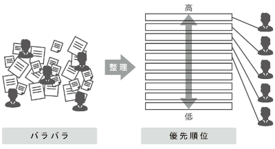
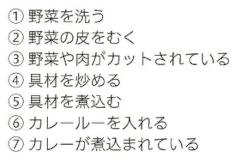

date:2024年10月

書籍『ここはウォーターフォール市、アジャイル町 ストーリーで学ぶアジャイルな組織のつくり方』  
https://www.shoeisha.co.jp/book/detail/9784798165387  

---

＜目次＞  

----

# この本の概要

アジャイルのエッセンスをつまみ食いし、ウォーターフォールに寄り添ったライトなアジャイルの方法論について書かれています。  

# アジャイルを知る

## アジャイルの生誕

アジャイルとは、2001年に17人のソフトウェア開発の賢人たちによって生み出された概念です。  
それぞれがうまくいった開発手法を持ち寄り、それぞれが提唱していた開発方法論の統合を試みたのです。  
その結果、生まれたのが「アジャイルソフトウェア開発宣言」です。  

この宣言の中では、下記に価値を置いています：

- 個人と対話
- 動くソフトウェア
- 顧客との協調
- 変化への対応

## アジャイルの原則

アジャイルには宣言とは別に「原則」が存在します。  
これには行動の指針となる **12の原則** が記されています。  

[アジャイル宣言の背後にある原則](https://agilemanifesto.org/iso/ja/principles.html)  

この12の原則、すなわち **アジャイル宣言の背後にある原則** を確認しておくことで、アジャイル像はもう少し鮮明になります。  

## ウォーターフォールとアジャイル

ウォーターフォールとアジャイルは対立する考え方ではありません。それぞれのメリットがあります。  

これからつくるプロダクトの要件や仕様が明確であり、途中変更もほぼない、開発メンバーもほぼ同じであれば複雑性が低いといえます。  
この場合は、きっちりと計画し、予定通りに進めていくことが可能になるため、ウォーターフォールで進めるのが得策です。  

世の中の状況が変わったり、つくるものの要求が変わったり、といった複雑性が高い状況があるとします。  
この場合は、プロセスを繰り返して **早く失敗し学びに変え** 、そのつど見直しながら開発を進めるアジャイルが適しています。  

## 開発方法論

スクラム、XP、TDD、FDD、Crystal、DSDM と呼ばれる開発方法論が提唱されていますが、そのどれもがアジャイルなのです。  
世の中のプロジェクトは、複数の方法論を組み合わせて、いいとこ取りをしながら開発しているケースが多くあります。どれか1つだけを採用しなければいけないということはありません。  

# アジャイルとは「あり方」である

## アジャイルになる

「これだけをやっていればアジャイル」なんてものはありません。また、「これを会社に導入すればアジャイルになる」なんてツールもありません。チームとしてセイチョウし、顧客価値を最大にしていくために、たゆまぬカイゼンをしていくことが大事なのです。  

重要なのは、アジャイルをする（Do Agile）のではなく、アジャイルになる（Be Agile）ことです。  
つまり、アジャイルとは **「あり方」** なのです。

## プラクティスから始めよう

しかし、いきなりアジャイルに変身することが不可能なのも事実です。「プラクティス」と呼ばれるプロダクト・プロセス・チームをカイゼンする方法論や習慣がいくつもあるので、これらをこの書籍を通して学びながら実践していきましょう。  
また、アジャイルはプロダクトづくりだけでなく、プロセス、マインドセット、人にもフォーカスを当てています。プラクティスを通じて、**実践と学びのループ** を回しながら習得していきましょう。  

# 問題整理

## 見える化する

**状況を誰もがわかるように透明性を上げ**て、見える化する。  
見える化することでチームとして対処していく **「仕組み化」** と **「場づくり」** が必要です。  

仕組み化・場づくりの具体案：  
- チケット管理： タスクの進捗管理、優先順位、対応状況の把握
- 朝会・夕会： 情報共有、チームの進捗状況の確認

### チケット管理

チケット管理でできること：  

- ワークフロー
  - チームとして対応するゲート(やり取りの門)として活用する
  - 進捗の更新状況の把握
  - 抜け漏れの防止

- タスクをチームで管理する
  - 今誰がボール(タスク)を持っているかが誰でも把握できる
  - タスクの優先順位を確定する
  - タスクの状況やステータスを管理する
  - ツールの統一 (Excel、メモ書き、リポジトリ、など各種バラバラで管理していたのを統一する)
  - ログとして記録もできる

#### チケットの優先順位

**上位に配置してあるタスク(チケット)の優先順位を高くする**ことで、どのタスクから片付けていけばよいかが一目瞭然になります。  

  

#### チケットの中身

・タスク名はなるべく具体的な名前をつける  

後からタスクの名前を見ただけでわかるようにするのがコツです。チケット管理ツールには検索機能が備わっているのが一般的なので、適切なタスク名をつけておくことで、過去の対応例を発見することもできます。  
例えば「昨日、内線で依頼したこと」がタスク名では、何のことかわかりません。「認証画面でエラー番号 505905 が表示される」などと記載することで、同様のトラブルが発生したときに大いに役立つようになります。  

・タスクの進捗状態の変更ルールを決めておく

「誰が」「いつ」タスクの進捗状態を変更するのか、誰がタスクを割り当てるのか、などのルールをチームできめておきましょう。  

#### チケット管理の役割とメリット

- 起こっていることを一元的に把握する手段として
- 作業履歴や対応履歴を記録するツールとして
- 個人や組織の備忘録として
- 非同期型の報告/連絡/相談の場として
- 問題を「一人で抱えない、悩ませない」ための仕組みとして
- 提案を風化させない仕組みとして
- 判例集＝その判断の背景や経緯を書き残す手段
  - なぜ、そのトラブルが発生したのか？
  - なぜ、その対応を取ることにしたのか？制約条件は？
  - どのような議論が行われたのか？

NOTE:  
「3月22日 対応済み」  
このような作業記録だけでは、判例集としては機能しません。判断の背景や経緯を書き残すナレッジマネジメントツールとして、ワンランク上のチケット管理を目指しましょう！  

### 朝会・夕会

朝会や夕会は、情報や状況や進捗を見える化するための方法です。  
問題が小さいうちにチーム全体で対策を打てるようにします。  

朝会と夕会はマネージャーのためだけにあるのではなく、**全員でチームの状況を把握するためにあります**。  
たまたまそこにいる人の「井戸端」で情報共有される、あるいは意思決定される「井戸端型意思決定」スタイルは不健全です。そんなチームで、主体性を持って働くことができるわけがありません。  

#### 朝会・夕会の運営方法

・毎日同じ時間に同じ場所で
- メンバー全員が出席する
- ディスプレイにチケット管理画面を表示し、その日のチームの問題やタスクと向き合う

・3つの問い
- 前回までにやったこと
- これからやること
- 問題になっていること

上記の「3つの問い」でタスクの状況や問題などについて各自が発言しながら、全体で15分以内で終わるように運営します。  

## プラクティス

チケット管理や朝会・夕会のような方法論のことを「プラクティス」と呼びます。  
アジャイルにはこれら以外にも様々なプラクティスが存在します。  

### プラクティス導入のコツ

- 前向きなメンバーと小さく始める。小さく始めることで導入コストを低くする
- 手段より課題にフォーカスする
- 現場の作業がまずラクになるようなことから始めてみる

## 抵抗

新しいことを始めるには、抵抗がつきものです。  
「どうしてもだめだったら、やめてもいいよ」という『折り返し地点』を設けるのも大事。  

### 2つの『る』が大事

- やってみる
- ふりかえる

やりっぱなしはダメです。折り返し地点の期限を決めて **ふりかえり** をし、チームに変化の実感をつくります。  
「私たちはできるんだ」という成功体験を言語化するためです。  
こういったことから、組織のカルチャーが変わっていき、**問題を先送りしない体質** を手に入れることができます。  

### ふりかえりの手順

1. データを収集する
2. アイデアを出す
3. 何をすべきかを決定する

#### ふせん

ふりかえりを実施する際に「ふせん」を使うと良いでしょう。  
ふせんを使うことで以下のメリットがあります。  

- 声の大きい人の意見がまかり通ることを抑止
- 意見することに慣れていないメンバーの考えを吸い上げる
- 議論が言葉だけの空中戦にならない
- 思っていることを短い文章にすることで、言語化するクセがつく

#### ふせんを使ったふりかえり会の手順

1. 全員が同時にふせんに書く
   ただし、1枚のふせんには1つのことを書くこと
2. 全員の意見を発表する
   ただし、1ターンで話せるのは1枚分だけ
3. ふせんを複数枚持っている人がいる場合は、2週目に突入

大事なのは **全員の意見を聞くこと** です。声の大きい人やマネージャーなどの意見を優先してはいけません。  

# チケット(タスク)管理ツールを活用する

## タスクばらし

「タスクばらし」の方法をマスターしておくと、1つずつのタスクの粒度が揃う、誰がタスクを実施するかのお見合いが減る、手戻りが少なくなる、などメンバー同士で管理がしやすくなります。  

カレーを作る際のタスクリストのよくない例：  

このタスクリストの中には、"作業ベース"のタスク名と、"状態ベース"の作業名が混在してしまっています。  
「③野菜や肉がカットされている」と「⑦カレーが煮込まれている」の2つが状態ベースのタスク名です。  

作業ベースと状態ベースのタスク名を混合させないようにするには、どうしたらよいでしょうか？  
別の要素は別に管理するのがよさそうです。タスクの状態はタスク名にするのではなく、タスクの中の「説明」の項目に「完成条件」として記載しましょう。この観点を押さえるだけで、何をどこまでやればよいかが、よりクリアになります。つまり、自分自身でそのタスクを実施する際に、作業の目指すゴールが明確になるのです。  

タスク名は作業ベースに統一しましょう。  
タスク名を作業ベースに統一すると、ToDoからDoing、Doneへと、タスクを次から次へと消費する意識ができたり、残作業のタスク量を把握できて管理しやすくなります。  

# メモ

## ホワイトボードの利点

- 「問題や課題を報告をする/受ける」から、見える化によって問題や課題が誰にでも気づきやすくなる
