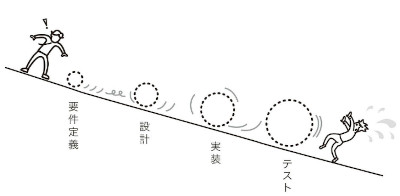

# はじめに

## プロジェクトとメンバーを守ることが仕事

**守るといっても自己犠牲ではありません。** これでは本人が先に潰れ、プロジェクトも失敗してしまいます。  

守るためには実力が欠かせません。実力を高めるためには **正しいスキルを身につける** 必要があります。本書にまとめたプロジェクトマネジメントのスキルは、プロジェクトとメンバーを守るために、筆者の中で自然と体系化されたものです。  

# スキル不足のプロジェクトマネージャー

「プロジェクト推進に関する意識調査」という調査によると、約7割がスキル不足のプロジェクトマネージャーがいると認識しています。

## スキル不足の理由

必要なスキルを備えたプロジェクトマネージャーが少ない理由として、主に次の2点が挙げられます。  

1. 世の中で流通しているプロジェクトマネジメントの共通概念が抽象的で利用しづらい
2. 「実務で覚えなさい」という方法論であるOJTが機能していない

## 機能していないOJT

OJTが有効に機能するためには、プロジェクトマネジメントを体系的に習得していて、それを的確に人に教えられるシニアクラスのプロジェクトマネージャーが社内にいることが前提となります。  

多様なスキルが必要なプロジェクトマネージャーの育成において、事前教育なしのOJTが有効に機能するケースは非常に少ないのです。  

## スキルのセルフチェック

プロジェクトマネージャーとしての自らのスキルを冷静に分析するには、**具体的に自分が最初から最後までその業務を実施できるか・実施したことがあるか** を正確に把握する必要があります。次のチェック表を基に、「できる・できない」や「得意・苦手」などの振り分けをしていきましょう。  

さらには、習熟に時間がかかるプロジェクトマネージャーを企業や社会で育成して増やしていくためにも、自分や担当者はどれくらいスキルレベルがあるのかを適切に認識する必要があります。  

---

###  交渉

| 項目 | 説明 |
|------|------|
| 提案/合意形成 | 各フェーズで必要な提案を行い、フィードバックを取りまとめて合意形成を行う |
| QCDの調整 | 発生したリスクや対応コストを説明し、品質/予算/納期の調整を行う |
| ステークホルダーの利害調整 | 関係者の利害調整を行う |

###  タスクマネジメント

| 項目 | 説明 |
|------|------|
| プロジェクト全体像の共有 | メンバーに要件定義で合意したプロジェクトの全体像を伝える |
| タスクの洗い出し | プロジェクトを遂行するために必要なタスクを洗い出す |
| 調達 | タスクを実行するうえで必要なメンバーの調達を行う |
| アサイン調整 | タスクを実行するうえで必要なポジションのアサインを調整する |
| タスクアサイン | メンバーにタスクをアサインする |
| 進捗管理 | 各メンバーのタスクの進捗状況をリアルタイムで把握する |
| 情報共有 | 情報共有のツール選定を行い、運用ルールを設計する |
| 振り返りの実施 | KPIなど、プロジェクトで都度振り返りを行う |

###  プロジェクト計画

| 項目 | 説明 |
|------|------|
| 座組の整理 | 関係者の役割分担や意思決定のプロセスを整理する |
| プロジェクトリスクの整理 | プロジェクトを実施するにあたって想定されるリスクを洗い出して関係者に共有する |
| QCDの優先順位確認 | 品質/予算/納期の優先順位を確認する |
| 適切な開発手法の選定 | プロジェクト要件を満たすために適切な開発手法は何か |
| マイルストーンの設定 | スケジュールにおいてマイルストーンとなるポイントを設定する |
| 情報共有の仕組みづくり | 会議体や情報共有フローの仕組みづくりを行う |

###  見積り

| 項目 | 説明 |
|------|------|
| 工数 | プロジェクトに必要な工数を見積る |
| 実行計画の作成 | 見積もった工数をスケジュールに落とす |
| 費用 | 見積もった工数を基に費用を算出する |
| 請求対応 | 費用を請求する |

###  契約

| 項目 | 説明 |
|------|------|
| 契約書レビュー | 契約書案が適切な内容になっているかレビューする |

###  要件定義

| 項目 | 説明 |
|------|------|
| ビジネス要件 | ビジネス要件を含意できるかを確認する |
| システム要件 | システム要件を含意できるかを確認する |
| 追加要件のハンドリング | 当初想定されていなかった追加要件のハンドリングを行う |

###  デザイン

| 項目 | 説明 |
|------|------|
| ビジュアル・アイデンティティ | プロダクトのビジュアル・アイデンティティを設計する |
| UI/UXデザイン | UI/UXのデザインを作成する |
| プロトタイピング(必要な場合) | プロトタイプを実施する |

###  設計

| 項目 | 説明 |
|------|------|
| 技術スタックの調査選定 | 実装で使用する技術を選定する |
| 開発の作法を整える | 開発の際に必要な取り決めを行う |
| 設計書を作成する | 設計書を作成する |
| 設計書レビュー | 各領域の設計が適切に行われているかを確認する |

###  テスト

| 項目 | 説明 |
|------|------|
| 品質担保の合意形成 | 限られたリソースで確保すべき品質について関係者と合意を形成する |
| テスト計画の作成・レビュー | テストをどのように進めるか、何を重点的に確認するかの計画を作成、またはレビューを行う |
| テスト体制の構築 | テストを実施する体制を構築する |
| 関係者への報告 | 関係者に対してテスト状況を報告する |

###  リリース

| 項目 | 説明 |
|------|------|
| リリース計画の作成・レビュー | リリース手順や全体の役割分担を作成、またはレビューする |
| ストア申請(アプリの場合) | ストアに申請する手順等を確認して実施する |

###  保守改善

| 項目 | 説明 |
|------|------|
| 費用対効果の確認 | プロジェクトの費用対効果について確認し、合意を形成する |
| 保守・改善内容の合意形成 | プロダクトの保守と改善内容の合意を形成する |
| 保守改善体制の構築 | プロダクトの保守改善体制を構築する |
| データ分析体制の構築 | プロダクトのKPIやログ分析の体制を構築する |
| グロース体制の構築(必要な場合) | プロダクトのグロース体制を構築する |
| 広告運用体制の構築(必要な場合) | プロダクトの広告運用体制を構築する |

# プロジェクトとは何か

本書ではプロジェクトとは、「今ある状態からあるべき状態にするために行う、スタートからゴールまで続く複数の業務」と定義します。  

## プロジェクトの成功とはなにか

プロジェクトには「目的」と「目標」があります。混同して使われることがありますが、プロジェクトの成功を考える際は明確に分けて理解しておきましょう。

### プロジェクトの目的

そのプロジェクトを実現することで最終的に達成したいゴールのことです。

### プロジェクトの目標とは

プロジェクトで達成すべき基準のことです。一般に「QCD」によって定義することができます。

## プロジェクトの本質的な特性とは

プロジェクトの失敗率の高さはプロジェクトの3つの本質的な特性に由来します。  

- スタートとゴールが決まっている
- 不確定要素が多い
- 異なる立場や専門性を持つ人が分業してかかわる

### スタートとゴールが決まっている

スタートとゴールまでの流れの中で「いまどのフェーズにいるのか」を意識してマネジメントしましょう。  

### 不確定要素が多い

ルーチンワークのような業務でない限り、プロジェクトでは、不確定要素が多いことを前提に計画を立て、実際の進捗を把握しながら柔軟に対応していくことが求められます。  

### 異なる立場や専門性を持つ人が分業してかかわる

さまざまな立場や異なる専門性をもつ人がプロジェクトにかかわります。こうした人々が実施するタスクをうまくつないでいくことが、プロジェクトマネージャーに求められます。

## プロジェクトの難しさとは

- 失敗を後で取り返すことが難しい
- どんなプロジェクトでも起こりやすい失敗パターンがある

### 失敗を後で取り返すことが難しい

不十分な予算や無理なスケジュールが失敗の原因になることはイメージしやすいですが、座組で不適切な人や企業がプロジェクトに参加してしまうと、それが後でプロジェクト遅延や失敗の原因になってしまい、挽回するのに大きな時間と予算を必要とします。  

雪山の斜面で小さな石を転がしていくと次第に大きな雪玉になるように、プロジェクトの初期の失敗は後で大きなネガティブな影響を伴います。  

### どんなプロジェクトでも起こりやすい失敗パターンがある

1. プロジェクトの全体像をメンバーが共有していない
2. 開発者(発注者/ベンダー/メンバー/関連企業)が対等に話し合える関係性を築けていない
3. プロジェクトマネージャーが多忙、もしくは能力不足で全体観を失っている

#### プロジェクトの全体像をメンバーが共有していない

異なる専門領域の齟齬を防いでよりよいシステムをつくるには、プロジェクトマネージャーがさまざまな観点でプロジェクト全体を取りまとめ、ドキュメントを基にプロジェクトメンバー同士で認識を揃えていかなければなりません。  

また、組織にとってプロジェクトがどのように貢献できるのかを全体的な観点で検討して取りまとめていくのも、プロジェクトマネージャーの役割です。  

#### 開発者が対等に話し合える関係性を築けていない

それぞれの立場と専門性を活かすからこそ、多角的な視点が生まれて不確実性の高いプロジェクトでも成功することができるのです。そうしたことが可能になる環境を整える意味でも、つねに意見や新しく発見した出来事を共有できるよう、プロジェクト関係者の間では上下関係のないパートナーシップを築いておきましょう。  

#### プロジェクトマネージャーが多忙、もしくは能力不足で全体観を失っている

プロジェクトマネージャーは正常な判断をするためにメンタルを正常に保っておくことがプロジェクトの成功に必要不可欠です。  
プロジェクトマネージャーは自分自身のタスクだけではなく、つねに意識を「プロジェクト全体の成功」と「チームのパフォーマンスの最大化」に向けられるよう、自分の限界とタスクの距離感には注意を払っておきましょう。  

### プロジェクト固有のリスクをマネジメントする

プロジェクトマネージャーの実力のもっとも大きな違いは、リスクマネジメントにあります。  

シニアクラスのプロジェクトマネージャーは多くのトラブルを乗り越えてきた経験があるため、できるだけ早期に検討や調整を行ってリスクを潰しておくことの重要性を知っています。  

### プロジェクトのリスクに向き合う

プロジェクトのリスクマネジメントやトラブル対応で重要になるのは「プロフェッショナルとしての態度」です。  
プロジェクトメンバーはつねに対等であるととらえ、自らの責任を遂行する意識をもって、プロとして是々非々(よいことはよい、悪いことは悪い)をいえる関係性を作りましょう。  

### プロジェクトマネージャーの役割

複雑な状況を取りまとめてプロジェクトメンバーや関係各所に伝え、チームワークが適切に発揮できるよう **全体を俯瞰して「優先して対処すべき物事は何か」を判断する人** が必要になります。それがプロジェクトマネージャーです。  

### プロジェクトマネジメントとプロジェクト管理の違い

プロジェクトの「管理」だけを主眼としてしまうと、「打ち合わせで進捗を確認するだけ」や「タスクをメンバーに振るだけ」などになってしまい、プロジェクトの目的の達成に必要な判断や全体像の把握、事前の調整という重要が業務が抜け落ちてしまいます。  
プロジェクトマネージャーは、プロジェクトの実態をリスクの観点で把握してアクティブな調整を行ってそれを計画にフィードバックしていく必要があります。  

### プロジェクトマネジメントとプロダクトマネジメントの違い

あえて違いをいうなら、従来のプロジェクトマネジメントは「ヒト・モノ・カネ」の3つの要素のうち、「ヒト」と「カネ」にフォーカスしているのに対して、プロダクトマネジメントは主に「ヒト」と「モノ(プロダクト)」にフォーカスしているといえるでしょう。  

プロダクトマネジメントという言葉が昨今はやっている理由は、ITの進歩によって事業においても「モノ」重要性が増していること、「Excelをいじっているだけのプロジェクトマネージャー」がいても事業は成功しないという考え方が背景にあると考えられています。  

プロジェクトマネジメントとプロダクトマネジメントはあくまでも「ヒト・モノ・カネ」それぞれどの領域を重視するかの違いです。もし1人ですべての領域をマネジメントするのが難しいと思ったら、詳しい人をよんできてパートナーシップを組むことが大事です。  

また、自分が弱い領域について少しずつでも検索して調べたり、本を読みながら学習していく姿勢も欠かせません。そうした姿勢がないと、専門家と意思疎通ができず、プロジェクトを取りまとめることはできないでしょう。日々進歩する技術や競争環境において、学習はとても重要な習慣です。  

