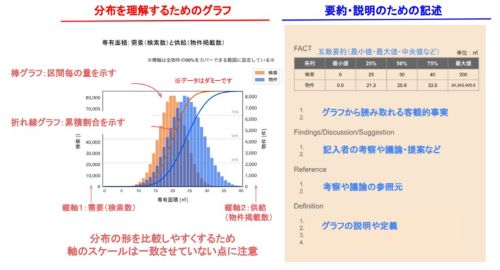

# SoftwareDesign_2025年4月号_ドメイン知識とどう向き合うのか？

## ドキュメント概要

以下のまとめです。  

雑誌『Software Design 2025年4月号』  
第1特集 ドメイン知識とどう付き合うのか？
技術でビジネスの成長を支えるために  
[https://gihyo.jp/magazine/SD/archive/2025/202504](https://gihyo.jp/magazine/SD/archive/2025/202504)  

- 読了日: 2025年03月
- 注意事項:「著者」は、雑誌記事を書いたAuthorの方を指します

---

## 序章

Author: 平田守幸 - 株式会社永和システムマネジメント

現代のITエンジニアに求められるのは、技術スキルだけでなく業界や業務に関する「ドメイン知識」です。  
ビジネスがITに依存する時代において、単に「動くシステム」を作るだけでは不十分です。エンジニアは業界のしくみや業務フローを理解し、適切に設計・実装する能力が重要になっています。  

本特集では、ITエンジニアとドメイン知識の関係性、その習得方法、キャリアへの影響について詳しく解説しています。

### ドメイン知識とは何を指すのか？

#### ドメイン知識の定義

「ドメイン」とは特定の領域や分野を指す言葉で、ソフトウェア開発の文脈では「対象となるソフトウェアが扱う領域」を意味します。  
「ドメイン知識」はその領域で必要とされる業界特有の専門知識のことです。

#### ドメイン知識の範囲

- 業界ルール: 各業界特有の法令、規制、標準規格など。システム開発時に遵守する必要がある。
- 業務プロセス: 業界ごとの業務フローや慣習。効率的なシステム設計のために理解が必要。
- 課題・ニーズ・トレンド: 業界が直面している課題、顧客のニーズ、最新の業界動向。システムの方向性を決める要素となる。
- 専門用語: 業界特有の言葉や概念。業務担当者との円滑なコミュニケーションに必要。

#### ビジネスドメインとの関係

似た言葉として、事業領域を示す「ビジネスドメイン」という言葉も存在します。企業が提供する商品やサービスに関わる事業領域や業務範囲を指します。これは企業の市場戦略や競争力に関連するもので、経営やマーケティングの文脈で触れられることが多いです。

ソフトウェア工学における「ドメイン」は、「ビジネスドメイン」の一部、または具体化された要素を反映します。

### 業界や職種ごとのドメイン知識の重要性

ドメイン知識の重要性は一律ではなく、関わる業界や職種によって異なります。そのため、自分の業務においてどの程度ドメイン知識が必要なのかを見極め、適切に学んでいくことが大切です。

#### 業界ごとの違い

とくに規制や法律の影響が大きい業界や、業務フローが複雑な業界では、ドメイン知識の必要性が高まります。規制の厳格さや、業務プロセスの複雑さに応じて、システムが満たすべき要件も大きく変わります。

| 業界 | 要素 | 重要性 |
|-----|-----|-----|
| 金融業界 | 資金運用や決済システムのしくみ、マネーロンダリング防止等の法規制など | AML（マネーロンダリング対策）やKYC（本人確認）などの法規制を理解しなければ、適切なシステムを開発できない |
| 医療業界 | 診療フロー、電子カルテの標準規格、患者データの機密性保持など | 診療フローや電子カルテの標準規格を知らなければ、医師や看護師が使いやすいシステムを作れない |
| 物流業界 | 倉庫管理のしくみ、配送経路の最適化アルゴリズム、季節需要の影響など | 配送や倉庫管理の最適化には、需要予測や在庫管理のしくみを理解することが重要 |

このような業界では、技術力だけでなく、業界特有のルールや業務プロセスを把握することが求められます。

#### 職種ごとの違い

ITエンジニアが持つべきドメイン知識の重要性は、担当する職種や役割によって異なります。システム開発に関わるすべての職種で一定の業界理解は必要ですが、どの程度の深さで求められるか、どの領域に特化すべきかは、それぞれの職種の業務内容に応じて変わります。

たとえば:

- アプリケーションエンジニア: 業務システムやWebサービスのビジネスロジックを実装する役割を担います。そのため、業界特有の業務フローやビジネスルールを理解し、それを正しくシステムに反映することが求められます。
- ITアーキテクト: ビジネス要件と技術要件の橋渡しをする立場であるため、業界特有のシステム要件を理解し、それに合わせた最適なアーキテクチャを設計する能力が求められます。
- インフラエンジニア: ドメイン知識を深く求められることは比較的少ないでしょう。ただし、システムの安定稼働を支える役割を担うために、どのような業界でどのような負荷が発生しやすいか、可用性やセキュリティ要件がどのように求められるかを理解することは重要です。

### 要件定義フェーズにおけるドメイン知識の活用

要件定義フェーズが適切に進められないと、後続の設計・開発・テスト・運用に多大な影響を与え、手戻りやコスト増大の原因になります。

#### 業務課題の正確な理解

要件定義では、クライアントや業務担当者とのヒアリングを通じて、システムの目的や解決すべき課題を明確にします。しかし、ITエンジニアが業界の背景知識を持っていない場合、クライアントの言葉を表面的に受け取るだけになり、本質的な課題を見落とすリスクがあります。

ドメイン知識を持つITエンジニアは、クライアントの発言の意図を正しくくみ取り、潜在的なニーズを引き出すことが可能になります。これにより、最初の要件定義段階でズレが生じにくくなり、開発後の手戻りを最小限に抑えることができます。

### アジャイルソフトウェア開発におけるドメイン知識

アジャイルソフトウェア開発は、「計画どおりに開発すること」よりも「変化に適応しながら、ユーザーにとって価値のあるソフトウェアを迅速に提供すること」を重視する手法です。そのため、開発チームとビジネスサイドの連携が極めて重要になります。

もしITエンジニアがドメイン知識を持たず、ビジネスの背景を理解していなければ、頻繁な仕様変更に振り回され、開発の方向性がブレるという問題が発生する可能性があります。

#### 「ビジネス価値の最大化」がアジャイルの本質

アジャイルの目的は、「計画どおりに開発を進めること」ではなく、ユーザーにとって価値のあるソフトウェアをすばやく提供することです。そのためには、「技術的に実現可能か？」という視点だけでなく、

- 「この機能がビジネスにどのような影響を与えるのか？」
- 「どの機能を優先してリリースすべきか？」

といったビジネス価値を意識した開発が求められます。

そのため、アジャイル開発においても、エンジニアがドメイン知識を持つことが、ビジネス価値の最大化に直結すると考えられます。

### ITエンジニアがドメイン知識を身につける方法

業界や職種ごとに重要性が異なるため、一律に必要なドメイン知識の質と量について定義は困難です。業界、職種ごとについては今回の特集の以降の章で触れているので、この章では、一般的に言われているやり方について紹介することとします。

#### 基本的なリサーチ

まったくはじめての業界の場合、まずは対象となる基本的なしくみや現状を理解することが必要です。その業界の新入社員が読むような、業界に関する入門書を数冊読むのがよいでしょう。

#### 専門家から学ぶ

ドメインエキスパート（事業領域の深い知識や経験を持つ専門家）が近くにいる場合、それらの人に質問することによって、知識を増やすことができます。たとえば、ビジネスサイドにいる業界に詳しい人に話を聞くのは効率的です。いない場合には、業界のカンファレンスや展示会への参加によって、学ぶことができます。

#### 開発プロジェクトの中で学ぶ

実際にプロジェクトに参画した後は、システムの利用者であるユーザー（もしくはクライアント）とのやりとりを通じて学んでいきます。ミーティングの機会等を通じて、知らないことを学ぶ機会は多いです。可能なら現地現物を確認できると良いでしょう。

#### チームや組織で知識を共有する

自らが書籍や現場で学んだ内容を、Wikiなどのナレッジベースに記録して共有したり、初心者に伝えたりすることで、チームとしての知識が深まります。他人に伝えようとすることで、自らも知識を深めることができるでしょう。

### まとめ

英語を話せるようになると、英語圏の話者とコミュニケーションしやすくなるように、ITエンジニアである私たちが、ビジネスの言葉を話せるようになる。これこそがITエンジニアがドメイン知識を身につけるべき一番の理由だと考えます。

## 第1章:自社プロダクト開発におけるドメイン知識 - エンドユーザーの課題解決には技術と顧客理解の両立が大事

Author: 金山哲平 - フリー株式会社

### エンジニアがドメイン知識を持つことで発揮できる価値

#### 設計・実装フェーズに与える価値

以下が例として挙げられています:

- 具体例：社会保険料の当月徴収

#### 要件定義フェーズに与える価値

以下が例として挙げられています:

- 具体例：遅刻早退控除ロジックの見直し

#### 要求定義フェーズに与える価値

以下が例として挙げられています:

- 具体例：ターゲットユーザーにより早く価値を届ける

### ドメイン知識に対する向き合い方

どうすればドメイン知識に強いエンジニアになれるのか、著者の実体験が説明されています。

#### 個人としての工夫

- ユーザー向けのヘルプページを読み込む:  
  当たり前過ぎる話かもしれませんが、意外と見落としがちです。  
  社外向けに書かれたドキュメントは、そのドキュメントの鮮度やわかりやすさがユーザー価値に直結するため、社内向けに書かれたドキュメントに比べて品質が高い場合が多いです。
- テーブルやモデルの関係性をつかむ:  
  関係データベースのテーブルや、テーブル同士の関連性（1対多など）を把握することにより、このシステムにどんなドメインがあってどんな関係性なのかをある程度推測できます。これはとくに業務システムで有効だと思います。もしくは、アプリケーションコード上にドメインオブジェクトがうまく定義されているシステムであれば、その部分のコードを読むのがよいかもしれません。
- 隣接領域を学ぶ:  
  向き合いたいドメインの隣接領域にも関心を持つことにより、かえって対象ドメインの理解が深まる場合があります。
- 一次情報に触れる:  
  社内の詳しい人に聞いたりするだけでも知識としては十分に得られる場合も多いと思います。しかし、自ら一次情報に触れることにより、より自分ごととしてそのドメインを感じられるようになります。

#### 組織としての工夫

著者の実施例:  

エンジニアが新しく一気に数十人増えるタイミングがあり、いかにスムーズにドメインキャッチアップしてもらうかが課題となりました。それに対する解決策として、丸1日かけて講義形式でドメイン知識を一気に解説するという方法を試しました。まずは「まったく聞いたことがない言葉」が「一度は聞いたことがある言葉」になるだけでも、あとから必要になったタイミングで人に聞いたり自分で調べたりしやすいだろうという考えで実施。講義のために網羅的なドキュメントも用意することで、あとから参照しやすいよう心がけました。

## 第2章:情報システム部門におけるドメイン知識と技術の天秤  - 「守り」「攻め」の両立で組織を支える

Author: 大多和亮 - 株式会社一休

### 情報システム部門の職務範囲

#### 情シスとは何か

情報システム部門（情シス）は組織のITインフラを支える重要な役割を担う部門ですが、その実態は組織の規模や業界によって大きく異なります。オンプレミスサーバやネットワーク機器の保守運用や監視が主な業務でした。しかし、時代とともに情報システム部門の役割は大きく変化してきました。システム開発の内製化やクラウドサービスの普及などのIT環境の変化に伴い、求められるスキルや職務範囲は多様化しています。

本稿では、求人などでもよく見かける「社内SE」「ヘルプデスク」「コーポレートエンジニア」の3つの職務について紹介します。

#### 社内SEの職務範囲

社内向けのシステム開発やサーバ、ネットワーク機器の保守運用、構築を行うSEのことを指します。組織によっては自社プロダクトも情報システム部門が担っており、社内SEが開発を行うケースもあります。

システム開発をパッケージ導入やスクラッチ開発で行う際は、外部のSIerへの発注や、自社に常駐するSESの管理を行う、いわゆる「ベンダーコントロール」と呼ばれる業務が中心となります。

#### ヘルプデスクの職務範囲

多くの従業員にとってヘルプデスクはIT関連のトラブルを解決してくれる人として広く認知されています。しかし、その役割は多岐にわたり、社内のIT環境を支える重要な存在です。

ヘルプデスクは、パソコンやモバイルデバイス、複合機などのOA機器、社内で利用しているさまざまなITツールやシステムの技術的なサポートやトラブルシューティングを行います。社内SEやコーポレートエンジニアがITツールの導入や構築、開発を進める一方で、ヘルプデスクはそれらの活用をサポートする役割を担っています。

#### コーポレートエンジニアの職務範囲

従来の情報システム部門の業務に加え、APIやiPaaSを活用したアプリケーション開発やSaaS間のインテグレーションを担うことで、組織全体の業務自動化や生産性向上に貢献します。

コーポレートエンジニアは、近年のクラウドサービスやSaaSの普及に伴い、とくにスタートアップ、ベンチャーなどのIT企業を中心にその職務領域を拡大している職種です。

### 情報システム部門における「ドメイン知識」とは何を指すのか

情報システム部門にとって、社内の従業員はエンドユーザーと同等に重要な存在です。従業員がどのような業務を行っているのか、どのようなツールを必要としているのかを理解することで、業務効率化に貢献するシステム開発やIT環境整備が可能になります。

#### コーポレートに関する知識

情報システム部門はその規模や役割に応じて組織構造も多様です。大規模な組織では本部として独立している場合もありますが、多くの場合、エンジニア部門またはコーポレート部門のいずれかに属しています。エンジニア部門に属している場合でも、情報システム部門はその業務特性上、人事、総務、経理といったコーポレート部門との連携が不可欠です。

たとえば、人事部門とは勤怠管理などの人事システムの導入のほか、従業員の入退社に伴う手続きやオンボーディング、従業員のアカウント管理において密に連携を行います。人事部門のドメイン知識として労働基準法や育児・介護休業法などの関連法規や、給与計算や年末調整などの人事の業務プロセスを知ることで、人事部門とのコミュニケーションが円滑になるだけでなく、より的確なシステム提案や開発、運用サポートが可能になります。

#### クラウドサービス／SaaSへの広い知識・スキル

情報システム部門という領域のドメイン知識としては、ハードウェア、ソフトウェア、ミドルウェア、OS、ネットワーク、データベース、セキュリティといったITの基礎知識に加えて、AWSやGoogle Cloud、Azureなどに代表されるパブリッククラウド、多様なSaaSに対する幅広い知識、スキルが求められます。

### 情報システム部門におけるドメインと新技術の習得の比重

#### 守りの情シス、攻めの情シスの両立

情報システム部門は組織のITインフラを支える「守り」の側面と、ビジネスの成長をITを活用して促進する「攻め」の側面の両方を担う必要があり、それぞれの側面におけるドメインと技術への知識がバランスよく必要となります。

- 守りの情シスにおけるドメイン知識:  
  最新技術やサービスを積極的に導入するよりも、長年の運用実績があり、多くのノウハウが蓄積された「枯れた技術」と呼ばれる安定した技術や製品を選定することが一般的です
- 攻めの情シスにおけるドメイン知識:  
  業務改善や自動化、SaaSやクラウドサービス、AIやIoTなどの新技術を積極的に採用し、ビジネスの成長に貢献します。近年はChatGPTを始めとする生成AIの急速な進化など、情報システム部門の担当者は常に最新の技術動向をキャッチアップし、ビジネスニーズに応じた最適なITソリューションを提供することで、組織、事業成長による利益向上に大きく貢献できます。

### まとめ

情報システム部門は、「守り」と「攻め」の両方の側面を担う必要があり、それぞれの役割に必要なドメイン知識と新技術の習得のバランスが重要です。基礎となるITやコーポレートに関する知識を習得しつつ、社外との交流も積極的に行い、サービスや技術の最新動向や他社事例をキャッチアップしていくことが求められます。

## 第3章:データ分析の現場におけるドメイン知識獲得の施策 - ファクトブックを活用し、事業の革進につなげる

Author: 羽賀崇史、嶋村昌義 - 株式会社LIFULL  
※一部、LIFULL社のブログ記事を参照

### ファクトブックの概要

ビジネスの世界では、データを活用することの重要性が加速度的に増加しています。多くのデータを集めて分析し、プロダクトに反映させたり、得られた示唆から意思決定を行ったり、大きなビジネスインパクトを生み出すことが可能です。また、さまざまなデータと組み合わせることで、ビジネス課題の解決だけではなく、社会課題の解決にも有用だと考えています。

「ファクトブック」は一般的に、マスメディア向け、あるいは株主や投資家向けの資料を指すこともありますが、LIFULL社での「LIFULLファクトブック」は、データの分布や代表値をグラフで確認し、そこからわかるファクト（事実）をまとめたものです。さらに、ファクトから導かれる考察をまとめ、共有したり議論したりすることで、正しい知識を共通認識化させる役割を持ちます。

### LIFULL HOME'Sにおける真のドメイン知識

#### LIFULL HOME'Sのドメイン知識とは

##### ドメイン知識の定義

LIFULL HOME'Sのサービスでは、主にユーザー情報、物件情報、広告情報、クライアント情報を扱います。自社の事業情報に加えて、不動産業界、ポータルサイト業界も含めた知識や知見、トレンド情報をまとめて、ドメイン知識と呼んでいます。

##### ドメイン知識定着の難しさ

ドメイン知識がとくに重要なのは、「仮説思考」に関係するためです。事業やサービスの革進には、迅速で柔軟な意思決定が求められます。仮説を立ててすぐに行動し、結果を確認しながら次の仮説を立てるという、PDCAサイクルをすばやく回すことが重要です。このとき、出発点になる「仮説」は、施策の方向性を決める重要なものです。

しかし、多くの場合、ドメイン知識は個人の経験によって蓄積されるため属人化が進んでしまい、ドメイン知識の活用が個人に依存しがちな問題が生じます。小規模なプロジェクトでは個人での仮説検証も可能ですが、ビジネスインパクトの大きなプロジェクトでは、チームでの意思決定が求められます。このとき、前提条件がそろわずに話をして、それぞれの主張が噛み合わないまま議論が進んでしまうといった経験はないでしょうか。このような議論の空中戦を防ぐためにも、仮説の立案前に、前提条件をそろえるためのコミュニケーションが必要になります。

しかし、ドメイン知識が形式知化されていない状況では、それをすり合わせることも難しくなってしまいます。

##### 真のドメイン知識の重要性

これまでに説明した問題意識をふまえ、社内で「真のドメイン知識」を定義しました。

「真」には3つの意味があります:

1. **正確さ**: 正しい情報（ファクト）を基にすることで、個人のあいまいな経験に頼らない知識を培います。
2. **定着**: スピーディな成果を目指すために知識が即座に利用可能であることが重要です。
3. **共通化**: 属人化させずに、ファクトを基に共通認識を持つことで、スムーズなコミュニケーションを可能にします。

#### データ分析リテラシーの課題

ファクトから正しく、共通化された「真のドメイン知識」を獲得するためには、データを適切に扱うスキル、つまりデータ分析のリテラシーが必要です。

しかし、LIFULL社ではこのデータ分析リテラシーに課題がありました。具体的な問題の1つは「代表値」の選び方です。たとえば、平均値を無条件に代表値として選ぶと、誤った解釈をしてしまうことがあります。データの分布に応じて、中央値や最頻値を使ったほうがよい場合や、複雑な分布では成分ごとに分析する必要があります。

このデータ分析リテラシーの課題をきっかけに、LIFULLのファクトブックを作ることになりました。

### LIFULLファクトブックの導入

これらの課題を解決するために、「LIFULLファクトブック」が作成されました。

LIFULLファクトブックに関する取り組みには2つのねらいがあります:  

1. 真のドメイン知識の獲得をする: 良質な仮説を作れる状態やドメイン知識が共通化される状態にし、事業革進の効率を高める
2. 分析リテラシの向上をする: 正しい分析や説明を意思決定層へ届けることで、迅速で正しい意思決定ができる状態にする

ファクトブックのコンテンツ例:  

#### ファクトブックの読み会

コンテンツが正しい情報をまとめた資料であるとするならば、読み会は、それらを定着させ血肉としていく場であり、知識を共通化させていく場として「真のドメイン知識」に変化させる役割を担っています。

### プロジェクトの変遷と試行錯誤

#### プロジェクト立ち上げ期

ファクトブックのプロジェクトは少数のコアメンバーから始まり、最初のファクトブックでは「物件」に焦点が当てられました。参加者のニーズに応えるための工夫や、比較対象の導入、クイズの実施など、読み会を活性化させるための試行錯誤が行われました。

#### 活用拡大期

物件情報にユーザー情報を加え、賃貸だけでなく売買マーケットにも拡大したことで参加者は増加しましたが、新しい発見を求める参加者のニーズや、大人数での参加による一方的な聴講といった課題も生じました。

#### 事業貢献期と今後の展望

現在は、多くの参加者を集めることよりも、事業貢献に資するコンテンツの作成に注力しており、とくに営業をターゲットとしています。ファクトブックが営業の売上や活動にどのように貢献しているかを測定する準備が進められています。

## 第4章:ドメイン知識とLLM - 汎用モデルの性能限界を超えられるか？

Author: 平野正徳 - 株式会社Preferred Networks

著者は現在、金融に特化したLLMの開発をしています。そこでの経験や最新の研究結果もふまえて、LLMにもドメイン知識が必要かどうかを考えていきます。

### LLMという技術

LLMの構築は主に

1. 事前学習
2. 事後学習

の2つのステップからなっています。

- 事前学習は、とにかくさまざまな文書を学習することで、言語や知識習得を行います。
- 事後学習は、AIアシスタントとして有益な返答というのを学ぶステップです。

これらの学習を実施することにより、LLMは、AIアシスタントのような能力を獲得します。（実際にはもっと複雑な学習を行っています）

### ChatGPTは万能か？

OpenAI社のGPT-4o（記事執筆時点でのChatGPTの最新版）をはじめとした最近のLLMは、我々が聞く質問のほとんどに答えられますが、ドメイン特化の深い知識を要求される質問には適切に答えられない場合もあります。

LLMは万能だと思いがちですが、必ずしもそうでないかもしれません。LLMも人間と同じで、すべての分野に長けているとは限りません。

では、どのようにこの疑問を解決していきましょうか？手っ取り早い話、金融の知識だけに特化するような学習をさせてみて、能力が上がるかどうかみてみるとよいかもしれません。しかしながら、ChatGPTなどは、モデルが公開されておらず、この実験ができません。ここでは、筆者がオープンなモデル等を使用して行った検証の結果を紹介します。

### ドメイン特化のための学習実験

#### 学習のための文書収集

ドメイン特化を行うために重要なポイントは、ドメイン知識を学習させることです。この知識の学習は、事前学習のプロセスがもっとも重要です。

検証では、インターネット上から独自にクローリングで取得したデータをもとに、LLMの学習においてライセンス上の支障の発生しないデータセットを構築し、学習を行いました。

検証に使用したデータセット:

- 中央銀行の役員等の会見や挨拶、政策決定会合の要旨
- 各種金融機関が公表しているレポートや語彙集、企業情報
- Wikipediaから抽出した金融に関連した記事
- EDInet（金融の公的開示文書プラットフォーム）の文書（API経由で取得）

これらのデータを手動で作成したルール等で変換や整形を行いました。たとえば、マークダウン形式や、Q&A形式などの形式に変換しました。

これらの文書を用いて、既存の日本語LLMに対して、追加で金融知識の学習を行います。

#### 評価ベンチマークの構築

実際に学習を行って、ドメイン知識を獲得できたか検証するためには、それを計測するベンチマークの構築も重要です。

金融におけるドメイン知識を計測する目的で、新しくベンチマークも構築しました。構築したベンチマークには、次の5つのタスクが含まれています。

- chabsa：金融分野における感情分析タスク
- cma_basics：証券分析における基礎知識タスク
- cpa_audit：公認会計士試験における監査に関するタスク
- fp2：ファイナンシャルプランナー試験の選択式問題のタスク
- security_sales_1：証券外務員試験の模擬試験タスク

これらのタスクは、金融において比較的よく使用される資格試験を中心に、ライセンス上利用可能なものを集めて構成しました。

