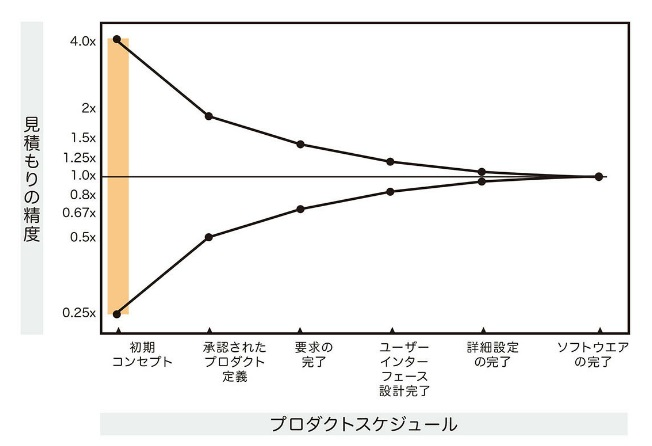
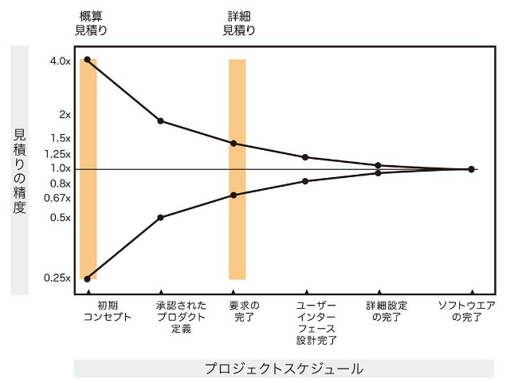
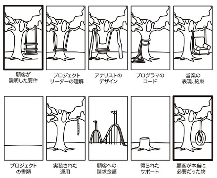

# プロジェクトマネジメントの基本が全部わかる本

## ドキュメント概要

以下の書籍のまとめです。

『プロジェクトマネジメントの基本が全部わかる本』  
[https://www.shoeisha.co.jp/book/detail/9784798177410](https://www.shoeisha.co.jp/book/detail/9784798177410)

- 受託開発のプロジェクトがメインとなる内容ですが、その分を除いてもプロジェクトマネジメントの基本がわかる書籍です。
- 読了日: 2025年04月

## はじめに

### プロジェクトとメンバーを守ることが仕事

**守るといっても自己犠牲ではありません。**  
これでは本人が先に潰れ、プロジェクトも失敗してしまいます。  

守るためには実力が欠かせません。実力を高めるためには**正しいスキルを身につける**必要があります。本書にまとめたプロジェクトマネジメントのスキルは、プロジェクトとメンバーを守るために、筆者の中で自然と体系化されたものです。  

## スキル不足のプロジェクトマネージャー

「[プロジェクト推進に関する意識調査](https://corp.neo-m.jp/report/investigation/work_013/)」という調査によると、回答者のうち約7割が、スキル不足のプロジェクトマネージャーがいる（いた）と認識しています。

### スキル不足の理由

必要なスキルを備えたプロジェクトマネージャーが少ない理由として、主に次の2点が挙げられます。  

1. 世の中で流通しているプロジェクトマネジメントの共通概念が抽象的で利用しづらい
2. 「実務で覚えなさい」という方法論であるOJTが機能していない

### 機能していないOJT

OJTが有効に機能するためには、プロジェクトマネジメントを体系的に習得していて、それを的確に人に教えられるシニアクラスのプロジェクトマネージャーが社内にいることが前提となります。  

多様なスキルが必要なプロジェクトマネージャーの育成において、事前教育なしのOJTが有効に機能するケースは非常に少ないのです。  

### スキルのセルフチェック

プロジェクトマネージャーとしての自らのスキルを冷静に分析するには、**具体的に自分が最初から最後までその業務を実施できるか・実施したことがあるか**を正確に把握する必要があります。次のチェック表を基に、「できる・できない」や「得意・苦手」などの振り分けをしていきましょう。  

さらには、習熟に時間がかかるプロジェクトマネージャーを企業や社会で育成して増やしていくためにも、自分や担当者はどれくらいスキルレベルがあるのかを適切に認識する必要があります。  

---

#### 交渉

| 項目 | 説明 |
|------|------|
| 提案/合意形成 | 各フェーズで必要な提案を行い、フィードバックを取りまとめて合意形成を行う |
| QCDの調整 | 発生したリスクや対応コストを説明し、品質/予算/納期の調整を行う |
| ステークホルダーの利害調整 | 関係者の利害調整を行う |

#### タスクマネジメント

| 項目 | 説明 |
|------|------|
| プロジェクト全体像の共有 | メンバーに要件定義で合意したプロジェクトの全体像を伝える |
| タスクの洗い出し | プロジェクトを遂行するために必要なタスクを洗い出す |
| 調達 | タスクを実行するうえで必要なメンバーの調達を行う |
| アサイン調整 | タスクを実行するうえで必要なポジションのアサインを調整する |
| タスクアサイン | メンバーにタスクをアサインする |
| 進捗管理 | 各メンバーのタスクの進捗状況をリアルタイムで把握する |
| 情報共有 | 情報共有のツール選定を行い、運用ルールを設計する |
| 振り返りの実施 | KPIなど、プロジェクトで都度振り返りを行う |

#### プロジェクト計画

| 項目 | 説明 |
|------|------|
| 座組の整理 | 関係者の役割分担や意思決定のプロセスを整理する |
| プロジェクトリスクの整理 | プロジェクトを実施するにあたって想定されるリスクを洗い出して関係者に共有する |
| QCDの優先順位確認 | 品質/予算/納期の優先順位を確認する |
| 適切な開発手法の選定 | プロジェクト要件を満たすために適切な開発手法は何か |
| マイルストーンの設定 | スケジュールにおいてマイルストーンとなるポイントを設定する |
| 情報共有の仕組みづくり | 会議体や情報共有フローの仕組みづくりを行う |

#### 見積り

| 項目 | 説明 |
|------|------|
| 工数 | プロジェクトに必要な工数を見積る |
| 実行計画の作成 | 見積もった工数をスケジュールに落とす |
| 費用 | 見積もった工数を基に費用を算出する |
| 請求対応 | 費用を請求する |

#### 契約

| 項目 | 説明 |
|------|------|
| 契約書レビュー | 契約書案が適切な内容になっているかレビューする |

#### 要件定義

| 項目 | 説明 |
|------|------|
| ビジネス要件 | ビジネス要件を含意できるかを確認する |
| システム要件 | システム要件を含意できるかを確認する |
| 追加要件のハンドリング | 当初想定されていなかった追加要件のハンドリングを行う |

#### デザイン

| 項目 | 説明 |
|------|------|
| ビジュアル・アイデンティティ | プロダクトのビジュアル・アイデンティティを設計する |
| UI/UXデザイン | UI/UXのデザインを作成する |
| プロトタイピング(必要な場合) | プロトタイプを実施する |

#### 設計

| 項目 | 説明 |
|------|------|
| 技術スタックの調査選定 | 実装で使用する技術を選定する |
| 開発の作法を整える | 開発の際に必要な取り決めを行う |
| 設計書を作成する | 設計書を作成する |
| 設計書レビュー | 各領域の設計が適切に行われているかを確認する |

#### テスト

| 項目 | 説明 |
|------|------|
| 品質担保の合意形成 | 限られたリソースで確保すべき品質について関係者と合意を形成する |
| テスト計画の作成・レビュー | テストをどのように進めるか、何を重点的に確認するかの計画を作成、またはレビューを行う |
| テスト体制の構築 | テストを実施する体制を構築する |
| 関係者への報告 | 関係者に対してテスト状況を報告する |

#### リリース

| 項目 | 説明 |
|------|------|
| リリース計画の作成・レビュー | リリース手順や全体の役割分担を作成、またはレビューする |
| ストア申請(アプリの場合) | ストアに申請する手順等を確認して実施する |

#### 保守改善

| 項目 | 説明 |
|------|------|
| 費用対効果の確認 | プロジェクトの費用対効果について確認し、合意を形成する |
| 保守・改善内容の合意形成 | プロダクトの保守と改善内容の合意を形成する |
| 保守改善体制の構築 | プロダクトの保守改善体制を構築する |
| データ分析体制の構築 | プロダクトのKPIやログ分析の体制を構築する |
| グロース体制の構築(必要な場合) | プロダクトのグロース体制を構築する |
| 広告運用体制の構築(必要な場合) | プロダクトの広告運用体制を構築する |

## プロジェクトとは何か

本書ではプロジェクトとは、「今ある状態からあるべき状態にするために行う、スタートからゴールまで続く複数の業務」と定義します。  

### プロジェクトの成功とはなにか

プロジェクトには「目的」と「目標」があります。混同して使われることがありますが、プロジェクトの成功を考える際は明確に分けて理解しておきましょう。

#### プロジェクトの目的

そのプロジェクトを実現することで最終的に達成したいゴールのことです。

#### プロジェクトの目標とは

プロジェクトで達成すべき基準のことです。一般に「QCD」によって定義ができます。

### プロジェクトの本質的な特性とは

プロジェクトの失敗率の高さはプロジェクトの3つの本質的な特性に由来します。  

- スタートとゴールが決まっている
- 不確定要素が多い
- 異なる立場や専門性を持つ人が分業してかかわる

#### スタートとゴールが決まっている

スタートとゴールまでの流れの中で「いまどのフェーズにいるのか」を意識してマネジメントしましょう。  

#### 不確定要素が多い

ルーチンワークのような業務でない限り、プロジェクトでは、不確定要素が多いことを前提に計画を立て、実際の進捗を把握しながら柔軟に対応していくことが求められます。  

#### 異なる立場や専門性を持つ人が分業してかかわる

さまざまな立場や異なる専門性をもつ人がプロジェクトにかかわります。こうした人々が実施するタスクをうまくつないでいくことが、プロジェクトマネージャーに求められます。

### プロジェクトの難しさとは

- 失敗をあとで取り返すことが難しい
- どんなプロジェクトでも起こりやすい失敗パターンがある

#### 失敗をあとで取り返すことが難しい

不十分な予算や無理なスケジュールが失敗の原因になることはイメージしやすいですが、座組で不適切な人や企業がプロジェクトに参加してしまうと、それがあとでプロジェクト遅延や失敗の原因になってしまい、挽回するのに大きな時間と予算を必要とします。  

雪山の斜面で小さな石を転がしていくと徐々に大きな雪玉になるように、プロジェクトの初期の失敗はあとで大きなネガティブな影響を伴います。  

#### どんなプロジェクトでも起こりやすい失敗パターンがある

1. プロジェクトの全体像をメンバーが共有していない
2. 開発者（発注者/ベンダー/メンバー/関連企業）が対等に話し合える関係性を築けていない
3. プロジェクトマネージャーが多忙、もしくは能力不足で全体観を失っている

##### プロジェクトの全体像をメンバーが共有していない

異なる専門領域の齟齬を防いでよりよいシステムをつくるには、プロジェクトマネージャーがさまざまな観点でプロジェクト全体を取りまとめ、ドキュメントを基にプロジェクトメンバー同士で認識を揃えていかなければなりません。  

また、組織にとってプロジェクトがどのように貢献できるのかを全体的な観点で検討して取りまとめていくのも、プロジェクトマネージャーの役割です。  

##### 開発者が対等に話し合える関係性を築けていない

それぞれの立場と専門性を活かすからこそ、多角的な視点が生まれて不確実性の高いプロジェクトでも成功することができるのです。そうしたことが可能になる環境を整える意味でも、つねに意見や新しく発見した出来事を共有できるよう、プロジェクト関係者の間では上下関係のないパートナーシップを築いておきましょう。  

##### プロジェクトマネージャーが多忙、もしくは能力不足で全体観を失っている

プロジェクトマネージャーは正常な判断をするためにメンタルを正常に保っておくことがプロジェクトの成功に必要不可欠です。  
プロジェクトマネージャーは自分自身のタスクだけではなく、つねに意識を「プロジェクト全体の成功」と「チームのパフォーマンスの最大化」に向けられるよう、自分の限界とタスクの距離感には注意を払っておきましょう。  

#### プロジェクト固有のリスクをマネジメントする

プロジェクトマネージャーの実力のもっとも大きな違いは、リスクマネジメントにあります。  

シニアクラスのプロジェクトマネージャーは多くのトラブルを乗り越えてきた経験があるため、できるだけ早期に検討や調整を行ってリスクを潰しておくことの重要性を知っています。  

#### プロジェクトのリスクに向き合う

プロジェクトのリスクマネジメントやトラブル対応で重要になるのは「プロフェッショナルとしての態度」です。  
プロジェクトメンバーはつねに対等であるととらえ、自らの責任を遂行する意識をもって、プロとして是々非々（よいことはよい、悪いことは悪い）を言える関係性を作りましょう。  

#### プロジェクトマネージャーの役割

複雑な状況を取りまとめてプロジェクトメンバーや関係各所に伝え、チームワークが適切に発揮できるよう**全体を俯瞰して「優先して対処すべき物事は何か」を判断する人**が必要になります。それがプロジェクトマネージャーです。  

#### プロジェクトマネジメントとプロジェクト管理の違い

プロジェクトの「管理」だけを主眼としてしまうと、「打ち合わせで進捗を確認するだけ」や「タスクをメンバーに振るだけ」などになってしまい、プロジェクトの目的の達成に必要な判断や全体像の把握、事前の調整という重要が業務が抜け落ちてしまいます。  
プロジェクトマネージャーは、プロジェクトの実態をリスクの観点で把握してアクティブな調整を行ってそれを計画にフィードバックしていく必要があります。  

#### プロジェクトマネジメントとプロダクトマネジメントの違い

あえて違いをいうなら、従来のプロジェクトマネジメントは「ヒト・モノ・カネ」の3つの要素のうち、「ヒト」と「カネ」にフォーカスしているのに対して、プロダクトマネジメントは主に「ヒト」と「モノ（プロダクト）」にフォーカスしているといえるでしょう。  

プロダクトマネジメントという言葉が昨今はやっている理由は、ITの進歩によって事業においても「モノ」の重要性が増していること、「Excelをいじっているだけのプロジェクトマネージャー」がいても事業は成功しないという考え方が背景にあると考えられています。  

プロジェクトマネジメントとプロダクトマネジメントはあくまでも「ヒト・モノ・カネ」それぞれどの領域を重視するかの違いです。もし1人ですべての領域をマネジメントするのが難しいと思ったら、詳しい人をよんできてパートナーシップを組むことが大事です。  

#### 学習

自分が弱い領域について少しずつでも検索して調べたり、本を読みながら学習していく姿勢も欠かせません。そうした姿勢がないと、専門家と意思疎通ができず、プロジェクトを取りまとめることはできないでしょう。  
日々進歩する技術や競争環境において、学習はとても重要な習慣です。  

## 交渉

プロジェクトは利害関係や立場の異なる人が集まって実行するものなので、それぞれの利害を調整していく必要に迫られます。その際に必要となるのは交渉です。交渉の前面に立つのはプロジェクト全体の遂行に責任をもつプロジェクトマネージャーが担当するべきでしょう。  

交渉の前面に立たないプロジェクトマネージャーは各関係者から信用されないため、プロジェクトの継続性にも支障をきたします。確かにプロジェクトの各局面で訪れる交渉は精神的にもタフなことが多く、逃げたくなる気持ちはわかりますが、交渉の矢面に立つからこそプロジェクトマネージャーが必要とされるのです。  

### 交渉はなぜ難しいのか

QCDに絡んでヒト・モノ・カネの特性が異なる物事を適切に調整し合意を取る必要があることと、それによって関係者の立場によって利害が衝突するからです。  

### プロフェッショナルとしての姿勢が問われる

不確実性の高いプロジェクトを形にする際はそれに対応できるだけの心構えが必要です。そこで問われるのが「プロフェッショナルとしての姿勢」です。  

各関係者はすべてプロジェクトを成功させるために集まっている対等なパートナーとしてとらえて、全体の遂行に対して責任をもつ立場として、**相手が誰であろうと是々非々で「あるべき進め方」を提示していく**ことが必要です。  

平たくいうと、相手が発注者でも上司でも、無茶な要求をされたら「無理です」とプロジェクトを守るために交渉することがプロジェクトマネージャーの責任として求められます。  

### リーダーシップの考え方

不確実性の高く、ヒト・モノ・カネのバランスをうまく組み立てないと成功させることができないプロジェクトでは、誰かの意見が必ず正しいということはまずありません。  
多角的な情報を集めてみんなの意見を聞きながら、関係者に方向性を指し示すようなやり方がリーダーシップとして最適なのです。

### 交渉する際に気をつけるポイント

#### ヒアリングの機会を定期的に設ける

余裕のない状況では、やるべきことを見落とさないために打ち合わせばかりになりがちですが、定期的に平場でディスカッションをする機会を設けることが重要です。  

発注者や上司から突然方針転換を伝えられ、「なぜいまになってそれをいうの？」というケースはよくあります。しかし、事前に相談しやすい場があれば、早めにキャッチできる可能性があります。  

とくに上意下達の文化が強い組織では、長期間にわたって上層部で密室の会議が繰り返され、プロジェクトの事情を汲み取らないまま無茶なオーダーが来がちです。平場でのディスカッションがあると、「実はこういう話もあってね、まだ決定事項ではないんだけど」と相談を受けやすくなります。  

#### コミュニケーション手段を使い分ける

##### 同期／非同期

同期と非同期の違いは、リアルタイムかリアルタイムではないかです。

同期コミュニケーションのメリット：  
あいまいな物事を相談する際にとても有効なことです。チャットなどでテキストを使って入り組んだ相談をすると、お互い時間をたくさん取られますし、勘違いなども発生しやすくなります。

同期コミュニケーションのデメリット：  
相手の時間を取ることです。プロジェクトは打合せをするだけでは進みません。作業時間の確保という観点では打合せはできるだけ少なくすることも必要です。各メンバーの作業時間が細切れにならないように配慮することも重要です。  

とくに定例会議のようなアジェンダ（議題）が明確に設定されていない状態で開催される打合せでは、多くの出席者がいるにもかかわらず、プロジェクトマネージャーと数人のみの会話しか交わされていないケースがよくあります。たとえば出席メンバーが10人いるとして、そのうち3人しか会話しない打合せがあると、残りの7人の工数がムダになってしまいます。  
プロジェクトのコミュニケーション設計では認識のすり合わせと作業時間のバランスをいかにうまく組み立てるかが大きなポイントとなるため、慣性のような打合せを設定することは極力避けましょう。  

生産性や効率性の低い組織では、マネージャー層が安心するためだけの打合せがたくさん設定されていて、部下の検討時間や作業時間が取れないというケースが非常に多くあります。  

##### 説明資料と議事録を文書化する

重要な交渉は限られた時間で限定的なメンバーの中だけで行われるのが通常です。このような状況で重要な意思決定を行う際は、適切な事実と見解に基づいて判断が行われるよう、事前に資料をきちんとまとめておく必要があります。判断が難しかったり、利害が絡んだりする意思決定の場合は、相手も事前に先入観をもって臨んでくることが一般的です。  

また、交渉後に議事録などで議論の内容や判断の結果を記して共有しておきます。重要な交渉をクリアしたものの、あとで「やっぱりやめた」や「そんなことをいったつもりはない」とひっくり返されないように、こうした事後の記録は欠かせません。議事録はトラブルの際に法的な根拠にもなるため、最悪のケースも想定してちゃんと記録するようにしましょう。

##### 相談内容や決定事項は関係各所に共有する

多くのステークホルダー（利害関係者）と交渉しながらプロジェクトを進めていると起こりやすいのが、「オレ/ワタシは聞いていない」とあとでヘソを曲げる人が出てくることです。正規のルートで意思決定をしていても、ヘソを曲げてしまった人の協力を得られず、後々プロジェクトを進めることが難しくなることは非常によくあります。

有力者とされる人ほどこうした状況になりやすいため、プロジェクトの決定事項などは直接関係ないと思えるような人にも共有するようにしましょう。  

#### 「仲のよさ」と「信頼関係」の違いを理解する

人間関係はきわめて重要なポイントとなります。人間関係は、とくに交渉やタスクマネジメントで大きな影響を与えます。チームビルディングの方法はさまざまですが、この際に「仲のよさ」と「信頼関係」を混同しないようにしましょう。飲み会を開催したり、チャットで雑談できるようにしたり、オフィスでパーティーを実施したりする企業は多くあります。しかし、こうした取り組みは信頼関係を醸成することには直接貢献しません。  

プロジェクトメンバー同士の仲が良すぎると、お互いの中に甘えが生まれてコミュニケーションが難になります。本来いうべきことをいえなくなったり、頼みやすい人に仕事の負荷が集中したり、シビアな状況で危機感を共有することが難しくなったりすることがあります。仲が良すぎて「馴れ合い」になっている場合は、かえってチームワークを阻害しプロジェクトの成功率を低下させる可能性すらあるのです。  

プロジェクトを成功させるうえで重要なのは、是々非々で会話できる「プロフェッショナルとしての姿勢」です。信頼関係は仲のよさのうえに築かれるものではありません。

## タスクマネジメント

タスクマネジメントはプロジェクト全体を通じて実施する、プロジェクトマネジメントの**基礎中の基礎**です。  

タスクマネジメントは「タスク管理」と表現されることもあります。しかし、単にタスクを割り振ったり進捗を「管理」したりするだけでなく、プロジェクトの目的達成のためにタスクを采配することが本来のタスクマネジメントです。  

タスクマネジメントは重要な技術であるにもかかわらず、やり方を正しく教えられる機会は少ないものです。正しいやり方を知らないために、肩書の権力に頼ったり、メンバーへ丸投げしたりしてしまって、マネジメントの責任を考えない人は実はたくさんいます。  

たまたまプロジェクトメンバーの自律性や仕事に対する意識が高かったり、プロジェクト自体がシンプルであったりする場合はそれでもうまくいく可能性がありますが、プロジェクトの環境や前提条件が変わるとタスクマネジメントの基礎ができていないプロジェクトマネージャーは失敗してしまいます。  

### タスクのアサイン

#### 肩書でアサインすることは避ける

プロジェクトのメンバー選定の際は「課長だから○○のポジション」、「情シスの部署にいるから○○のポジション」といった理由ではなく、「そのポジションに必要なタスクをこなせるか」を能力とマインドの観点でチェックするようにしましょう。  

### タスクの遂行能力

#### 見積もりでタスクの遂行能力を見極める

実際のタスクを渡す前に遂行能力を見極める方法として、「見積り」を依頼することが有効です。  
見積りはある程度経験がないと具体的な数字を出すことが難しく、その数字には責任が伴うため、どの程度確信をもって出せるかでタスクの遂行能力をある程度判断ができます。また、実際にタスクを渡すようになると、見積りと実績の差分でかなり正確に実力を見極めることが可能です。能力の高いソフトウェアエンジニアが出す見積りは極めて正確です。タスクの遂行能力と見積りの精度は比例するのです。  

見積りを依頼した際に「やってみないとわからない」というようなスタンスのメンバーは経験不足で遂行能力が低いか、責任回避的でタスクに積極的に取り組むマインドがないかのどちらかであることがほとんどです。  

もちろん、新しい技術を利用した実装などは実際にやってみないとわからないこともありますが、その場合は実装の見積りを出すまでにどれくらいの調査や検討が必要なのかの見積りを依頼しましょう。  

よくプロジェクトの遅延を特定の人物の責任にするプロジェクトマネージャーがいますが、これはタスクの遂行能力のチェックを怠っているプロジェクトマネージャー本人にも責任があるのです。  

### タスクマネジメントの手順

1. タスクを洗い出す
2. タスクを実施する優先順位をつける
3. タスクを依頼する
4. 定期的に振り返りを実施する

#### 手順1. タスクを洗い出す

まずは、その**プロジェクトに必要なタスクをすべて洗い出す**ことです。  

タスクの洗い出しの際に注意するポイントは次の3つです。  

1. タスク名は「〇〇を〇〇する」と記載する
2. 「いつまでに（When）」の部分は期間ではなく工数（何時間かかるか）を記載する
3. 抜け漏れなく行う

##### タスク名は「〇〇を〇〇する」と記載する

タスク名を固有名詞で書かないようにしてください。これは、自分はタスクの内容が分かりますが、チームでタスクをこなす際は情報量が足りずよいチームワークに繋がらない可能性があります。  

例：  

- 市場調査 → 市場調査の資料を作成する
- ホーム画面の実装 → ホーム画面を実装する

一見些細なことのように思えますが、他の人が担当するタスクのイメージがわきやすくなり、チームワークにつながりやすくなります。  

##### 「いつまでに（When）」の部分は期間ではなく工数（何時間かかるか）を記載する

タスク洗い出しの時点ではまだあいまいな部分が多いため、タスクの前後関係やプロジェクト開始後に追加されるタスクが見えておらず、ここで設定した期間は当てなりません。  

よくある失敗として、**最初に設定したタスクの期間にとらわれすぎて、プロジェクトの進行とともに計画と実態が乖離していき、計画が形骸化してしまう**パターンがあります。  

タスクマネジメントとタスク管理を混同しているプロジェクトマネージャーは、こうした根拠の薄い計画に固執してしまっていることがよくあります。タスクマネジメントでは、都度発生するプロジェクトの変化を把握して計画を調整していく考え方が重要です。  

##### 抜け漏れなく行う

最初のタスク洗い出しの段階ではタスクの粒度が大きくても構いませんが、重要なタスクが抜けていると、あとで工数や担当者の調整で大変なことになる可能性があります。  

#### 手順2. タスクを実施する優先順位をつける

基本設計にかかわるタスクをプロジェクトが進行したあとで実施したり、あとでやり直しを行ったりすると、影響範囲が大きいため工数と予算の大きなロスにつながります。そこで、プロジェクトメンバーや専門家に相談しながら「どの順番でタスクを実行するべきか」を組み立てておきましょう。  

このタスクの組み立ての際によく使われるのがガントチャートです。  
ガントチャートとはタスクをリストアップして、それぞれのタスクにかかる期間をバーで表現する管理方法です。ガントチャートは非常に認知度が高いため、プロジェクトの状況を共有するには便利ですが、欠点もあります。

##### ガントチャートの欠点

- タスクの抜け漏れに気づきにくい
- 納期に合わせたスケジュールになりやすい（逆線表）
- タスクの追加や変更管理が煩雑になりやすい
- タスクを割り振られた人が「学生症候群」になりやすい

ガントチャートをつくると「それっぽい計画」になって、プロジェクトの実現可能性や変更管理の観点が抜けやすくなります。つまり、タスクが抜けたり漏れたりしやすくなるのです。

ガントチャートで「納期に間に合うように見える計画」を立ててしまうと、あとで実態と乖離して管理や調整が非常に大変になるだけでなく、実態が把握できなくなってプロジェクトの炎上や大きな失敗につながります。  

さらに、不確定要素の多いプロジェクト初期にタスク計画を最初から最後までつくってしまうと、突発的なタスクの対応やプロジェクトの外部環境の変化を反映させることが煩雑になり、計画の変更管理に大きな工数を取られるようになります。プロジェクトの最初にはそれっぽい立派なガントチャートがつくられているのに、更新されなくなってすぐに形骸化したり、編集作業に時間がかかり「1週間前の時点のガントチャートが遅れて共有される」といったりした例を見かけますが、それはこうした事情から発生します。とくにExcelでガントチャートを管理していると、編集作業には膨大な時間がかかります。  
昨今の変化の激しいプロジェクトではリアルタイムで状況を把握して対応していかなくてはならないため、変更管理に時間を取られすぎると本末転倒な結果になってしまうのです。

そもそも、ガントチャートは第一次世界大戦当時の1916年に発表されたマネジメント手法です。一般に電話が普及しておらず、まだ伝書鳩や使者が使われていたのどかな時代です。この時代の手法が、日々ビジネス環境が変わり世界中とリアルタイムでつながっている現代でそのまま通用すると考えるほうが無理があるでしょう。  

このように、ガントチャートはタスクマネジメントを行う際には致命的な欠点がありますが、発注者や上層部への報告の際はプロジェクトの現状がわかりやすく表現されているため有効に機能します。ガントチャートを利用する際は利点と欠点をよく意識するとよいでしょう。  

##### 優先順位付けはクリティカルパス法を使う

タスクマネジメントの際にガントチャートの欠点を解決するには、クリティカルパス法を使うのが理想的です。  
**クリティカルパスとは、プロジェクトを進めていくうえでスケジュールに影響が出る作業経路のこと**を指します。「どのタスクを優先的に片付けないとプロジェクトが進まないか」を共有しながらタスクマネジメントを行うことができます。  

クリティカルパス法は、タスクマネジメントとして扱えるツールは限られています。事前にどのようなツールがあるかをインターネットで調査・検討しておきましょう。  

#### 手順3. タスクを依頼する

##### タスクの目的とプロジェクト上の背景を説明する

タスクを依頼する際にもっとも気をつけるべきなのは、**手戻り（やり直し）をできるだけ防ぐ**ことです。  

手戻りはアウトプットの品質が不十分だったり、方向性がズレてしまったりする場合に発生しますが、これはタスクの担当者に対するインプットが不十分なことで起こります。  
その機能がどのような理由で、なんのために必要なのかといったタスクの目的やプロジェクト上の背景を説明しなければ、担当者はただいわれた通りにタスクをこなすだけになってしまいます。せっかく機能を実装しても、ユーザーが使いづらいものになったり、プロダクト全体で性能を十分に満たせないものになったりする可能性があるのです。  

タスクを実行する前提となる要件や仕様は不完全なことが多く、タスクとして実行する人の検討や意見のフィードバックはよりよいプロダクトをつくるうえでとても重要です。  

また、**タスクを依頼する際にプロジェクト上の背景や理由を説明すると、メンバーの中に「自分はただ歯車として利用されているのではなくチームメンバーとして信頼されているのだ」という意識が生まれ、プロジェクトに対する信頼感や忠誠心につながります**。すると、フィードバックが生まれやすい環境となり、チームの中にシナジー（相乗効果）を生むことになります。プロジェクトメンバーに対してプロジェクト上の背景や理由を丁寧に説明してタスクをこなしていくことは、飲み会を数多く開催するよりもチームワークの向上に貢献するでしょう。

途中でプロジェクトメンバーが入れ替わったり、新しく参加したりする場合には忘れず説明するようにしましょう。

##### タスクの優先順位と完了条件、期限を合意する

**タスクの目的とプロジェクト上の背景、実施内容を伝えたら、優先順位と完了条件、期限について担当者と合意します**。やることが多いプロジェクトでは、複数のタスクが同じ人にアサインされることは珍しくありません。その際、優先順位が明確でないと、本来プロジェクトで対応しなければならない順番で実行されない状態が発生します。  

プロジェクトではクリティカルパスに該当するタスクをいかにスムースに完了していくかが効率性に直結します。担当者個人の優先順位とプロジェクトの優先順位がズレていないかをつねに確認しましょう。

完了条件はアウトプットの定義を基準にするのが基本です。  
たとえば「市場調査の資料を作成する」タスクの場合は「調査報告書を作成して所定のフォルダに格納する」や「上司に資料のレビューを依頼してフィードバックを反映する」が完了条件となります。  
完了条件によってやるべきことが変わるため、タスクの完了基準を明確に合意していないと、タスクの担当者が完了した気になっていても、プロジェクト側では不十分なものとなるケースが発生し、ここでも手戻りや想定外の追加工数が発生してしまいます。  

タスクの期限については、見積りで出した工数を基に「いまの状況で対応するといつまでかかるか」を担当者に確認し、合意しましょう。見積りの時点では人日（1人が1日の業務時間を丸々使って作業した場合の数値）の単位で工数を立てますが、実際には1日の業務時間をすべて使うことは難しいことが多いため、それを実際のスケジュールに落とした場合にどれくらいかかるかを確認します。  
たとえば、見積りが5人日（40時間）となっていても、タスクの依頼時点で1日の中で使える時間が50%（4時間）であれば、10営業日かかる計算になります。第4章「プロジェクト計画」や第5章「見積り」でも説明しますが、工数とスケジュールを混同すると大幅に想定が狂うため、ここはよく注意して期限を確認しましょう。  

また、タスクの優先順位と完了条件、期限について、「指示する」ではなく「合意する」と表現したのは、各担当者の優先順位や担当者の事情を適切に把握する必要があるからです。もしかすると、担当者は他のプロジェクトの突発対応を依頼されているかもしれませんし、家族が病気で入院してプライベートで大変な状況になっているかもしれません。これらの事情を無視してタスクの期限を担当者に押し付けると、期限が守られなくなるだけでなく、メンタルに負荷がかかったり、それが理由で休職したりプロジェクトを離任したりしてしまうかもしれません。  

担当者の事情を適切に把握してタスクを進めるためにも、相手の状況や見通しを確認しながら合意するようにしましょう。

もちろん、プロジェクト上の事情で本来は担当外にあたるタスクを依頼したり、残業や休日対応などをしてもらったりするケースも発生するでしょう。しかしそれはあくまでも特別な手段です。無理のある対応が恒常的に発生する場合はそもそもの計画に問題がある可能性が高いので、どこに無理があるのか計画や体制を見直すようにしましょう。  

##### 定期的に進捗と課題を確認する

**タスクを依頼したら、定期的に進捗と課題を確認します**。これも手戻りを防ぐ重要なポイントです。  

担当者と認識がズレていて設計の方針が想定と異なる機能が実装されるケースがあります。ソースコードのアップ後にテストで方針のズレに気づいた場合はタスクをやり直す必要がありますが、定期的に進捗や課題を確認しておけば、そのタイミングで認識のズレに気づく可能性があります。  

アプリやシステム開発などの変化の多いプロジェクトやリモートワークが主体のプロジェクトでは、朝会の実施がオススメです。タスクの担当者が毎日の進捗や課題を記録しておき、朝会でそれらを簡単に共有すると、効率的に課題の確認と解決を行うことができるでしょう。  

たとえば、「機能Aを実装しようとしたら、データベースの仕様確認が必要となった」という場合、プロジェクトマネージャーが率先してデータベースの担当者や担当部署と調整して、打合せの機会を設けるなどの対策を打つようにしましょう。  
また、担当者のスキルがタスクと比べて低い場合は一緒にサブタスクレベルまで分解して、都度状況を確認するのがよいでしょう。  

マネジメントコストはかかりますが、丸投げするとアウトプットが低品質になって手戻りが発生するリスクが大きくなるため、対策は早く打たなければなりません。  
こうして、**タスクの担当者個人の中で解決が難しい課題などをプロジェクトマネージャーが早めに検知して対策を打つことがプロジェクト全体の効率性につながっていくのです**。  

##### タスクのアウトプットを確認する

手順通りにタスクマネジメントができていれば、アウトプットの確認はスムースに行うことができるでしょう。逆に、これまでの手順を飛ばしていると、アウトプットが想定外の方向で着地していることがここで判明することになります。  
タスクを丸投げするとアウトプットの質が低かったり方向性が異なっていたりして、やり直しが発生しやすくなり、プロジェクト全体の工数や予算が逼迫して失敗しやすくなります。  

#### 手順4. 定期的に振り返りを実施する

タスクマネジメントは基本的にタスクをサッカーのボールのようにパスし合うことで行います。これに加えて定期的に全体の振り返りを実施することも有効です。変化の激しいプロジェクトでは毎週、そうでないプロジェクトでは月一や四半期に一度実施するのがよいでしょう。

振り返りは「KPT」を使うのがオススメです。KPT はプロジェクトに参加しているメンバーが Keep（よかったこと）や Problem（改善したいこと、課題）、Try（今後努力したいこと）を出し合って解決していく方法です。  

KPTでは個人が感じている改善ポイントを拾い上げることができます。たとえば、「オフィスのエアコンが寒すぎて集中できない」や「チャットの使い方が統一されていないために使い分けが大変」や「打合せが多すぎて作業時間が取れない」といった課題は、こうした機会が用意されないと自分からはなかなか言い出しにくいものです。しかし、チームのパフォーマンスに影響する課題は効率性の観点でプロジェクトの課題として解決する必要があるため、プロジェクトマネージャーはこうした課題を把握して解決していく必要があるのです。  

現役時代のイチロー選手がつねにバッティングフォームの維持や改良に取り組んでいたように、優れたプロジェクトマネージャーほどこの基本に忠実にプロジェクトを実施しています。自分はチームのパフォーマンスやプロジェクトの効率性や生産性に寄与できるタスクマネジメントを実施できているかを自己点検しながらプロジェクトを進めていくようにしましょう。  

## プロジェクト計画

プロジェクトが始まったら、最初に「プロジェクト計画」を立てます。プロジェクト計画とは、プロジェクトのリスクや目標、基本的な進め方を関係者と合意するために行うプロセスです。座組やスコープの確認、マイルストーンの設定はプロジェクト全体にかかわる大事な要素となるため、慎重かつ綿密にプロジェクト計画を立てていきましょう。  

プロジェクト計画は、次の9点に基づいてまとめるとよいでしょう：  

1. ヒアリング：プロジェクトの要件を確認・提案する
2. 座組とチームビルディング：プロジェクトの体制を整える
3. アサイン：誰になにを依頼するかを決める
4. 目的：プロジェクトの真の目指すべきところをとらえる
5. QCD（品質・コスト・納期）：プロジェクトの判断基準を決める
6. 会議体と意思決定フロー：適切なプロジェクト推進方法を決める
7. 契約形態：請負か準委任かを確認する
8. マイルストーン：進捗を関係者で共有する
9. 情報共有のやり方：意思疎通の仕組みをつくる

### ステークホルダー（利害関係者）のリテラシーレベル

現在、新規事業や業務改善ではITを完全に切り離して考えることが難しい時代になっています。しかし現実には年齢や経験の差によって、ステークホルダーのリテラシー（知識）レベルはばらばらであることが通常です。  
ITは手に触れられるものではなく、絶えず進歩しているため、正確に理解するには専門知識や継続的な業務経験を必要とします。プロジェクトで必要な技術のリテラシーレベルが低い人が意思決定者であったり重要な関係者であったりする場合は、資料作成や打合せの説明で多くの労力を必要とします。また、理解力が足りないためにプロジェクトにとって間違った判断が下されるリスクもあります。  

相手の自己認識や肩書を信用しすぎないようにしましょう。本人は技術に詳しいつもりでも、知識や感覚が古すぎて現場ではまったく通用しないケースや、自分は過去のプロジェクトに部分的にかかわっただけでその技術を深く理解していないケースも残念ながらよくあります。「過去にこんなことをやった」という主張を鵜呑みにせず、そのプロジェクトで「本人が実際になにをやったのか」を確認するようにしましょう。  

「プロジェクトそのもの」についてのリテラシーが十分でない場合は、不確実性をコントロールする必要性を理解していないために後から過大な要求をチームに突き付けたり、スケジュールで無理なプレッシャーをかけたり、後から見積り金額を値切ったりすることがあります。これはプロジェクトの成功を大きく阻害する原因になりますので、ヒアリングやプロジェクト計画の説明の際にこうした姿勢がないかをチェックしておきましょう。  

### アサイン

#### ベンダーを選定する際の注意点

自社にプロジェクトに必要な技術の専門家がいない場合やプロジェクトの規模が大きい場合、外部のベンダーを調達しなければならないこともあります。こうした場合、複数の企業に個別に声をかけて提案と見積りを受けることが通常ですが、リサーチを行い、少なくとも有望な企業を3～4社集めることをオススメします。  

このときのチェックポイントは「その企業ならではの提案があるか」と「見積りが安すぎないか」です。  

提案がない企業は「発注者のいう通りにやればいい」というスタンスのため、最初は好印象を抱きがちですが、待ちの姿勢になりやすいため結果的にプロジェクトがよいものにならない可能性があります。「いわれた通りにやる」は「いわれなければやらない」と表裏一体です。  

見積りが安すぎる場合は技術者の単価が低いか、見積りの精度が低いかのどちらかであることが一般的です。技術者の単価の低さはスキルの低さを示し、見積りの精度の低さはプロジェクトの遂行力の低さを示します。いずれもプロジェクト失敗のリスクにつながるため、選定を避けるのが賢明です。  

### QCD（品質・コスト・納期）

プロジェクトの方針の意思決定はQCD（Quality / Cost / Delivery）、つまり「品質・コスト（予算）・納期」の基準を基に行います。プロジェクト計画の段階で、どの基準を他より優先するのかを合意しておきましょう。

たとえば、「ユーザーの使いやすさや画面の見た目にこだわりたい」といった品質を重視するプロジェクトの場合、その品質を担保するために、必要であれば予算とスケジュールを追加するなどの調整を行うという方針をあらかじめ立てておくのです。  

QCDの優先順位をプロジェクト計画の際に確認しておかないと、意思決定者の中で各基準をクリアすることに対する期待度が当初よりも大幅に上がってしまい、交渉が難しくなります。また、調整の必要性についての意識がなくなり、プロジェクトを進める中で立て直しが必要になった際に「どの基準も必達だ」という話になって調整そのものが困難になることもあります。  

プロジェクトの初期にQCDの合意が取れていれば、予算とスケジュールを調整して大きな混乱なく進めることができるようになります。たとえばECアプリのプロジェクトの途中で「利便性以外にも機能としてクレジットカード以外の決済方法を最初から導入したい」となった場合に、工数を増やして費用やスケジュールを延ばすといった対応が可能となります。  

まだプレッシャーの少ない初期の段階だからこそ、QCDの優先度について冷静に議論することができるため、必ずプロジェクト計画の際に合意しておきましょう。  

### 会議体と意思決定フロー

#### 会議体

**会議は簡単にプロジェクトメンバーの時間を奪ってしまうため、設定する際は慎重に検討しましょう**。たとえば、6か月のプロジェクトで1時間の定例会議を週に一度、毎回10人が参加することにすると、合計で240人時（1.5人月）のプロジェクト工数を消費します。状況報告のためだけに多くの人が参加する定例会議が惰性で開催されている組織はよくありますが、これは非常に生産性や効率性を犠牲にするのです。  

とはいえ、情報共有が足りないと「そんなつもりじゃなかった」と認識の齟齬が起きてトラブルが発生してしまうため、チャットやプロジェクトマネジメントツールなどの効率的なコミュニケーション手段を導入し、それをカバーする目的で意識合わせのための定例会議を必要最低限の頻度で設定するようにしましょう。

会議を設定する際は、参加するメンバーは適切か、参加者の工数を割く価値があるかをよく検討しましょう。  

#### 意思決定フロー

たとえば、意思決定フローの中にプロダクトのディテールにまで細かく口を出すワンマン社長がいたり、意思決定権をもっているのに多忙で打合せに出られない事業部長がいたりする場合はプロジェクトをスムーズに進めることができず、大きな遅延の原因となります。  

こうした場合は、意思決定に時間がかかるとプロジェクト全体の進行に影響が出ることを明確に伝えたり、プロダクトのディテールの判断については他の人に権限委譲してもらったりするなどの交渉をしましょう。そして、そのうえで「誰にいつまでになにを決めてもらわないとプロジェクトが予定通りに進まないのか」をプロジェクト計画にマイルストーンとして明確に記載しておきましょう。  

#### 開発手法の選択

システム開発のプロジェクトの場合、プロジェクト計画の段階で開発手法を選定します。  

- ウォーターフォール開発
- アジャイル開発

それぞれ長所と短所があり、性質も異なるため、前提条件と合わない手法を選択するとプロジェクトが危機に陥ることがあります。  

##### ウォーターフォール開発の特徴

ウォーターフォール開発では要件定義、設計、実装、テストといったフェーズに区切ってプロジェクトを進めます。ウォーターフォール開発はフェーズごとに区切って進めることから、進捗の確認がしやすかったり、各フェーズの予算やスケジュールを明確にしやすかったりするメリットがあります。  
しかし、要件定義や設計のフェーズではドキュメント主体で合意を形成していくことになるため、ドキュメントに対する理解力や想像力が意思決定者やプロジェクトメンバーに求められます。途中で生じた追加要望やフィードバックを生かして変更・改善しづらい性質があります。その結果、プロジェクトの終盤になって「欲しいものとは違うプロダクトができた」というトラブルを生じやすい欠点があります。  

##### アジャイル開発の特徴

アジャイル（agile）は「素早い」や「機敏な」という意味の単語で、アジャイル開発とは短い期間で反復的に要件定義、設計、実装、テストを繰り返してプロダクトの品質を高めていく手法の総称です。  

アジャイル開発には、「エクストリームプログラミング」や「ユーザー機能駆動開発」などの手法がありますが、これらは日本ではあまり導入されておらず、日常的に「アジャイル開発」とされる場合はほぼ**スクラム開発を指している**と考えてよいでしょう。  

スクラム開発とはプロダクトの意思決定を行うプロダクトオーナー、チームをまとめるスクラムマスター、プログラミングを行うソフトウェアエンジニア、品質をチェックするテスターなどで構成されるチームがスプリントとよばれる一定の期間（通常1-4週間程度）で反復的に開発を行い、画面や機能の実装判断、それらの品質の向上を行う開発手法です。スクラム開発は実際のプロダクトを確認しながら開発を行うことができますが、4つの重要な前提条件を満たさない場合はウォーターフォール開発よりもプロジェクトが難航することがあります。  

1. 素早い意思決定
2. プロジェクトメンバーの要求レベルが高い
3. 外部システムやサブシステムとのシステム連携がない
4. プロジェクト全体の予算やスケジュールを調整できる

条件1：素早い意思決定

スクラム開発は前述の通り、意思決定を行いながら開発を反復的に継続していく手法のため、**意思決定に時間がかかる組織には不向きです**。たとえば、「システムに関する意思決定は発注者の社長がすべて決定するが、忙しくてなかなか時間が取れない」といった組織がかかわるプロジェクトには向いていません。  
**スクラム開発では意思決定が開発プロセスに組み込まれているため、意思決定が止まると開発全体が止まってしまい、工数の大きなムダにつながってしまいます**。  

条件2：プロジェクトメンバーの要求レベルが高い

スクラム開発を実施するには、ウォーターフォール開発よりもプロジェクトメンバーのITリテラシーや開発スキルが高いレベルが求められます。ウォーターフォール開発では一定の期間でフェーズに区切って要件定義、設計、実装、テストを行うため、各フェーズでやるべきこととプロジェクトメンバーのスキルを照らし合わせてスケジュールを策定ができます。  

しかし、スクラム開発では短期間のスプリント内でこれらの工程を行わなければならないため、プロジェクトメンバーはそれぞれの工程について習熟している必要があります。習熟度がチームである程度そろっていないと、習熟度の低いプロジェクトメンバーをカバーするために全体のスピードが下がってしまいます。さらに、スクラム開発では短期間で適切な要件や設計を行わなければならないため、ある程度知識と経験があって「アプリやシステムはこうやってつくるもの」という基本的な考え方が備わっていないと、開発が混乱してしまう可能性もあります。  

プロジェクト全体の工程について習熟しており、「システムをどうつくるべきか」を正しく理解している人材は一般的な基準でいうとスキルが高いほうに分類されます。そうした人材の確保は難しいことも多いため、**各ポジションをスキルが高いメンバーで固められない場合はウォーターフォール開発のほうが適切でしょう**。スクラム開発で高度な人材を調達できれば、成果を得るまでの期間は短くなるが、費用が高くなるため、月当たりのコストは高めになると思ったほうがよいでしょう。  

また、スクラム開発では、スプリントの間に複数のソフトウェアエンジニアがアップする**ソースコードの設計や記述に関する品質を管理するレビュアー（マージ担当者）がとくに重要なポジションとなります**。レビュアーはフロントエンド（画面）やバックエンド（アプリケーションやデータベースなど）、インフラ、利用するフレームワーク（利用するプログラムを集めた基本的な構成）など各領域の高い知見をもっている必要があります。

この要求レベルは人材市場全体で見ると極めて高い水準に相当し、「テックリード」とよばれる10人に1人いるかどうかの希少人材なので、レビュアーが調達できない場合もスクラム開発を実施するのは困難だと判断するのが適切でしょう。

条件3：外部システムやサブシステムとのシステム連携がない

外部システムのAPIの仕様がすでに公開されているものを利用する場合や別ベンダーの設計やテスト体制が整っている場合はスクラム開発でも問題ないことがありますが、一般的にはウォーターフォール開発を採用するほうが適切でしょう。  

条件4：プロジェクト全体の予算やスケジュールを調整できる

スクラム開発はまず動くものをつくり、それに対するフィードバックや追加検討を行い、使いやすさや機能などの品質を高めていく手法です。スクラム開発を進める中で、要件や仕様が変更されていくため、前提として一定の継続的な投資があることが想定されています。スケジュールや予算に柔軟性がなく、きっちりコントロールしていかなければならない場合は、要件定義や設計でやるべきことを固めて開発に移行するウォーターフォール開発のほうが適当でしょう。  

ここまで説明した通り、スクラム開発が機能して効率的に開発を進められるようになるには、ウォーターフォール開発よりも比較的厳しい条件が求められます。スクラム開発で失敗すると、プロダクトの品質が保てなかったり、予算やスケジュールの超過につながりやすかったりするため、「はやっているから」や「なんとなく先進的でカッコいいから」などのあいまいな理由で推進しないよう注意しましょう。  

### 情報共有のやり方

プロジェクトには多くの人がかかわります。**役割も判断基準も異なるメンバー間で、どう意思疎通をし、情報共有をしていくのかは、事前にしっかりと決めておかなくてはなりません**。  

たとえば、情報共有は定例で会議を行うのか、相談事項は誰にどのような手段で伝えるのか、それらを決めないままプロジェクトをスタートすると情報が混乱して必ず早々に問題が発生します。  
会議体の設定以外にも、最近ではチャットツールやオンラインミーティングツール、プロジェクトマネジメントツールを使って、情報共有を行うことが多くなっています。**ただツールを導入するだけでなく、これらのツールをどう使い分けるのか、誰がなにを対応するのかという一般的なルールを事前に決めておきましょう**。たとえば、チャットでプライベートな話以外はすべてオープンな場でするようにしたり、タスクの話はプロジェクトマネジメントツールの中で行うようにしたりするだけで、コミュニケーションコストを大幅に下げることができます。

## 見積もり

### なぜ見積もりで失敗するのか

炎上するプロジェクトは世の中にたくさんありますが、その多くが見積もりで失敗しています。  

**見積もりは工数を見積もって、そこから費用とスケジュールを組み立てるのが鉄則**です。  

工数は前提となる条件や要件・仕様の網羅性や精度によって変わるため、精度の粗い「概算見積り」と比較的精度の高い「詳細見積り」を段階的に出す必要があります。ほとんどの見積りの失敗はこの「手順」と「タイミング」でミスすることで発生します。  

不確実性コーン：  

プロジェクト計画段階ではまだ「こんな感じのものをつくりたい」というふわっとした要求が提示されている段階ですが、不確実性により、この時点でのブレ幅は4倍から0.25倍まであるとされています。  

たとえば、金額で1000万円が適正な見積りだとすると、ブレ幅は4000万円から250万円までになり得るのです。実際にプロジェクト予算でこのブレが発生すると、調整の際に大きなトラブルになるでしょう。  

とはいえ、多くの企業では事業計画を基に事業を進めており、プロジェクトを始める際に予算取りや関連する他部署との連携のために早い時点での見積りが要求されることが一般的で、不確実性の高い段階で金額や工数の算出が求められるのが現状です。  

**見積りを通じて「ビジネスの現実」と「プロジェクトの現実」をすり合わせていくことがプロジェクトマネージャーに求められるのです**。  

### 概算見積もりと詳細見積もりを使い分ける

**いま提示している見積りはどの程度の正確さをもつものかを意思決定者やプロジェクトメンバーに明確に共有する**ことがポイントです。  

#### 概算見積りとは

一般的に、まだ不確実性が多く詰めていかなければならない事柄が多い段階で提出する見積りは概算見積りとよばれています。  

社内プロジェクトでの企画時点、プロジェクト計画、要件定義の段階で行います。そこで記載した予算やスケジュールが独り歩きしないよう、提出する見積書やプロジェクト計画書には「これは現時点での概算見積りです。詳細見積りは設計完了後に改めて行います」と日付と合わせて明記しておきましょう。  
また、見積もりに大きく影響する前提条件がある場合は、それも明記しておきます。  

最初に見積もりを低く出して、後になって追加予算を求められると、調整の際に抵抗が強いケースが多いため、**概算見積もりはバッファを見込んで高めに出す方がよい**でしょう。  

#### 詳細見積もりとは

詳細見積りは要件定義や設計で不確実性をかなり潰した状態で提示する見積りです。  

まだこれから細かい微調整や微修正はあり得るものの、明確にやるべきことが見えている段階で出す見積りは精度や信頼性が高く、これを「正式な見積り」とするのが適切です。  

あらかじめ概算見積りで「全体の費用感」を共有しつつ、詳細見積りまで固めていって予算を確定していくイメージをもっておくとよいでしょう。  

### 正しい見積もり方の手順

工数の見積りで一番失敗しやすいパターンは、アプリやシステムなどの大きな目標にかかる工数や金額を「ざっくり」と見積ってしまうやり方です。その方法や呼称は組織や現場によって異なりますが、「概概算」とか「ざっくり見積り」「3秒見積り」とよばれていることが多いです。  
多くの場合、これは口頭での金額やスケジュールの提示や簡単なExcelに記載された数字が利用されます。これは社内で目処を立てるために利用する際はまだ限定的な有用性があるものの、この見積りを打合せなどの会社間でのやりとりやプレスリリースなどで対外的に使用すると、数字だけが独り歩きして大変な誤解を招く可能性があります。**プロジェクトの炎上が多い組織では、ざっくり見積りが使われているケースが頻繁にあります**。

見積りの方法には、下記の通り複数の方法があります。

- パラメトリック見積り： 特定の係数モデル（FP法、COCOMOなど）を利用し、重み付けをして工数を算出する手法
- 三点見積り法： 作業毎に最頻値・楽観値・悲観値を設定し、値を掛け合わせて工数を算出する手法
- 類推見積り： 過去の類似するプロジェクトを参考に必要な工数を類推する手法
- ボトムアップ見積り： 成果物や作業を分解してそれぞれの構成要素の工数を算出し、積み上げて全体の工数を見積る手法

本書では意思決定者やプロジェクトメンバーへの説明が行いやすく、かつ要件と工数の調整が行いやすいボトムアップ見積りの手法を説明します。  

#### 手順1. やることを細分化して積み上げ式で見積る

**プロジェクトの目標を実現するには誰がなにをやらなければならないかを細分化して、メンバーのタスク（作業）レベルにまで落とし込みます**。  
その時点で得られる情報を基に、Excel などでやるべきことを洗い出し、それをどのポジションの専門家が担当するのかを割り当てていきます。アプリやシステム開発の場合は、機能一覧や画面一覧、大まかなシステム構成などを事前に作成しておくとよいでしょう。  

タスクを洗い出したら、それぞれの担当者に人日（1日の業務時間（一般的には8時間）で対応できる作業量）で「そのタスクを完了するのにどれくらいかかるか」を記載してもらいます。記載した数字は必ずその領域の専門家に確認してもらうようにしましょう。  
この際、工数は1、3、5、10、15……と5人日以上の工数は5人日刻みで出すことをオススメします。タスクを見積る際は、それが作業に集中できる理想的な状態で行われることを想定します。しかし実際は、作業中にチャットツールでのカットインが発生したり、プライベートでトラブルが発生したり体調不良の時期があったり、作業に集中できない時間が発生することはよくあります。  
そこで、「このタスクは4人日かな」と思っても5人日としてカウントしたり、「7人日かな」と思った場合は10人日としてカウントしたりすることで、自然とタスクのバッファが積まれて適切な工数になります。  

なお、プロジェクトマネージャーやディレクターのマネジメント工数やテスト工数が漏れていて、赤字になってしまっているプロジェクトは少なくないので、それらも忘れずに盛り込みましょう。

積み上げ式で見積りを立てておくと、あらかじめ決まっている予算枠やスケジュールとマッチしないときに「なにを削れば対応できるか」が調整しやすくなります。失注やプロジェクトのキャンセルを恐れて見積りで無理をするプロジェクトマネージャーは多いですが、無理な見積りはプロジェクト成功の可能性を大きく下げます。

また、予算やスケジュールに合わせて現実的な案を相談することはプロジェクトの実現を真剣に考えている姿勢の表れでもあるので、発注者や上司の信頼度を上げることにもつながります。  
見積りの明細には対応項目ごとに工数と単価を明記して記載しておくと、提示された側から見ても「明朗会計」になり、信頼されやすくなります。とくにアプリやシステム開発の場合、発注者や上司は実際になにをやるのかわからないことが多いため、「これを実現するために誰がなにをするか」を明記しておくことが相手の納得につながります。  

#### 手順2. プロジェクトバッファを見込んでおく

プロジェクトで予想外の事態が発生した際には追加の工数が必要となります。これをプロジェクトバッファとよびますが、これがないと、想定外の事態が発生するたびに予算やスケジュールの追加調整が必要となります。  

バッファがどれくらい必要なのかはプロジェクトの性質や大きさによって異なりますが、1.2～1.5ぐらいの係数を掛けて出す（20～50%の追加工数を乗せる）ことが一般的です。やることが明確でリスク低めのプロジェクトなら1.2でよいですが、座組で意思決定フローが不透明だったり、前提として決まっていなかったりすることが多く不確実性が高いプロジェクトは1.5程度必要なことが多いでしょう。  

プロジェクトバッファはベンダーの利益の観点でも重要です。企業が継続的に発展するには大まかにいうと30%以上の粗利、15%以上の経常利益が必要になります。プロジェクトの状況によっては15～30%程度の工数やスケジュールの変動は起こり得るため、バッファを積んでおかないと、とくに請負契約の際は簡単に赤字になってしまうのです。  

#### 手順3. 工数をスケジュール上に可視化する

工数を出したら、それをスケジュール上に可視化します。工数をそのままスケジュールに組むと確実に破綻します。  
見積りは1日8時間をフルでその作業に使えることを想定していますが、実際は各メンバは兼任の業務があったり、会議があったり社内研修があったり、本人や家庭の事情で休みを取ったり別の部署の突発的な依頼に対応したりする可能性があるため、現実との乖離が生じるからです。  

#### 手順4. 予算取りを意識する

見積りは予算取りや事業計画のスケジュール調整にも使われます。そこで精度や出した数字に対する責任が発生するため、見積りの提出後にこれが適切に利用されることを想定して作成します。  

**見積書は発注者側や自社内で独り歩きすることを想定して、見積りの種類（概算見積りか詳細見積りか）と明細の内容を詳細に記載して、工数にプロジェクトバッファを見込んでおきます**。見積りの前提条件（参照した資料名や見積りに大きく影響する条件など）も忘れず記載しておきましょう。  

#### 見積もりと実態が大きく乖離しがち

プロダクト開発の見積りは要件定義前の「概算見積り」と要件定義・設計後の「詳細見積り」の2回で出すことが通常です。しかし、これにとらわれずに、プロジェクトの状況に応じて適宜見積りのタイミングを追加して精度の高い数字を共有するようにするとよいでしょう。  
たとえば、追加要件や仕様変更が多いプロジェクトの場合は、いったんそれを締め切ったうえで「追加見積り」として提示します。また、システム連携が重要なプロジェクトの場合は、システム連携の仕様がまとまった段階で追加見積りを提示します。

肝心なことは、要件や仕様が変わると工数が変動すること、そしてそれを見積る必要があることをプロジェクト関係者に都度説明することです。  

## 契約（受託開発）

### 契約はプロジェクトを守る

#### トラブルを最小限におさえるために

**契約書はプロジェクトを進める際の責任や義務について記載する重要な書類です。**  
プロジェクトでトラブルが発生した際に最終的に法的な責任が問われるのは、契約の文面に「なにがどのように記載されているか」です。

契約書の記載内容が実際の合意と異なっていないかを確認し、法務担当や顧問弁護士と連携しながら適切な内容を記載するようにしましょう。契約は口頭でも法的な効力がありますが、途中でトラブルが発生した際にいったいわないの揉めごとになることがあります。

プロジェクト開始時は受発注担当者が互いに良好な関係性をつくれていることが多いため契約書のチェックを不十分なままにしてしまうケースがあります。しかし、ひとたび関係が悪化したり、人事異動によって担当者が変わって契約書の文面と実態の乖離を指摘されたりした場合の拠り所になるのが契約書なのです。

なお、2020年4月に民法が大幅に改正され、請負契約と準委任契約についても内容が大きく変わりました。これらの変化に対応できていない企業と取引する可能性も十分あるため、こうした点にも配慮が必要です。

### 契約は2種類ある

#### 請負契約と準委託契約

外部の企業や個人に仕事を受発注する契約の場合は、主に「請負契約」と「準委任契約」の2種類の契約があります。

- 請負契約：発注者に「成果物」を納品してその成果物に対価を支払ってもらう
- 準委任契約：発注者の代わりに行った専門的な「労働」の対価について支払いを受ける

請負契約は発注者が指示した仕様通りに受注者が完成して期日までに納品する義務があります。また、発注者は受注者が行う作業について指揮命令権をもたないため、契約の前提として発注者が「なにを欲しいか」が発注時に明確に提示されている必要があります。  
つまり、発注者の要求が「新しい売上を立てるためにECアプリをつくりたい」というようなあいまいなものであった場合、その期日と予算が決められたうえで完成を請け負うのは受注者にとって大きなリスクになるのです。「なにをつくるか」を決める要件定義や設計で多くの時間がかかれば、納期までの開発工程が圧迫されますし、途中で大きな変更が入ると追加の対応で苦慮することになるからです。

現状では大手の事業会社ほど、準委任契約を嫌がる傾向があります。これは準委任契約が比較的新しい考え方なのに対して、請負契約は昔からある契約形態だからです。また、請負契約であれば発注金額の変動の余地が少ないため予算の見積りも簡単です。こうした理由から、大企業でも担当者が準委任契約を利用するための契約雛形が整備されていなかったりするケースがあります。

しかし、発注者が正確な発注内容を資料化することが難しいアプリやシステム開発の場合、請負契約では不公平な契約になりやすく、それがプロジェクト失敗の原因にもつながるため、プロジェクト計画の時点でこうした点をちゃんと説明して、必要であればこちら（請け負う側）から契約書案を提示するなどのアクションを起こしていく必要があります。

「なにをやるか」が明確でなく、見積りが大きくブレやすい要件定義・設計までは準委任契約（詳細見積りを出せるまでの間）として、「なにをやるか」が明確になっていてブレが小さい実装・テストは請負契約とする、などの折衷案を取ることも有効です。

### 請負契約のチェックポイント

1. 成果物はなにか（成果物の定義）：  
   成果物に何を書くかでプロジェクトの負担が大きく変わります。
2. 何をもってプロジェクトを完了とするか（研修の定義）：  
   何をもって検収が問題なく完了されたと見なすか。
3. それは本当に対応が必要か（契約不適合への対応）
4. 一方的な内容になっていないか（損害賠償条項）：  
   損害賠償条項が取引先に不利な内容になっていることが少なくありません。損害賠償責任が青天井になっている場合は上限額を記載するようにしましょう。

### 準委託契約のチェックポイント

1. 作成する資料や具体的な進め方、報告方法は共有できているか
2. 「善管注意義務」に違反していないか

### 請負契約・準委託契約に共通するチェックポイント

1. 偽装請負になっていないか：偽装請負は違法で、発注者も受注者も罰則を受けます。
2. 支払いサイトと支払い方法は確認できているか
3. 監査の立ち入り要件が入っているか

## 要件定義

要件定義とは**プロジェクトで実現するべきこと（要件）を決める（定義する）こと**です。  
企業間ではここで決めた要件が約束事になるので、慎重に進めるべきフェーズです。  

要件定義の手順：  

- 手順1.「要求」と「要件」を切り分ける
- 手順2. 決めるべきことをスケジュールの観点で見極める
- 手順3. ビジネス要件（Why）を固める
- 手順4.「実現すること」（What）の軸足と概要を描く
- 手順5. 合意された事柄を資料化する
- 手順6. 法律など社会のルールを踏まえる
- 手順7. 要件変更や追加要件のハンドリングをする

### 手順1.「要求」と「要件」を切り分ける

要件定義でよくある失敗は、「発注者や意思決定者からの**要求**」と「プロジェクトの**要件**」を混同してしまうことです。  
これを混同したまま要件定義を進めると、要求を伝えた側はあとで「あれ、言ったのにやってくれてないじゃん」という心理になり、プロジェクトの余裕が無くなった際にトラブルを招くことがあります。

進め方のポイントは：  

1. 発注者や上司から「要求」をひととおりまとめて、具体的に検討を進めることで「要件」に落とす。
2. 「要求」と「要件」のカラムを分けて関係者と共有しながら検討する。
3. 要求の項目は「○○したい」という表現にし、要件の項目は「○○する」という表現にする。

たとえば、サイトをリニューアルするプロジェクトの場合、「パソコンやスマホでもスムースに見られるようにしたい」という要求は、要件として「レスポンシブデザインにする」となります。  

こうして要求と要件を書き分けることで、発注者や上司は自分達の要求をいったん受け止めてもらったという感覚をもちつつ、プロジェクト上の実施判断と分けて冷静にハンドリングしていくことができるようになるのです。  

### 手順2. 決めるべきことをスケジュールの観点で見極める

要件定義は取りまとめるのが難しいフェーズのため、十分に時間を取るのが理想です。しかし、実際のプロジェクトでは予算やスケジュールの枠が決まっていて時間を十分に取ることが難しいことは珍しくありません。  

そういった場合に必要なのは、本来詰めるべき要件の中から、**必ず要件定義フェーズ中に詰めなくてはならない要件と後のフェーズで詰めていく要件を切り分けて、関係者にそのことを理解してもらうこと**です。  
要件にはそのプロジェクトの骨格となるものがあり、そうした要件はあいまいな状態でプロジェクトを進めたり、検討不足のために後から変更したりすると、プロジェクト全体に大きな影響をもたらします。

たとえば、アプリ開発のプロジェクトで最初は「iOSのアプリだけでいいです」となっていた要件が、後から「やっぱりAndroidとPCも対応できるようにしてください」といわれるようなケースがこれに該当します。要件自体は対応可能でも、この場合、必要な工数と予算は大幅に調整が必要になるでしょう。最初からiOS/Andorid/PCの対応が必要とわかっていれば、最初はアプリをつくるよりもブラウザで動くWebアプリケーションで開発する方法を検討するなど、プロジェクトの方針を変えることも可能です。

### 手順3. ビジネス要件（Why）を固める

「なぜそれをやるのか（Why）」が明確になっていないプロジェクトは進める中でプロジェクトメンバーがしだいに「これは何のためにやっているんだろう」と感じ始めます。タスクの進捗が出なくなる、関係者が責任回避的になる、トラブルが頻発する、など失敗の確率が大きくなります。  
プロジェクトの目的を明確にすることは、**事業におけるプロジェクトの位置づけを明確にして投資判断ができるようにするだけでなく、プロジェクトメンバーのモチベーションを高めたり維持したりする意味でも非常に重要**なのです。

しかし、実際にプロジェクトが始まると「ビジネス要件を詰めること」の重要性が軽視されることも多く、スケジュールに余裕がなかったりプロジェクトを実施するチームが上意下達の考え方で「発注者や上司からいわれたことをやればいい」と考えていたりする場合はとくにそうしたことが起きやすくなります。  

以下によく利用する一般的な「ビジネス要件の手法」とフレームワークを挙げます。詳細は書籍などを参照してください。  

- 市場調査
- 競合調査
- ビジネスモデル
  - ビジネスモデルキャンバス
  - リーンキャンバス
  - 4P分析
  - 4C分析
- KPIツリー
- ペルソナ設計
- ユーザーヒアリング
- カスタマージャーニーマップ
- ユーザーストーリーマッピング
- ユースケース
- 業務フロー
- グロース設計
- UI/UX

フレームワークは寄り多角的な観点を取り入れることができ、作成が効率的になるよう進歩しています。  
プロジェクトマネージャーは、そういった新たな手法も取り入れ、進行するプロジェクトに最適のフレームワークを用いて、ビジネス要件を素早く効率的にまとめていくことが求められます。  

### 手順4.「実現すること」（What）の軸足と概要を描く

プロジェクトの「実現すること」（What）の部分は専門知識が必要な部分なので、ここでも知識と経験が問われます。  

ここでは一般的な「システム要件の項目」を挙げます。システム要件については優れた書籍がたくさんありますので、必要に応じて参照するとよいでしょう。  

- システムアーキテクチャ
- 機能要件一覧
- 画面遷移図
- シーケンス図
- ER図・テーブル定義書
- API一覧
- データ移行
- 非機能要件一覧

### 手順5. 合意された事柄を資料化する

要件定義で合意された事柄は必ず資料化する必要があります。その際、4つのポイントがあります。  

#### 1. できるだけ「図で表現する」

よく考えられた要件定義は箇条書きでも進めることが可能ですが、それだけでは抜け漏れが発生しやすくなってしまいます。とくに業務やITのような「目に見えない」物事の要件をまとめて整理する際はできるだけ図で表現することを心がけるようにしましょう。  
図といっても、イラストと違って概念図やフロー図に「絵心」は必要なく、打ち合わせで話しながらホワイトボードやmiroなどのオンラインツールで描くだけで大丈夫です。  

図にすることによって、**「検討すべき物事の全体像」や「検討が漏れている要件」もわかりやすくなります**。  

#### 2. スライド作成ツールで作成しない

要件定義資料をPowerPointなどのスライド作成ツールで作成されているケースは多く見かけますが、これは避けたほうがよいと考えています。スライド作成ツールは**資料のページの広さに制限があり、要件定義で行われる多様な検討の経緯や結果を残せなくなってしまう**からです。  

#### 3. 「正しい描き方」よりも「伝わる資料」

フロー図やシステムアーキテクチャなどは、UMLなどの「正しい描き方」が多く存在します。  
はじめて業務フローを描く場合などはそういった正しい描き方を学ぶことが有益ですが、実際のプロジェクトに適用する際はそれに執着しないことも同じくらい重要です。

「正しい描き方で描かれた資料」は、それを読み取る際にもリテラシーが必要です。資料の作成者と受け取り手の間にリテラシーのギャップがあると、重要な情報がスルーされてしまい、誰もちゃんと読んでいないのに形だけ承認される、といった事態が起こります。  

こうした事態を避けるためにも、正しい描き方を踏まえたうえで、**「今回のプロジェクトの関係者に伝わる表現」を考えてつくりましょう**。

#### 4. before（AsIs）/after（ToBe）を作成する

要件定義でもう1つ抜けやすいポイントとして、「どうするべきか（after/ToBe）」はある程度明確になっていても、「いまどうなっているか（before/AsIs）」が明確になっていないというものがあります。  

業務改善のシステム導入で失敗するケースは、「いまどうなっているか」がちゃんと見えていないためにプロジェクトが与える影響が想定外の結果をもたらすことで起こります。  

### 手順6. 法律など社会のルールを踏まえる

要件定義では、プロジェクトの実現内容（What）を正確に把握する以外にも法律など「社会のルール」も踏まえておかなければなりません。  

ITに関連する新規事業で引っかかりやすいのは、個人情報保護法、著作権法、出資法、資金決済法、特定商取引法、特定電子メール法、プロバイダー責任制限法、景表法、薬機法、医療広告ガイドライン、出会い系サイト規制法などです。ビジネス要件が固まった段階で法務担当や弁護士に相談してチェックをしてもらうとよいでしょう。  

とはいえ、**現実の社会においては法律は絶対のものではなく、時勢に応じて変わっていくもの**でもあります。仮想通貨のように、既存の法律では扱いきれない技術やビジネスモデルが生まれてくる可能性も十分にあります。  

### 手順7. 要件変更や追加要件のハンドリングをする

#### 変更や追加はつき物

ウォーターフォール開発の考え方では、基本的に要件定義で決めた要件を後のフェーズで逆流してやり直すことはありません。しかし、実際のプロジェクトでは要件定義で決めた要件の変更や、追加の要件が出てくることは頻繁にあります。それは、プロジェクトが後工程になっていくと不確実性が消えていき、「つくっているもの（What）」が誰の目にも明らかになっていくため、口を出しやすくなるからです。  

プロジェクトは後工程になればなるほど工数や予算の余裕がなくなるため、要件変更や追加要件のハンドリングの重みが増します。これに失敗すると、本来求められる品質が担保できず、変更や追加になった要件も不完全になり、プロジェクトが中途半端なものになってしまいます。  

**要件変更や追加要件のハンドリングで大事なのは「期限を切ること」**です。  
プロジェクトの各フェーズで「その時点で決まっている要件」をちゃんと関係者に共有し、その後の要件変更や追加要件は「追加要求」として対応します。  

たとえば、ラーメン屋さんでラーメンを頼んだ後にトッピングや注文を追加した場合は、それに応じて追加料金が発生するのは当たり前のことです。餃子など、調理時間が必要なものは待つ必要があるでしょう。それと同じように、プロジェクトでも要件変更や追加要件を依頼した場合には「その対応には追加でどれくらい費用や時間（工数）がかかるのかを正確に把握して各種調整や交渉を行いましょう。  

#### 備えておくべきマインドセット

また、この際に重要なマインドセットが第2章の「交渉」でお話しした「プロフェッショナルとしての姿勢」と「リーダーシップ」です。発注者や上司に対して上意下達な関係ができていると、要件変更や追加要件で「偉い人がいっているんだからやればいいじゃん」と御用聞きのように相手のいうことをそのまま受け入れてしまって、プロジェクトを窮地に陥れることになってしまいます。  

コミュニケーションのテクニックとしては、プロジェクトで対応が厳しいと思えるような要件変更や追加要件も、**相手がいうことを要求としていったん受け止める**ことです。要求をもち帰り、プロジェクトメンバーで検討した結果を追加要件や要件変更として適切にプロジェクト上の観点でチェックしてハンドリングできるようにしましょう。  

要件定義の難しさは「立場の違い」や「目に見えないものを扱う」ことにあります。また、人間は忘れたり自分の都合のよいように記憶を改ざんしたりする生き物でもあるので、あとでトラブルにならないよう、要件定義では明確な資料化と検討結果の共有を行いましょう。

要件定義はプロジェクトの成否を握る「プロジェクトマネージャーの一番の腕の見せどころ」といっても過言ではありません。  

### 要求提出や意思決定に時間がかかり、スケジュールが遅れてしまう

Q.  
要件定義で発注者からの要求提出や要件についての意思決定で時間がかかり、プロジェクト全体のスケジュールが押してしまいます。このような状況ではどんな進め方をすればよいでしょうか？　　

A.  
この悩みはさまざまなプロジェクトでよく聞きます。自社サービスの開発でも聞きますし、とくに受託開発では頻繁に耳にします。  

この事態を解決するには、「提案型」で要件を取りまとめていくアクティブな対応が必要です。  
要求をヒアリングという形で取りまとめていって、それを実際にプロダクトに落とすとどうなるかを要件定義のフレームワークやプロダクトのデザインイメージに落とし込み、最終的な判断を意思決定者に求めるようにするのです。このとき、選択肢は「A案かB案」の2択程度に留めると迅速に進むでしょう。  

提案型で要件定義を取りまとめていくには非常に労力がかかります。しかし、プロジェクト全体で見ると要件定義の停滞ややり直しがグッと減って大きな効率化になります。  

### 要件定義では「発散」と「収束」を意識しよう

要件定義でとくにコントロールが難しいのは、議論が発散して焦点や方向性があいまいになったり、一度まとめたはずの議論が再燃してしまうケースです。  
関係者の熱が乗って「あれもやりたい」「これもやりたい」と多くのアイディアが出されることが通常です。しかし、やりたいことをどんどん増やしていくと、QCDの調整が難しくなってしまいます。  

要件定義をうまくコントロールする方法として、打ち合わせなどの場で、いまがアイディアの提出や議論を活性化させる「発散」の段階なのか、取りまとめを行って要件や仕様に入れるかどうかの判断をする「収束」の段階なのかを関係者に明示しながら検討を進めるやり方があります。  
スケジュールと照らし合わせて、**いまは発散の段階なのか、収束の段階なのかを意識しながら**議論を進めましょう。  

## デザイン

### UIとUXの両面が大切

デザインというと、Webやアプリでは目に見える画面のデザインと思われやすいですが、機能の使い心地やその製品によって得られたメリットなど、より広く利用者が製品に触れた時の体験のデザインという意味で「プロダクトの全体像のデザイン」ととらえたほうがよいでしょう。  
IT業界では目に見える画面のビジュアルや操作性などのデザインをUI（User Interface）のデザイン、顧客体験などのデザインをUX（User Experience）とよび分けます。  

デザインの際はUIとUXは両方とも意識する必要があります。見た目はカッコいいけど不便なアプリ、演出が豪華だけど重くて肝心な情報を見るのに手間取るWebサイトなどはプロダクトデザインに成功しているとはいえません。  

### 手順1. ペルソナを設計する

どんなプロダクトでもユーザーがいるため、デザインはペルソナを設計してそのユーザーのことを考えながら行います。  
ペルソナを作成しないと意思決定者や声の大きい人が気に入るようなデザインをつくりがちです。しかし、そうしたプロジェクト内で影響力の強い人と実際のユーザーの好みやリテラシーが異なる場合、リリースした時点で失敗してしまいます。  
プロダクトのデザインはあくまでもユーザーに向けてつくる必要があります。とはいえ、打ち合わせなどで発注者に面と向かって「あなたの好みはユーザーの好みとは違います」というわけにもいかないでしょう。また、デザイナーやプロジェクトマネージャー自身がユーザーのことを正確に理解しているとは限りません。  

そこで、**ペルソナ（代表的なユーザー像）をつくって、「誰に向けてつくっているのか」を明確にしていくとうまく合意形成ができる**ようになります。  
また、デザインは誰でも口を出しやすいため、意思決定者や声の大きい人のエゴが出やすく、ペルソナを設計してそれをプロジェクト全意の指針とすると、「いつまでもやり直しや細かい指示が出てきてデザインが終わらない」という事態を防ぐのにも役に立ちます。  

#### ペルソナは客観的な属性でつくる

ペルソナは立場や属性ごとにいくつかつくると多角的に検討できます。  
たとえばメインユーザーのペルソナが「40代男性、ITリテラシーは低め」「営業職で出張が多い」という分析結果になったとします。すると、「イメージよりも視認性を重視して画面の機能はシンプルに、文字サイズを大きく、色彩を抑えめにしたスマホでの利用を中心」などのデザイン方針を導くことができます。  

#### ユーザーインタビューの意見が正しいとは限らない

また、ペルソナ設計と並行してユーザーインタビューを行うこともあります。いわゆる「ダサピンク問題」（女性ウケを狙ってなんでもピンクにしてしまう問題）のように、ペルソナ設計の内容とユーザーのセンスがズレていないかチェックする際にとても有効に機能します。  

ただ、必ずしもユーザーインタビューの意見が「正しい」とは限りません。リアルな意見として受け止めつつ、あまり個人の意見に引っ張られすぎないように気をつけましょう。  
**すでにあるプロダクトを客観的に評価する際にはユーザーインタビューはとても有効ですが、新しいものをつくる際にはあまり参考にならないことが多い**のです。  

#### 手順2. ビジュアル・アイデンティティを決める

ペルソナが決まったら、ビジュアル・アイデンティティ（ロゴやトーン＆マナー）を決めましょう。  
ビジュアル・アイデンティティは企業やサービス、ブランドなどを視覚的に統一感をもたせるために決めるもので、具体的にはロゴやフォント（文字）、使用する色のセットなどを決めていく作業です。  

#### 手順3. プロダクトの全体像をデザインする

ビジュアル・アイデンティティが決まったら、プロダクトの全体像のデザインに入ります。  
UIとUXは相互に関連しています。プロセスとしては、顧客の体験（UX）をプロダクトの全体像としてデザインしながら、画面などの詳細部分（UI）について細かく整えていく流れになります。  

具体的には下記のような手順を踏みます。  

1. 類似するプロダクトのUI/UXを学習する
2. ユーザーにとってなにがメインの画面や機能なのかを検討する
3. 検討内容をUIに落とし込む

##### 類似するプロダクトのUI/UXを学習する

現在は多種多様なプロダクトが世の中に溢れており、パソコンやスマートフォンの普及によって多くの人が日常的にこれを使い慣れています。たとえば、スマホアプリでテキストを入力して投稿（送信）する機能について、多くの人は「こういうもの」というイメージをすでにもっています。  
つまり、ITが普及している現在ではプロダクトのUI/UXには基本文法とよべるようなものがあり、ユーザーにとって使いやすいものをデザインする際は、それらを踏襲していることが極めて重要です。  

要件定義でどのようなプロダクトをつくるかを検討したら、競合や類似する機能をもつプロダクトを使い込んで、それがどのようにデザインされているか調査し学習しましょう。

デザインはデザイナー個人のセンスが問われる作業だと考える人も多いでしょう。もちろん、デザイナーのセンスも必要ですが、実はプロダクトのUI／UXをデザインする際には学習による知識の引き出しの深さも大きな役割を果たすのです。  

##### ユーザーにとってなにがメインの画面や機能なのかを検討する

ユーザーがよく見る画面やよく利用する機能など、プロダクトのメインとなる部分を抽出したら、そこからデザインします。  
この際に意識しておくとよいのは、**デザインの「基本的なパーツ」となる部分から作成する**ことです。  

#### 手順4. 「デザインを育てる」という発想をもっておく

「顧客が本当に必要だったもの」という有名な絵があります。これは正しいプロダクトをつくるのがいかに難しいかを皮肉っぽく描いたものです。  

この絵の中でもっとも重要なポイントは「顧客が説明した要件」と「顧客が本当に必要だったもの」が大きく異なっている点です。  
「Webサービスを発注者のいう通りにつくったけど、鳴かず飛ばずで終わった」とか、「業務システムを関係者のヒアリング結果に忠実に刷新したけど誰も幸せにならなかった」といったケースは実は頻繁にあります。  
しかし、見えないものが多い状況で実施する初期開発でいきなり正解にたどり着くことは極めて稀です。ITを取り巻く状況は現在も日々進歩し、新しい技術やそれを利用した新しいプロダクトも日々登場しています。そうした状況の中で、限られた予算と期間でつくっていくものが「正解」、つまり「顧客が本当に必要だったもの」になることは極めて難しいことなのです。  

##### プロトタイピングでUXを育てる

そこで重要になるのが、「プロダクトを育てていく」という考え方です。  
初期のデザインの際には将来事業の大きな枝葉を支えられるように、プロダクトの初期開発では限られた予算と時間の中で拡張性の高い丈夫な幹をつくるつもりでデザインしていくとよいでしょう。  

また、デザインのフィードバックのサイクルを早めるには、「プロトタイピング」という手法も有効です。とくに不特定多数の利用者が使うプロダクトはUI/UXが大きなポイントになるため、「どのボタンを押すとどんな画面が出てくるか」などを試作品のような位置づけで制作して動きを含めて確認します。これによって、より質の高い有益なフィードバックを得ることが可能です。  
注意点としては、プロトタイピングでは細かい設計を行わず、「とりあえず動く」ことを目的に作成するため、作成したものがそのまま本番のプロダクトに使えるわけではないことです。

しかし、**プロトタイピングは要件定義資料や設計書などで難しい表現でプロジェクトを進めていくよりも圧倒的に関係者を巻き込んでいく力を発揮します**。  

## 設計

### 要件の実現方法を決める

要件定義とデザインでプロダクトや事業についての概要やその見せ方を決めたら、設計でそれらをどうやって実現するかを固めていきます。  
**設計とは仕様（あるべき動作や構造など）を決めていくこと**です。  
設計で大事なことは、**できるだけあいまいさを残さない**ことです。  

とくにITを利用するプロダクトは、要件定義がずさんなまま設計に入ると、仕様をいつまでも決められなかったり、仕様同士で齟齬が発生してアプリやシステムが正常に動作しなくなったりしてしまいます。したがって、設計に入る際はまず要件定義が適切に行われているかをチェックします。  

具体的な設計の作業には以下の5つの手順があります。  

1. 技術スタックを選定する
2. 開発の「作法」を整える
3. 設計書に求められる精度を確認する
4. 設計書を作成する
5. 設計書をレビューする

### 手順1. 技術スタックを選定する

技術スタックの選定はビジネスに影響します。  
ITの分野では、**技術スタックとはプログラミング言語やOS、ミドルウェア、フレームワーク、ライブラリなど、実際にプロダクトを制作する際に使用する技術の組み合わせ**を指します。  

技術スタックはソフトウェアエンジニアに相談しながら決めていきますが、上記の各要素の詳細は専門書で確認しておくと会話がしやすくなります。  
**プロジェクトマネージャーは必ずしも自分で実装できるレベルまで理解しておく必要はありませんが、ソフトウェアエンジニアがいっていることを理解できる**必要があります。  

また、技術スタッフの選定は下記の点に留意してください。

- すでにメンバーが修得している技術か
- 技術に汎用性があるか
- 技術に関する情報や知見がインターネットで入手しやすいか
- マイナーすぎる技術でないか（人の採用で困らないか）

「ソフトウェアエンジニア任せで技術スタックを選定したら、中心人物がいなくなって開発が頓挫してしまった」や「事業としての拡張性がなくなって結局つくり直しになってしまった」というケースもよくあります。  
将来性などは判断が難しい場合がありますが、技術スタックの選定ミスは事業に大きなデメリットをもたらす可能性があるため、時間をかけて調査と検討を行いましょう。  

### 手順2. 開発の「作法」を整える

プロジェクトで使用する技術が決まったら、どのように開発を進めていくかを決めます。  
ITのプロダクトは物理的に扱うことができず認識がズレやすいため、専門家の間でどのように仕事を進めていくかの「作法」をチームで合意しておきましょう。開発の作法として検討しておく必要がある項目としては表9-2のようなものがあります。  

- ソースコード管理
- コーディング規約
- 開発環境
- デプロイ方法
- コンテナ
- 使用ツール

#### ソースコード管理

- 使用するツール
  - GitHub、GitLab
  - Git、Subversion
- バージョン管理をどのように行うかのルール
- 誰がレビューしてマージするか

とくに、**レビュアーはソースコードの品質を担保するポジションのため、スキルや知識、経験が高いレベルで求められる上に、ソースコードの数や複雑さに伴って確認の工数が増えますので、非常に忙しいポジション**となります。  
レビュアーに他のソフトウェアエンジニアと同様に実装タスクを振って負荷がかかりすぎて潰れたり、タスクの負担で不公平感が出たりしないよう、プロジェクトマネージャーは事前にこうしたポジションによる負担度の違いを把握しておきましょう。また、スクラム開発を採用する際はレビュアーはこのソースコードレビューを短期間で行わなければならないため、より大きな負荷がかかります。  

#### コーディング規約

コードの体裁がバラバラだと以下のようなことが起きます。  

- レビュワーがソースコードをレビューする際の負荷の原因になる
- プロジェクトメンバーが入れ替わった際、ソースコードが読みづらく開発効率が悪くなる

また、複数のチームが並行してプロダクトを開発している場合、チーム間でソースコードの書き方がバラバラだと同様の問題を引き起こすため、チーム間でもコーディング規約をすり合わせるようにしましょう。  

#### 開発環境

開発で使用するソフトウェアのバージョンによって固有のバグがあることがあります。こうした個別の環境の違いによるトラブルを避けるため、プロジェクトである程度環境を揃えておきましょう。  

### 手順3. 設計書に求められる精度を確認する

#### なにを書くかを決める

設計書の作成の際に「求められる精度」を確認します。本章の冒頭で「設計とは仕様（あるべき動作や構造など）を決めていくこと」とお伝えしましたが、実は「なにがあるべき動作や構造なのか」は伝える相手によって異なります。

プロダクト開発では「実装したプログラムが正しく処理されたときに期待される動作や処理結果（正常系）が仕様の基本となります。加えて「そのプログラムが不正／異常に処理された際の動作（異常系）やセキュリティ上対策しなければならないこと」（脆弱性対策）も実装しなければなりません。

一定のレベル以上のソフトウェアエンジニアにとっては異常系の実装や脆弱性対策は常識ですが、これを無意識に前提条件としてしまうと、実装担当者のスキルや認識が低い場合に大きな失敗をすることがあります。

つまり、「どの設計書をどのレベルまで正確に記載する必要があるか」はそれを受け取る側（受け取り手）のレベルによって大きく変わるのです。

### 手順4. 設計書を作成する

#### 基本設計から着手する

設計書作成の分担は、担当する職種はプロジェクトマネージャー、ディレクター、SE、ソフトウェアエンジニアなどプロジェクトによって異なることが通常です。担当者は専門分野の知識レベルと工数で決めます。

設計はプロダクトの「基本設計」となる部分から着手します。後から変えることが難しいプログラムの処理やデータのフロー、インフラデータベース、外部連携などの機能をまず設計していきましょう。  
IT業界には「技術的負債」という言葉があります。これは**行き当たりばったりなソフトウェアアーキテクチャと、余裕のないソフトウェア開発が引き起こす結果のこと**を指します。より具体的には、技術的負債が大きい状態とは、基本設計が不適切なために後々から機能を追加したり改修したりする際にムダな工数が発生し、中長期的に見た場合に「新しくつくり直したほうが早い（安い）」という状態を指します。

プロダクトの初期開発の場合、設計の段階でこれからつくるプロダクトの将来像を完全に見通すことは不可能ですし、技術そのものの進歩によって正しい（より効率的な）基本設計は変わっていくため、技術的負債を完全に無くすことはできません。  
しかし、基本設計はできるだけ中長期的に効率的な開発や運用が可能となるように専門家と相談して検討しましょう。また、現実的に工数の観点である程度「ベストではないがよりよい品質である設計」で妥協する必要があることもあるでしょう。

基本設計は専門知識と経験が必要とされる領域のため、担当する人はシニアクラスをアサインするようにしましょう。若いメンバーで構成されたチームなどでシニアクラスの専門家がいない場合は、早めに相談する相手を決めておいてください。

### 手順5. 設計書をレビューする

担当者の作業が終わったら、タスクのアウトプットをレビュー（確認）します。とくに仕様が適切に定義されているか、各設計書の間で整合性が確保されているかを確認しましょう。

### 設計は大変なプロセス

#### 設計はどんな形でも残す

設計は単に書類を作成するだけでなく、事前の検討やレビューでも大きな工数がかかるプロセスです。真正面から取り組めばスケジュールと予算にも影響するため、いかに工数を分散させたり効率化したりするかがポイントとなります。

工数削減の観点から、スタートアップや新規事業でほとんど設計書をつくらずに実装を進めるケースもあります。これはスピードが早そうに見えて、実装時の手戻りやテストでムダな工数がかかることが多いため、簡素でも必要最低限の設計は行ったほうがよいでしょう。

プロジェクトメンバーや開発チームの交代があったり、初期開発から次期プロジェクトまでの間に長い期間が空く場合は「正しい仕様がわからない」状態に陥ります。その場合は仕様の調査に大きな工数がかかりますので、プロジェクト進行中に余裕がないときは、プロジェクトの合間で工数が空いている時期などに設計書を作成するタスクを入れるとよいでしょう。

#### エビデンスとしての設計書

基本的にどんなプロジェクトでも設計書は作成するようにしましょう。受託開発では設計書は合意形成の証拠としての役割ももちますので、テストやリリース後に「そんなつもりじゃなかった」や「やっぱりこうしてほしい」といった後付けの要求を防ぐことができます。

設計はドキュメント作成が中心となり、工数に余裕がないプロジェクトでは焦って実装に進むことが多くなりますが、設計を飛ばすことによるネガティブな影響も大きいため、そうした影響をできるだけ減らす方法を検討することがポイントです。

## テスト

### テストは工数やスケジュールが削られやすい

**テストとはできるはずのことが本当にできているかを確認すること**です。  
しかし、それ自体が価値を生み出すものではないため、工数やスケジュールの観点で軽視されやすいフェーズでもあります。  

IPAの調査「ソフトウェア開発データ白書」によると、テストは全体の工数の3割程度が適切であるとされています。  
もちろん、工数はスケジュールにそのまま反映するものではないため、テストの担当者を集中して投入することでスケジュールの圧縮は可能です。しかし実際はこの程度の工数やスケジュールを見積っているケースは多くはないでしょう。  
とくに受託開発では提案時に「受注するために金額を安く出したい」という誘因が働くため、テストの工数は削られやすくなります。

しかし、テストを軽視すると、大きなプロジェクト上のリスクを抱え込む可能性があります。  
そこで、**テストで最低限実施することはなにか**をおさえておくことがプロジェクトマネジメントのポイントとなります。  

### テストを軽視することで発生する3つのリスク

1. 「できるはずのこと」ができない
2. プロダクトが悪用されていることに気がつかない
3. 開発企業や開発チームとしての責任を問われる

### 適切なテストの進め方

リスクを回避するためには適切な手順でテストを進める必要があります。  
基本的には4つの手順を経て進めていきます。

1. 「テストとはなにか」の認識を共有する
2. 各テストの定義を確認する
3. テストを計画する
4. テストをマネジメントする

### 手順1. 「テストとはなにか」の認識を共有する

まず、**「テストとはなにか」の認識を共有する**必要があります。  
その際、重要となるのがJSTQBというソフトウェアテスト技術者資格認定の運営組織が提唱している「ソフトウェアテストの7原則」の考え方です。  
「ソフトウェアテストの7原則」についての詳細は、書籍やインターネットで検索してください。  

原則1. テストは欠陥があることしか示せない  
テストはソフトウェアが完璧であることを証明するために行われるものではなく、**欠陥を早期に発見して対処するため**に行うものであるという認識を関係者で共有することが重要です。  

原則2. 全数テストは不可能  
組み合わせが大量にある場合、すべての可能性をテストすることは不可能です。  
テストを計画する際は、**限られた時間や予算のなかでいかに効率的に「欠陥がある」かを早期に発見**し、対応していくかを検討しなければなりません。  

原則3. 初期テスト  
欠陥を発見した際に、該当する処理を実装したばかりであれば、すぐに問題がある箇所を察してすぐに解消できる可能性が高くなります。  
そこで、実装した処理や機能単体のテスト（単体テスト）や複数の関連する機能や処理との連携に関するテスト（結合テスト）は全体の機能をチェックする総合テストのフェーズではなく、実装フェーズで済ませておくことがポイントです。  

原則4. 欠陥の偏在  
複数の仕組みを組み合わせてつくりますが、発生する不具合は特定の処理や画面、機能に集中することが通常です。それは、つくるものの全体の中で複雑な部分は一部に限られることが通常だからです。  
特定の事象が全体の一部に集中することを説明する際によく使われる「パレートの法則」に則って、「ソフトウェアの不具合の8割は2割のプログラムに集中する」といわれることもあります。  

テストを計画する際は「どこがこのプロダクトの複雑な部分にあたるか」の検討を付けておきましょう。  

原則5. 殺虫剤のパラドックス  
農業やガーデニングで害虫を駆除する際に殺虫剤を使い続けていると害虫に耐性が付いて、かえって強い害虫が増えてしまう可能性があります。これを「殺虫剤のパラドックス」といいますが、テストでも同様のことが起こります。  
同じシナリオ、データを利用してテストを繰り返すと、当初発見された不具合は解消できますが、新しい欠陥は発見することができません。つまり、「そのテストでなにを確認するか」を検討しなければなりません。  

原則6. テストは状況次第
同じソフトウェアをテストしていても、状況が変わるとその結果が変わることがあります。  
たとえば、あるスマホアプリをリリースしたら、テストでは問題なかったが利用者が使っている一般的な通信環境では反応が遅くて使い物にならなかった、というケースもあります。これはテスト実施時はWi-Fiが整備された室内の環境で利用していたために欠陥に気づかなかったことが原因です。  

原則7.「バグゼロ」の落とし穴
欠陥がなくなることは品質が上がることを保証しません。  
たとえば、あるバグを解消することで、トレードオフとして機能が使いづらくなったり、処理や読み込みが重くなるといった性能に影響が出てしまったりすることもあります。  

欠陥をできるだけ減らすことは重要ですが、工数が限られている状況ではその中でどの欠陥に対応するべきなのかが極めて重要な判断となります。バグがクリティカルなものか、対応することでどれくらいの工数を消費するのか、トレードオフとして失われる要素がないかをよく確認しましょう。  

### 手順2. 各テストの定義を確認する

一般的なテストとしては11種類あります。  

具体的な「誰がなにをやるか」について認識がズレていると作業の責任範囲やスケジュール調整の際にトラブルの元になりますので、テスト計画の前に認識をすり合わせておきましょう。  

- ユーザビリティテスト
- クリエイティブチェック
- 単体テスト／結合テスト
- リグレッションテスト
- 総合テスト（シナリオテスト、システムテスト）
- 連携テスト（システム間テスト）
- 負荷テスト
- 脆弱性テスト
- 受入テスト（検収）
- テスト駆動開発

### 手順3. テストを計画する

テストはプロジェクトの大詰めでもあり、不具合対応やそのマネジメントでかなり慌ただしくなるため、事前にこうした全体計画を練っておかなければなりません。テストの各手法の認識をすり合わせたら、次はそれらを組み合わせてプロジェクトとして必要なテストはなにか、誰がいつなにを実施するかについて全体の計画を行います。  

たとえば、ECアプリを初期開発する場合は、以下のようになります。  

- 単体および結合テストまではソフトウェアエンジニアがテストコードを書いて自動化
- 総合テストはテスト計画書を基にテスターが実施
- 完了後に負荷テストをツールで実施
- 脆弱性テストは事業者に委託し、発注者の検収はそれらの報告書を基に行う
- 並行してクリエイティブチェックを行う

総合テストでは、要件定義や設計の資料を基に、画面や機能の「実装したプログラムが正しく処理されたときに期待される動作や処理結果」（正常系）や「そのプログラムが不正／異常に処理された際の動作」（異常系）が期待通りに実行されるかの観点をチェックリストとしてテスト計画書に記載します。  
テスト計画書なしで行うモンキーテスト（その場の思いつきで行うテスト）は観点の抜け漏れが多くなるため、極力避けましょう。  

テスト計画書の作成者は、プロジェクトマネージャーやディレクター、テストマネージャー（テストリーダー）などそのときどきによりますが、**作成する時期は実装フェーズと重なることが多いため、作成に専念できる人をアサインする**ようにしましょう。また、専門性や経験が求められる点も考慮します。  

### 手順4. テストをマネジメントする

テスト計画書を作成したら、総合テストでそれを基にテストを実施します。テストを実施する際は適切なマネジメントが必須です。マネジメントをせずにテストを実施すると、テスターとソフトウェアエンジニアの間でコミュニケーションが混乱して、非効率的になったりトラブルの元になったりすることがあります。テストのマネジメントのポイントは4つあります。

#### 1. 必ずテスト全体をマネジメントする人を立てる

総合テストでは大量の不具合報告が上がってきます。開発したソフトウェアの複雑性にもよりますが、数百件の報告が上がることは珍しくありません。その報告は本当に不具合なのか（要件変更や仕様変更ではないか）、再現性はあるのか、他の報告と重複していないか、対応すべき優先度はどの程度かなどを判断する人がいないと大量の報告を受けるソフトウェアエンジニアは消耗してしまいます。  
また、真面目なソフトウェアエンジニアほどバグを出してしまったことに罪悪感を抱きやすいため、直接報告を受けることに対するストレスから守って効率的に対応できるようにする必要もあります。

そこで、総合テストを実施する際は必ず不具合報告をマネジメントする人を立てて、**いつ誰がなにを担当するかを全体的な観点で判断する**ようにしましょう。テストのマネジメントには比較的大きな工数がかかりますので、誰が実施するかは稼働バランスの観点でアサインするようにしましょう。  

#### 2. 責任の追及ではなく対策を追求する

テストを実施する際は責任の追及ではなく対策を追求する考え方で臨みましょう。テストはできるだけ多くの不具合を発見して効率的に対策を行い、本番でトラブルを起こさないことが目的ですので、**報告が多く上がることは悪いことではありません**。  

もちろん、実装を担当したソフトウェアエンジニアの力量が足りずに不具合が頻発することもありますが、その場合もアサインを決定したマネジメント側の責任が大きいため、プロジェクト全体の課題として対応を検討するようにしましょう。  

#### 3. チケット（タスク）で管理する

不具合の報告は必ずチケット（タスク）で管理しましょう。チャットやExcelなどで管理すると情報の管理が煩雑になりすぎてマネジメントが非効率的になり、適切な対応ができなくなる可能性が高くなります。  

チケットにはどんな環境でなにを実施するとどんな結果になったのか、それは再現性があるかを記載するようにします。  
マネジメントを行う人はその内容を確認して、他の報告と重複していないかや重要度（リリースまでに必ず対応すべきか）を判断します。担当者にチケットを割り当てる際は、一つひとつの対策に専念できるよう、**どの順番で対応すべきかの優先度（着手順）を都度伝える**ようにしましょう。  

不具合報告の内容を確認した際に、要件や仕様に由来するものがあった場合は早急に関係者と対策を協議して実施するようにしましょう。  

#### 4. 進捗を意思決定者に定期報告する

不具合が数十件、数百件と報告されると、テストに慣れていない発注者や上司は「本当にリリースできるのか」と不安な状態になります。  
報告されたチケットの総数、解消されたチケットの数、重複しているチケットの数、リリースまでに必ず対応するべき重要度の高いチケットの数などをベースに**定期報告を行います**。適切にチケットの消化率が上がっていけば不安は解消されていきますし、リリースまでに必ず対応すべきかどうか判断に迷うようなチケットの対応方針や要件や仕様の変更が必要な際の相談の場にもなります。  

また、当初想定していた工数やスケジュールを超えそうなクリティカル（致命的）な不具合が発生した際も、突然相談すると否定的な態度になりやすいですが、進捗をこまめに伝えておくと信頼関係ができて相談しやすくなる効果もあります。リスクヘッジの観点でも定期報告を実施するとよいでしょう。  

## リリース

### リリースは事前の準備が肝心

#### 不確実性は完全になくせない

テストでは不確実性を潰すためにさまざまな角度で確認を行いますが、**不確実性を100%潰すことは不可能**です。たとえば、業務システムをリリースした際にプロジェクト実施中は想定していなかった「本番でしか利用していないハードウェア」や「ユーザーが用意している特別な環境」のような要素が原因となってトラブルが起きてしまったり、それによってさらに想定外の損害が発生したりしてしまうことがあります。

リリースは4つの手順で進めることがトラブル回避の近道です：  

1. 事前に日程と体制を調整する
2. リリース計画を作成する
3. リハーサルを実施する
4. 関係各所に説明する

### 手順1. メンバーが確実に稼働できる日にリリースする

まずはリリースを行う日程を決めます。これは関わるメンバーの稼働が確実に確保できる日を選びましょう。  
体調不良などで誰かが急に抜ける可能性がある場合は、誰が誰の対応領域をカバーするかも確認して、適切な対応方法や緊急時の連絡方法の共有が事前に行われるようにしておきます。

リリース日程の候補を決める際は、そうした体制面の検討を踏まえ、「プロダクトがどのように利用されるか」と「トラブルが発生した際の影響範囲」がポイントになります。

#### よくある失敗例

ゴールデンウィークやお盆、年末年始の大型休暇前にリリース日を設定してしまうことがあります。「なんとなくすっきりするから休暇前にリリースしたい」という理由からです。しかし、休暇前は他の業務も立て込むため想定通りに進捗せずに「生煮え」の状態でリリースに取り掛かることになりやすいので、トラブルが発生した際はメンバーの休暇が潰れてしまって各々の家庭で不満が溜まり、関係者のモチベーションを大きく下げてしまう可能性があります。

さまざまな事情で大型連休前や連休中にリリースを行うことはありますが、関係者のプライベートを毀損することを理解したうえで、早めの連絡と穴埋めの方法（振替休日や各種社内評価等々）を検討しておく必要があります。無配慮な組織やプロジェクトではメンバーの離職が増えて、大きなリスクを抱えることになるでしょう。

このように、リリースの日程は「なぜその日、その時間なのか」を体制面やプロダクトなどの多角的な観点を踏まえて、合理的に検討します。

### 手順2. リリース計画を作成する

#### タイムラインに沿って考える

プロダクトのリリース時は予想を超えて慌ただしくなるため、事前にリリース計画を立てておきましょう。比較的シンプルな Web サービスのリリースでも、トラブルが発生すると情報や判断が錯綜して混乱が拡大することがあります。

リリース計画では、タイムラインを区切って誰がいつなにを実施するか、作業の実施中にトラブルが発生したらどうするか、連絡手段はどうするかを事前に確認しておきます。

#### 緊急時の対応計画

リリース計画でトラブル発生時に対応する際の計画は「コンティンジェンシープラン（緊急時対応計画）」とよばれます。**どのタイミングでどのようなトラブルが発生した場合、どのような対応を行うか**を事前に決めて、関係各所に説明しておきましょう。

#### リリース計画を共有しておく

自分が作業していないときもリリース対応が続いていることを各関係者に理解してもらうためにも、事前に関係各所にリリース計画を共有して説明するようにしましょう。

リリース計画の例：  

| タイムライン | 担当A                        | 担当B          | 担当C          |
|--------------|-------------------------------|----------------|----------------|
| 18:00        | リリース体制確認              | 着席           | 着席           |
| 18:30        | リリース作業開始              | 待機           | 待機           |
| 20:00        | 社内確認開始                  | 待機           | 待機           |
| 22:00        | 社内確認完了、本番連携確認    | 本番連携確認開始 | 本番連携確認開始 |
| 24:00        | 本番連携確認完了              | 本番連携確認完了 | 本番連携確認完了 |
| 29:00        | リリース後待機                | リリース後待機 | リリース後待機 |
| 29:30        | リリース体制解除              | リリース体制解除 | リリース体制解除 |
| 30:00        | 監視体制確認                  | 着席           | 着席           |

### 手順3. リハーサルを実施する

#### リハーサルで気づくこともある

リリース計画を作成したら、リハーサルをやりましょう。リハーサルでは本番環境を厳密に再現することはできない場合もあるため、リリース作業を再現できないこともありますが、手順の確認の意味でも実施しておきます。

リハーサルを実施して、**想定していた手順に齟齬があったり、想定よりも時間がかかったりする場合などはリリース計画を見直しましょう**。

リリース計画書に記載したことだけでは気づくことができなかった点を認識しておくことで、当日スムーズに対応を行い、混乱を未然に防ぐことができるのです。

### 手順4. 関係各所に説明する

#### 認識をそろえておく

**リリース計画は、必ず現場レベルから経営層のトップ、広報など対外的な窓口の担当者まで事前に説明しておきます**。リリース計画を共有していないと、トラブルが起こって新聞沙汰になった際に、広報からの発表やトップの見解が現場の実情に即していないものになり、より大きな混乱をもたらす可能性があるからです。

リリースは単にシステム開発の終わりではなく、全社的なイベントであると認識して協力体制をつくりましょう。

## 保守改善

### プロダクトは「つくって終わり」ではない

TODO

### 損益分岐点の考え方

TODO

### プロジェクトの固定費

TODO

### プロジェクトの変動費

TODO

### 売上の考え方

TODO

### 新規事業を成立させるための考え方

TODO

### ファネルモデルをつくる

TODO

### 事業に価値をもたらすプロジェクトマネージャーになろう

#### プロジェクトを繰り返し成功させる

プロジェクトの成功はQCDを満たして目標を実現することです。しかし、プロジェクトの成果を事業の成功へとつなげるには、**事業の目的に向かってプロジェクトを繰り返し成功させる**必要があります。

受託開発では発注者から信用されて再び指名されたり、新しいプロジェクトも生まれたりするでしょう。信頼関係のあるクライアントと実施するプロジェクトはリスクが低く、より成功の確率が高まります。

#### 成長とキャリア

プロジェクトマネージャーとしてのキャリアを積む中で少しずつ自分が対応できる領域を広げ、プロジェクト全体を一貫して進められるようになることが一人前です。転職や独立など、多くの人生の選択肢をもつことができるでしょう。プロジェクトを事業に直接貢献できる形でマネジメントできるようになれば、より高い評価と報酬を伴う重要なポジションを担えるようにもなるでしょう。
