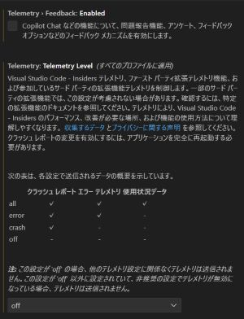

# Visual Studio Codeの種類について

資料作成日: 2025/04/11

CursorでC/C++の拡張機能が使えなくなってしまったのを受けて、Visual Studio Codeのライセンスなどを調べてみました。

## 1. Code - OSS

GitHubリポジトリ（[github.com/microsoft/vscode](https://github.com/microsoft/vscode)）で開発されているオープンソース版。  

- MITライセンスで提供されている
- 誰でも自由に使用、改変、再配布が可能
- 基本的なエディタ機能のすべてのソースコードが含まれている
- これも「Visual Studio Code」を名乗っているので分かりづらい。区別をつけるために、「Code - OSS」と呼び分けているようです。

## 2. Microsoft Visual Studio Code

前述のCode - OSSをベースに、Microsoft独自のカスタマイズを加えた製品版。  
以下、「VS Code」はMicrosoft版を指すこととします。

- Microsoftの製品ライセンスで提供
- 追加される主な機能：
  - 拡張機能を配布しているVisual Studio Marketplaceとの統合
  - リモート開発機能の一部
  - 特定のMicrosoft製デバッグアダプター
  - 厳選された拡張機能の推奨リスト
  - テレメトリーの収集

### Stable版

VS Codeの安定版

- 通常みんなが使っているのはこれ

### Insiders版

VS Codeの開発版（ナイトリービルド）

- 最新の機能や修正を一早く試すことができる
- 安定版とは別にインストール可能
- 設定や拡張機能の保存場所は安定版とは分離されている

## 主な違いのポイント

1. **ライセンス**
    - Code - OSS: MITライセンス（オープンソース）
    - VS Code: Microsoft製品ライセンス
    - Microsoftが作成している拡張機能もMicrosoftの製品ライセンス  
      以下の拡張機能など：
      - [C/C++](https://marketplace.visualstudio.com/items?itemName=ms-vscode.cpptools)
      - [C#](https://marketplace.visualstudio.com/items?itemName=ms-dotnettools.csharp)

2. **機能の違い**
    - プロプライエタリ（独占的）なコードは全体のごく一部
    - 主にMicrosoft独自のサービスとの連携機能に関する部分

3. **ブランディング**
    - Code - OSS: Microsoft以外の組織が独自のブランドで再配布可能
    - VS Code: Microsoftのブランド要素を含む

## 補足

- VS Codeは「オープンソース」ではなく「オープンソースをベースにした」製品と表現される
- ほとんどの一般ユーザーにとってはMicrosoft版のVS Codeを使用するのがもっとも便利
- 拡張機能は開発者が自由にライセンスを選択可能（ただし、その拡張機能はオープンソースとは限らない）

### VS Codeのテレメトリー

VS Codeの設定で`telemtry`で検索してみました。情報が送られているのが嫌な人は設定を変更しましょう。

### CursurやWindsurfは？

CursorやWindsurfは「VS Codeのフォーク」と書かれている記事をよく見ますが、おそらくCode - OSSのフォークだと思われます。（明確な情報は見つからず）

---
Obsidian tag:  
#research  
