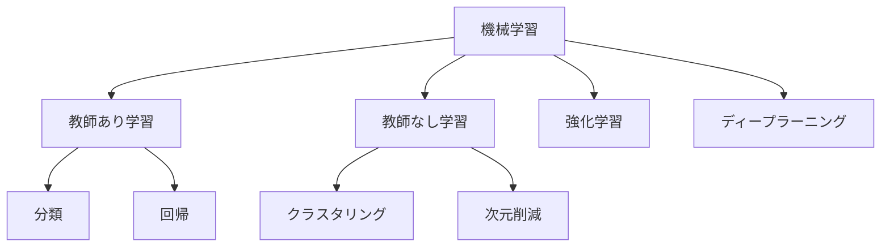

# 機械学習の学習方法

- [機械学習の学習方法](#機械学習の学習方法)
  - [機械学習の相関図](#機械学習の相関図)
  - [教師あり学習](#教師あり学習)
    - [分類](#分類)
    - [回帰](#回帰)
    - [教師あり学習の使用例](#教師あり学習の使用例)
  - [教師なし学習](#教師なし学習)
    - [クラスタリング](#クラスタリング)
    - [次元削減](#次元削減)
  - [強化学習](#強化学習)
    - [強化学習の参考記事](#強化学習の参考記事)
  - [ディープラーニング](#ディープラーニング)
  - [参考：大規模言語モデルは、どうやって学習データを作成しているのか](#参考大規模言語モデルはどうやって学習データを作成しているのか)
    - [データの収集](#データの収集)
      - [ウェブデータの収集](#ウェブデータの収集)
      - [書籍データの活用](#書籍データの活用)
      - [その他のデータソース](#その他のデータソース)
    - [データの前処理とクリーニング](#データの前処理とクリーニング)
      - [不要要素の除去](#不要要素の除去)
      - [データの品質向上](#データの品質向上)
      - [倫理とプライバシーへの配慮](#倫理とプライバシーへの配慮)
    - [データの変換とトークン化](#データの変換とトークン化)
      - [トークン化](#トークン化)
      - [テキストのベクトル化](#テキストのベクトル化)
    - [LLMの学習プロセス](#llmの学習プロセス)
      - [事前学習（Pre-training）](#事前学習pre-training)
      - [微調整（Fine-tuning）](#微調整fine-tuning)
    - [データセット作成の最近の取り組み](#データセット作成の最近の取り組み)
    - [結論](#結論)

## 機械学習の相関図

## 教師あり学習

教師あり学習は、「正解データ（ラベル）」を教えていく学習させる手法です。

たとえば、大量の動物の画像データに、「これは“ネコ”」「これは“イヌ”」・・・といったようにあらかじめラベリングをしておきます。十分なデータを用意し、それらを教師（正解）として学習を行います。

教師あり学習は、**正解・不正解が明確な問題**の解決に利用できます。

教師あり学習の手法の代表例：

- 分類
- 回帰

### 分類

カテゴリやクラスに対する予測を行う手法であり、たとえばスパムメールの分類などに使用されます。

### 回帰

連続的な値を予測するための手法であり、たとえば住宅価格の予測などに使用されます。

### 教師あり学習の使用例

- スパムメール判定
- 画像認識

## 教師なし学習

教師なし学習は、「正解のデータ」を与えずに学習させる方法です。

大量のデータを学習させることでデータの特徴やパターンなどを覚えますが、それが正解か否かを「判断」することを覚えるのが教師なし学習の特徴です。正解・不正解が明確でない場合に効果を発揮します。

教師なし学習の手法の代表例：

- クラスタリング
- 次元削減

### クラスタリング
  
クラスタリングは、データの特徴からグルーピングする手法です。  

たとえばA・B・Cという特徴を持つデータが無造作に配置されていた場合、人間であれば正解を示さずともAグループ・Bグループ・Cグループとグルーピングできるでしょう。  
同じように、教師なし学習のクラスタリングを用いることで、コンピュータが自動的にグルーピングすることが可能です。

### 次元削減

次元削減は、データを特徴づける情報を抽出する手法です。

たとえば、学校のテストで国語80点、英語90点、理科60点、数学45点という学生がいた場合、この学生は「文系が得意な学生」と見ることができます。これはデータの次元数を減らしてデータを特徴づける情報を抽出しています。

機械学習の次元削減でもコンピュータが自動的にこのようなことを実現できるのです。データの次元数を減らすことで本質的な情報を導き出す手法とも言えるでしょう。  

## 強化学習

強化学習では、出力される結果にスコア（点数）をつけて、もっとも望ましい結果を出すための行動を学習させていきます。強化学習を行う機械は、スコアという報酬をいかに最大化するかを判断しながら学習していくのです。

たとえば、株式の売買で利益を最大化する問題や、複雑な迷路をいかに最短でゴールするかなどを考える機械をイメージすると分かりやすいでしょう。

教師なし学習と同じように、正解データを学習させることはありません。しかし、教師なし学習との大きな違いは、機械が報酬を得るために最適な行動を考え実行するということです。

### 強化学習の参考記事

- [1000台超のPS4で強化学習。ソニーのAI「Sophy」は何がすごいのか](https://www.businessinsider.jp/article/250516/)
- [CEDEC2022「強化学習AIを活用してゲームデザインを！」](https://www.4gamer.net/games/476/G047655/20220828002/)

## ディープラーニング

TODO:

## 参考：大規模言語モデルは、どうやって学習データを作成しているのか

GPT-4などの大規模言語モデル（LLM）は、どうやって学習データを作成しているのか調査してみました。

### データの収集

大規模言語モデルのトレーニングには、まず膨大な量のテキストデータを収集する必要があります。データ収集には主に以下の方法が用いられています。

#### ウェブデータの収集

LLMに必要なテキストデータの大部分はインターネット上から収集されます。一般的な収集方法としては以下のような方法があります。

- **Webスクレイピング**: ニュースサイトやWikipediaなどのウェブページから情報を抽出します
- **Common Crawl（コモンクロール）**: ペタバイト級のデータ量を持つオープンソースのウェブクローリングデータベースで、多くのLLMの学習データとして広く利用されています
- **APIによるデータ取得**: TwitterやRedditなどのウェブサービスがAPI経由で提供するデータを利用します

#### 書籍データの活用

質の高いテキストデータとして書籍も重要な情報源となっています。

- **BookCorpus（ブックコーパス）**: GPTモデルやBERTなどで初期的に使用されたデータセットで、幅広いジャンルをカバーする11,000以上の書籍から構成されています
- **電子図書館**: 小説、エッセイ、詩、ドラマ、歴史、科学、哲学などのパブリックドメイン作品を含む7万冊以上の文学書が利用されます

#### その他のデータソース

- **Reddit**: ユーザーがコンテンツを投稿し、評価システム（upvote/downvote）によって質が判断されるソーシャルメディアからのデータ
- **学術論文**: 専門的な知識を学習するための情報源
- **コードリポジトリ**: プログラミング能力を持たせるためのソースコード

OpenAIの公式情報によると、GPT-4の学習データには「公開データ（publicly available data）」と「ライセンスを取得したデータ（data we've licensed）」の両方が使用されています。

### データの前処理とクリーニング

収集した生データには、ノイズや不要な情報が含まれているため、高品質なデータセットを作成するためにはクリーニングが必須です。主な前処理手法には以下のものがあります。

#### 不要要素の除去

- **HTMLタグの除去**: Webスクレイピングで収集したデータには多くのHTMLタグが含まれているため、これらを取り除きます
- **特殊記号や余分な空白の削除**: テキストの構造を整理し、モデルが正確に学習できるようにします
- **広告やスパムのフィルタリング**: LLMに無関係な情報を除去します

#### データの品質向上

- **重複データの削除**: データの冗長性を減らすために、同じ内容が繰り返されているテキストを削除します。これにはMinHashなどのアルゴリズムが使用されます
- **言語判定**: 特定の言語のデータのみを抽出するために、言語判定ツールを使用します
- **文字数・文の構造によるフィルタリング**: 文章として成り立っていないデータ（例：「#朝食メニュー スクランブルエッグ クロワッサン コーヒー」）を除外します

#### 倫理とプライバシーへの配慮

- **有害コンテンツの除去**: 差別的表現や暴力的内容を含むテキストを排除します
- **個人情報のマスキング**: プライバシー保護のため、個人を特定できる情報をマスキングまたは削除します
- **バイアスの軽減**: 性別、人種、年齢などに関するバイアスを軽減するため、データのサンプリング方法を調整します

### データの変換とトークン化

前処理後、LLMがテキストデータを理解できる形式に変換する必要があります。

#### トークン化

- **単語トークン化**: テキストを単語ごとに分割する方法で、英語などのスペース区切りの言語に有効です
- **サブワードトークン化**: 単語をさらに細かく分割し、語の一部に分解する技術。BPE（Byte Pair Encoding）やWordPieceなどが使用されます
- **文字トークン化**: 文字単位でトークン化する手法で、どんな言語や文字体系にも対応可能です

#### テキストのベクトル化

- **TF-IDF**: 単語の出現頻度と重要度を数値化する手法
- **Word2Vec**: 単語を低次元の密ベクトルに変換する手法
- **BERT埋め込み**: 文脈を考慮した単語の表現を生成する手法

### LLMの学習プロセス

GPT-4を含む大規模言語モデルの学習は、主に2段階で行われます。

#### 事前学習（Pre-training）

- **自己教師あり学習**: 大量のテキストから次の単語を予測するタスクを通じて学習します
- **因果言語モデリング**: GPT系モデルでは、過去のトークンの情報を基に次のトークンを予測する「因果デコーダー」アーキテクチャが採用されています
- **クロスエントロピー損失関数**: 各トークンの予測確率から算出される損失を最小化するように、モデルのパラメーターが更新されます

#### 微調整（Fine-tuning）

- **人間のフィードバックによる強化学習（RLHF）**: 人間のアノテーターから得たフィードバックを基に、モデルの出力を改善します
- **指示データの活用**: GPT-4自体を使って指示に従うデータを生成し、より小規模なモデルを微調整する研究も行われています

### データセット作成の最近の取り組み

最新の研究では、より高品質なデータセットを作成するための工夫も見られます。

- **無料GPT-4アプリを活用したデータ収集**: 公開されたGPT-4アプリを通じて質の高い指示（Instruction）データを収集する試み
- **クリーンデータセットの構築**: 商用可能なモデル作成のために、高品質で使用制限のないデータセットの構築に取り組む事例
- **計算リソースの最適化**: データセットのサイズが大きくなるほど前処理に時間がかかるため、並列処理や処理順序の最適化を行う技術

### 結論

GPT-4を含む大規模言語モデルの学習データ作成は、膨大なデータ収集、入念な前処理とクリーニング、適切なトークン化と変換、そして効果的な学習プロセスという複数の段階を経て行われています。とくにデータの品質は最終的なモデルの性能に大きく影響するため、重複や低品質なコンテンツの削除、有害コンテンツのフィルタリングなどの前処理が非常に重要です。

また、現在でも研究者やエンジニアたちはより効率的なデータ収集方法やクリーニング技術の開発に取り組んでおり、GPU時間やストレージなどのコンピューティングリソースの制約の中で、いかに高品質な学習データを作成するかという課題に挑戦し続けています。
