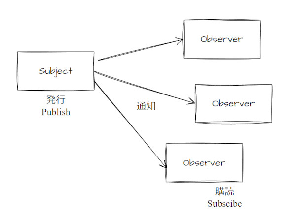

# Observer パターン：デザインパターン

通知が欲しい時のデザインパターンです。  

あるオブジェクトの状態が変化したときに、それに依存する複数のオブジェクトへ通知が欲しい場合の処理パターンです。  



- Observer: 値を受け取るオブジェクト
- Subject: 値を発行するオブジェクト（ObservableやProviderと書かれる場合もあり）  

## 実装例

```CSharp
// Observerパターンのサンプル(C#)

using System;
using System.Collections.Generic;

namespace Observer
{
	// Observerインターフェース
	public interface IObserver<T>
	{
		void OnNotice(T value);
	}

	// Subjectインターフェース
	public interface ISubject<T>
	{
		void Subscribe(IObserver<T> observer);
	}

	// Observer具象クラス1
	public class Observer1 : IObserver<int>
	{
		public void OnNotice(int value)
		{
			Console.WriteLine($"Observer1 Receive Notice:{value}");
		}
	}

	// Observer具象クラス2
	public class Observer2 : IObserver<int>
	{
		public void OnNotice(int value)
		{
			Console.WriteLine($"Observer2 Receive Notice:{value}");
		}
	}

	// Subject具象クラス1
	public class Subject1 : ISubject<int>
	{
		private List<IObserver<int>> m_observerList = new List<IObserver<int>>();
		private int m_val = 0;

		// 購読の登録
		public void Subscribe(IObserver<int> observer)
		{
			m_observerList.Add(observer);
		}

		// 値変更および通知
		public void ChangeValue(int value)
		{
			if (m_val == value) { return; }

			m_val = value;

			// 購読しているObserverに対して通知
			foreach (IObserver<int> observer in m_observerList) {
				observer.OnNotice(m_val);
			}
		}
	}

	//// メインプログラム /////
	class Program
	{
		static void Main(string[] args)
		{
			var subject1 = new Subject1();
			var observer1 = new Observer1();
			var observer2 = new Observer2();

			// 購読
			subject1.Subscribe(observer1);
			subject1.Subscribe(observer2);

			// テスト
			subject1.ChangeValue(1);


#if true	// テスト専用のコード
			Console.ReadKey();
#endif
		}
	}
}
```
