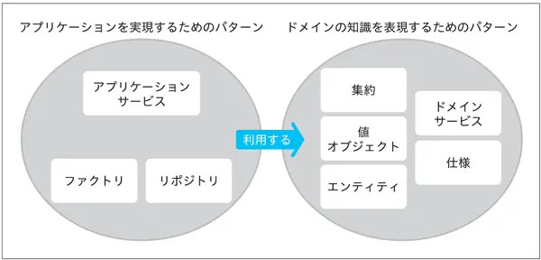

# ドメイン駆動設計の学び始め

## 目次

- [ドメイン駆動設計の学び始め](#ドメイン駆動設計の学び始め)
  - [目次](#目次)
  - [概要](#概要)
  - [なぜ「ドメイン駆動設計」が必要なのか？](#なぜドメイン駆動設計が必要なのか)
  - [「ドメイン駆動設計」とは？](#ドメイン駆動設計とは)
  - [「ドメイン」って？](#ドメインって)
  - [ドメイン駆動設計の理解について](#ドメイン駆動設計の理解について)
  - [ドメイン駆動設計に登場する代表的なパターン](#ドメイン駆動設計に登場する代表的なパターン)
  - [学ぶ順番](#学ぶ順番)

## 概要

ドメイン駆動設計（Domain-Driven Design、DDD）についてまったく知らなかったので、下記の書籍で勉強を始めました。  

[ドメイン駆動設計入門 ボトムアップでわかる！ドメイン駆動設計の基本](https://www.amazon.co.jp/dp/B082WXZVPC)

## なぜ「ドメイン駆動設計」が必要なのか？

ドメイン駆動設計が提唱されたのは2003年頃ですが、昨今になってドメイン駆動設計という言葉を耳にする機会が増えています。いったいどのような背景があるのでしょうか？  

ひと昔前はサービスをいち早く世に出すことこそがもっとも重要なこととされていました。しかし、開発速度を優先したソフトウェアは、柔軟性に乏しく、変化を吸収しきれません。ソフトウェアは変化するものです。ソフトウェアに求められる変化に対応するために、開発者は継ぎはぎのような修正を重ねます。数年もすればソフトウェアは複雑怪奇な進化を遂げるでしょう。  

場当たり的な対応に嫌気の差した開発者たちが安定運用を願うようになるのも想像に難くありません。救いを求めて手にしたものの中に「ドメイン駆動設計」がありました。  

**プログラムは動かすだけなら簡単で、しかし動かし続ける（運用し続ける）ことは難しい代物です。システムを長期的に運用したいと願うのならば、ドメイン駆動設計をいまこそ習うべきでしょう**。  

## 「ドメイン駆動設計」とは？

**ドメインを学び、学んだことをコードで表現する**  
これがドメイン駆動設計です。  

## 「ドメイン」って？

ドメイン＝「領域」  

ソフトウェア開発におけるドメインは、「プログラムを適用する対象となる領域」を指します。重要なのはドメインが何かではなく、ドメインに含まれるものが何かです。  

たとえば会計システムを例にしてみましょう。会計の世界には金銭や帳票といった概念が登場します。これらは会計システムのドメインに含まれます。物流システムであれば会計システムとは打って変わって貨物や倉庫、輸送手段などの概念が存在し、それらがそのまま物流システムのドメインに含まれます。  

このように**ドメインに含まれるものはシステムが対象とするものや領域によって大きく変化します**。  

ソフトウェアの目的は、利用者のドメインにおける何らかの問題の解決です。ドメイン駆動設計は、いわば当たり前を当たり前に実践するための開発手法なのです。  

## ドメイン駆動設計の理解について

ドメイン駆動設計を理解するのは難しいといわざるを得ません。ドメイン駆動設計の学習を進めるとまるで翻弄するかのように多くの概念や用語が出てきます。これは多くの初学者を混乱させ、恐怖に陥れます。  
知識は連鎖するものです。ある知識を得るために、前提として異なる知識が求められることは多くあります。ドメイン駆動設計で語られる概念や用語を理解するためには、その結論に至る過程で得られる多くの前提知識を要求します。ひとつひとつは些細な知識であったとしても、それがいくつもとなると対応するのは難しいものです。  

ドメイン駆動設計のプラクティスにはそもそも実践の難しいものが存在するということです。百聞は一見に如かずという言葉もあるとおり、知識を理解に落とし込むための最善の手段は実践です。残念ながらドメイン駆動設計のプラクティスには、実践するためにある程度の環境を要求するものも存在します。  

## ドメイン駆動設計に登場する代表的なパターン

- 知識を表現するパターン
  + 値オブジェクト
  + エンティティ
  + ドメインサービス
- アプリケーションを実現するためのパターン
  + リポジトリ
  + アプリケーションサービス
  + ファクトリ
- 知識を表現する、より発展的なパターン
  + 集約
  + 仕様

パターンは「アプリケーションを実現するためのパターン」と「ドメインの知識を表現するためのパターン」に分けられます。

  
※図は書籍から引用させて頂きました  

## 学ぶ順番

**1：ドメインの知識を表現するためのパターン**  
ドメインの知識をオブジェクトとして表現する手法を理解することから始めます。  

  - 値オブジェクト
  - エンティティ
  - ドメインサービス

 

**2：アプリケーションを実現するためのパターン**  
知識の表現方法を学んだ後は、利用者の必要を満たすアプリケーションを構築するための手法を学びます。  

  - リポジトリ　（リポジトリの元の意味は「貯蔵庫」「資源のありか」）
  - アプリケーションサービス
  - ファクトリ

 

**3：知識を表現する、より発展的なパターン**  
集約と仕様は知識を表現するオブジェクトですが、より発展的なパターンです。  

  - 集約
  - 仕様
