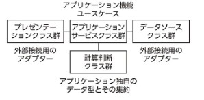
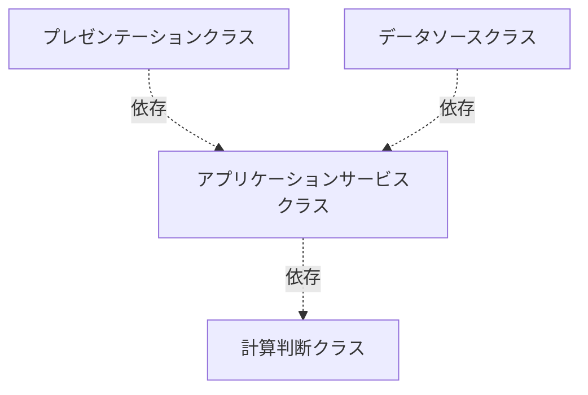

# クラス設計の鉄則 まとめ

> 5月号の「クラス設計の鉄則」という特集記事に基づき、クラス設計の基本的な考え方と実践的な指針、そして設計の劣化を防ぐための対策について要約します。

## 第1章 クラス設計再入門

この章は、モジュール性・関心の分離・依存関係の3点を中心に、クラス設計の基本的な考え方と実践的な手法を解説しています。

堅牢で変更に強いコードを作り上げるための、**クラス設計の基本**を学びましょう。

### ソフトウェアシステム構築の基本課題

ソフトウェアシステムの構築では、複雑さの整理と、修正・拡張のしやすさが大きな課題になります。

大規模なシステムは小さな部品に分割して組み立て、変化に柔軟に対応できる設計が求められます。そのための仕組みが「クラス」です。

### 設計を考えるときの視点

全体をわかりやすく整理し、変更容易性を確保するためのクラス設計の視点は、次の3つを意識することが役に立ちます。

- モジュール性
- 関心の分離
- 依存関係

### モジュール性

「モジュール性」とは、システム全体が独立性の高い部品の組み合わせで構成されている度合いです。

モジュール性の高いシステムには次の特徴があります。

- ひとつひとつの部品（モジュール）の役割が明確
- 部品と部品の接続方法が明確
- 部品の交換や追加が容易

クラスは、ソフトウェアをモジュールに分割する手段の1つです。

大きなプログラムを役割が明確なクラスに分解し、クラス間の接続方法を定義します。クラス間の接続方法とは、具体的にはメソッド呼び出しです。

#### 大きな泥団子

クラスを分割しても、ただメソッドを呼び出し合うだけではモジュール性は高まりません。

クラスとメソッド呼び出しでシステムを構築しても、構造がわかりにくく変更が困難なシステム、つまりモジュール性が低いソフトウェアになってしまうことはめずらしくありません。**大きな泥団子**と呼ばれるような、構造がわかりにくく変更が困難なシステムです。

こういうモジュール性の低いシステムでは、クラスの役割がはっきりしません。クラスとクラスの関係がわかりにくく、密接に関係するコードが異なるクラスに分散し、同じ機能のコードが複数のクラスに重複したりしています。その結果、ソフトウェアの修正や拡張はやっかいで危険な作業になります。

#### モジュールとしてのクラス

プログラムをモジュールに分割するアプローチはさまざまなスタイルがあります。

手続き的なプログラミングであれば、モジュールの基本単位は、一連の操作手順を処理の順番に記述した「手続き」です。手続きから手続きを呼び出す構造で全体を組み立てます。

関数的なプログラミングでは、モジュールの基本単位は、副作用のない（数学的な意味での）「関数」です。関数と関数を組み合わせて（合成して）新たな関数を定義することで全体を組み立てます。

```text
補足：「副作用のない（数学的な意味での）関数」について

数学でいう「関数」は、同じ入力に対して必ず同じ出力を返すものです。たとえば、f(x) = x + 1 なら、xに3を入れたら必ず4が返ってきます。何回やっても結果は変わりません。

プログラミングでも「副作用がない関数」というのは、入力が同じなら出力も必ず同じで、関数の外の状態（変数やファイルなど）を変えたりしない関数のことを指します。

つまり、「数学的な意味での関数」とは、「入力と出力が一対一で決まっていて、他の影響を与えない関数」という意味です。
```

オブジェクト指向プログラミングでは、基本のモジュール単位は「クラス」です。**クラスは関連するデータとロジックを1つのモジュールとしてまとめるためのしくみ**です。

関連するデータとロジックをひとかたまりにする、クラスを使ったモジュール化の利点は次のとおりです。

- どのように分割し整理するかの方針に一貫性がある
- 同じデータに対する操作が1つのモジュールに集まり、異なるモジュールでの重複がなくなる
- あるデータに関連した変更の影響範囲が狭い範囲に限定される

### 関心の分離

モジュール性の高いクラスを設計するために役に立つ視点が**関心の分離**です。

ソフトウェアシステムは多種多様な関心事の集まりです。さまざまな関心を切り離し、1つのクラス（1つのモジュール）では1つの関心事だけを扱うようにすることで、クラスの役割が明確になり、クラス間の関係も単純になります。

#### 計算判断と入出力を分離する

クラス設計でもっとも実践的かつ重要な関心の分離は「計算判断」と「入出力」の分離でしょう。

たとえば、「金額」「数量」「日付」は、業務的に複雑なルールを持つことが多いデータ型です。計算判断ロジックを、このような業務上のデータの種類ごと、つまり金額クラス、数量クラス、日付クラスごとに分けて整理することで、複雑なロジックが整理され扱いやすくなります。

これに対し、入出力を扱うロジックの整理は計算判断クラスほど簡単ではありません。入出力を扱うクラスの設計を難しくする原因には次の課題があります。

- 入出力操作をどういう視点でグループ化するか
- プログラム外部との入出力に伴う障害や不安定性をどう扱うか
- フレームワークや入出力用のライブラリとの依存性

入出力を扱うクラスをどう設計するかは、第2章で取り上げます。

#### アプリケーション独自のデータ型を作る

プログラミング言語に標準で用意されているデータ型（整数や文字列）だけを使っていると、あちこちに似たようなロジックが記述されます。

金額も数量もint型として扱っていると、金額に関するロジックと数量に関するロジックを判別しにくくなります。標準のデータ型だけでロジックを記述する方法は危険です。たとえば、金額と数量を足してしまったり、日数を渡すべきメソッドに人数を渡してしまったりしてしまう間違いを防止できません。

クラスを使ってアプリケーション独自のデータ型を定義すると、このような問題の発生を防げます。合計金額を扱うクラス、単価を扱うクラス、人数を扱うクラス、個数を扱うクラス、予定日を扱うクラス、というような、アプリケーション独自のデータ型をクラスを使って定義します。

#### 関係ないものを見えなくする

関心を分離するためには「可視性」のコントロールも重要な設計課題です。関心のあるものだけを見えるようにし、別の関心事は見えないようにします。

たとえば、Javaでは、public、default（修飾子無し）、protected、privateのアクセス修飾子を使って、可視性をコントロールできます。

アクセス可能な範囲（見える範囲）は可能な限り狭く設定します。ほんとうに公開が必要なものだけをpublicに指定します。

適切に関心を分離できているクラスやパッケージでは、publicを使う箇所は限定されます。**publicを使う箇所が増えてきたら、関心の分離がうまくいっていない可能性があります**。

### 依存関係

クラス同士の依存関係は、変更容易性に大きく影響します。変更がやっかいで危険になるのは、依存関係が複雑でわかりにくいからです。

クラス同士の依存関係には、暗黙的な依存関係と、明示的な依存関係があります。

- 暗黙的な依存関係：同じ処理をするコードが複数のクラスに重複しているような場合
- 明示的な依存関係：クラスの参照関係としてコード上に表れている関係

#### 暗黙的な依存関係

暗黙の依存関係は、変更をやっかいで危険にする元凶です。コードの重複や、関連するコードが複数のクラスに分散している状況です。

プログラムが大きくなると、全体を見渡して重複や分散を発見し改善することが難しくなります。実際に変更してみた結果、そういう重複や分散を発見することがあります。しかし、そういう見つけ方は、場当たり的で時間がかかる割には、ごく一部の改善になりがちです。

関連するコードの重複や分散をあらかじめ防ぐ方法の1つが、アプリケーション独自のデータ型です。アプリケーションでどのような種類の値を扱うかは、要求分析など設計の初期の段階からいろいろ見つかります。業務的に関心がある値は「請求金額」「割引率」「有効期限」など業務で使われる言葉として発見できます。そういう用語のすべてがデータ型になるわけではありませんが、アプリケーション独自のデータ型の有力な候補です。

こういうデータ型の候補を、開発の早い段階からクラスとして定義しておきます。どういうロジックやメソッドを実装すべきかは、まだあいまいな段階であっても、ロジックの仮の置き場所としてクラスを作成します。そういうロジックの置き場所を事前に用意することで、コードの重複や分散のかなりの部分が予防できます。

開発が進むにつれ、仮置きのクラスにロジックが集まってくると、コード量が増え、コードが乱雑になり、クラス名やメソッド名と記述内容が一致しなくなります。しかし、これは悪い状況ではありません。**良い設計を見つけるための手がかりが手元に集まっている**ので、設計の問題点やその改善方法を具体的に判断できます。

このような段階のクラスの設計をどう改善するかの具体的な方法は第3章で説明します。

#### 明示的な依存関係

あるクラスから別のクラスを利用する依存関係は、メソッドの呼び出し関係として、ソースコード上に明示されます。最近の高機能なエディタや開発ツールを使えば、過度に複雑になっている依存関係を検出したり、可視化したりすることが簡単にできます。

全体の構造がわかりにくく、変更容易性が低いプログラムになってしまう依存関係の典型的な問題は大きく2つです。

- 依存関係の多さ
- 不安定な依存関係

##### 依存関係の多さ

依存しているクラスが、同じパッケージのクラスであれば、あまり大きな問題ではありません。依存関係のあるクラスを変更するときに、変更の影響範囲が同じパッケージ内のクラスに閉じていれば、関心の分離とモジュール化がうまくできていると判断できます。

それに対し、異なるパッケージへの参照が多いクラスは問題です。変更の影響範囲が、複数のパッケージに広がると、変更の影響範囲の確認や変更作業が大変になります。

依存関係が多いクラスは、メソッドが長くなり、クラスが大きくなります。そのようなメソッドやクラスのどのような点に注目し、どのように設計を改善するかは、第3章で取り上げます。

##### 不安定な依存関係

クラスとクラスの依存関係の実体はメソッドの呼び出しです。コード上は安定した呼び出し関係に見えても、実行時に、その関係が不安定になることがあります。

たとえば数量の足し算をするメソッドを考えてみましょう。

`int add(int 増分) {...}`

このメソッドを使った呼び出し関係は、不安定です。Javaであれば、引数の増分は、負の値でもよいし、最大約21億を渡すこともできます。メソッドが返す値は、マイナス約21億からプラス約21億までの可能性があります。

実際のアプリケーションの適切な数量計算はもっと狭い範囲に限定されます。たとえば「注文数量」は1以上で最大100未満でなければならない、というような業務上の決め事があったりします。int型を使うこのメソッドでは、その制限を守っていません。実行時に、間違った値の混入や不適切な計算結果が発生する可能性があります。

数量が1以上で100未満であることが保証されているアプリケーション独自のデータ型としてQuantityクラスを定義したとします。数量の足し算は次のように表現できます。

`Quantity add(Quantity 増分) {...}`

引数の値の範囲も、計算結果の値の範囲も、業務の決め事どおりになっていることを保証できます。このメソッドは呼び出す側と呼び出される側の関係が明確で、かつ、動作が安定します。

このようなメソッドの仕様を明確にする設計方法は「契約プログラミング」と呼ばれる設計技法の一種です。

契約プログラミングとは、メソッドを呼び出す側が守るべき制約条件（事前条件）と、メソッドを提供する側が守るべき制約条件（事後条件）を、明確に定義することを重視する設計技法です。

メソッド呼び出しの仕様（事前条件と事後条件）をできるだけ厳格に制限することが、ソフトウェア全体の構造をわかりやすくし、実行時の挙動を安定させます。

### 第1章のまとめ

クラス設計の基本は、次の3つの視点を意識することです。

- モジュール性
- 関心の分離
- 依存関係

## 第2章 迷わないクラス設計の指針

この章では、モジュール性、関心の分離、依存関係の視点を実践的なアプリケーション開発におけるクラス設計で活用する方法と、現代的なクラス設計の指針について解説します。

### アプリケーションの関心事とクラス設計

第1章で説明したとおり、ソフトウェアの多種多様な関心事を適切に分離することは、クラスの重要な役割です。それでは、アプリケーションを構築するためのさまざまな関心事を分離するためには、どのようなクラス設計が役に立つでしょうか。

関心の分離の基本方針、そしてクラスを使ったモジュール化と依存関係の整理の指針として参考になるのが、アプリケーションアーキテクチャです。アプリケーションアーキテクチャとは、アプリケーションソフトウェアの構造や設計の枠組みを定義した設計モデルです。

よく知られたアプリケーションアーキテクチャとしては

- 多層アーキテクチャ
- ポートとアダプター（ヘキサゴナルアーキテクチャ）
- オニオンアーキテクチャ
- クリーンアーキテクチャ

などがあります。これらのアーキテクチャのスタイルは、強調する点や考え方に異なる点があります。しかしいずれのスタイルも、関心の分離の観点では、アプリケーションの関心事を次の4つに分類しているという点でほぼ同じです。

- 計算判断
- アプリケーションサービス
- プレゼンテーション
- データソース

それぞれの分類をクラスとして設計すると、図1のような構造になります。

図1：



なお、これらの関心事の分類は、それぞれのアーキテクチャスタイルにおいて異なる用語で表現されています。表1にその違いを整理しています。

表1 関心事の分離とアプリケーションアーキテクチャの用語の対応：

| 関心事                   | 概要                                         | 対応する用語                              |
|--------------------------|----------------------------------------------|-------------------------------------------|
| 計算判断                 | 業務ルールに基づく計算ロジックや判定ロジック | ドメインモデル、エンティティ、ビジネスロジック |
| アプリケーションサービス | アプリケーション機能の提供                   | ユースケース                              |
| プレゼンテーション       | 外部からのリクエストの受付                   | プライマリーアダプター                    |
| データソース             | データベース操作や外部との通信               | セカンダリーアダプター                    |

#### 依存関係とクラス設計の順序

アプリケーションの4つの関心事をクラスとして実装する場合、クラス間の依存関係は次のように設計します。

- 計算判断クラスはほかの関心事のクラスに依存しない
- アプリケーションサービスクラスは計算判断クラスに依存し、プレゼンテーションクラスとデータソースクラスには依存しない
- プレゼンテーションクラスとデータソースクラスは、アプリケーションサービスクラスに依存する



依存関係は設計の順番に影響します。先に依存される側のクラスを設計し、依存する側のクラスは、依存されるクラスがすでにある状態で設計します。

つまり適切なクラス設計は

1. 最初に計算判断クラスを設計
2. 次にアプリケーションサービスクラスの設計
3. その後でプレゼンテーションクラスとデータソースクラスを設計

という順序になります。

#### 計算判断クラスの設計

入出力では、プログラム外部とのやりとりが発生します。それに対し、計算判断はプログラム内部に閉じた関心事です。そのため計算判断は、ほかの関心事に依存しない、完全に独立した関心事として扱うことが可能です。また、そのようにクラスを設計すべきです。

計算判断クラスの設計の基本は、アプリケーション独自のデータ型の設計です。アプリケーションで扱うさまざまな値の種類ごとに、値を表現するデータとそのデータを操作するロジックを1つにまとめたクラスを設計します。値の種類とは、たとえば、金額、数量、単価、割引率、予定日、有効期限などです。

そして、複雑な業務ロジックを表現するために、これらのアプリケーション独自のデータ型を組み合わせた、計算判断集約クラスを設計します。

計算判断クラスは、次のような計算や判定のメソッドを提供します。

- 足し算、引き算、掛け算、割り算
- 同値判定、大小判定、有効範囲（最少、最大）

汎用のデータ型であれば、これらの計算用のメソッドをすべて用意することが基本です。それに対して、アプリケーション独自のデータ型を表現する計算判断クラスではこれらをすべて用意せず、アプリケーションに必要なメソッドだけに絞って実装します。この必要なメソッドの特定が、計算判断クラスを設計するときの中心課題です。

計算判断クラスは、内部のインスタンス変数の状態を変更しない、不変なクラスとして設計することが基本です。

#### アプリケーションサービスクラスの設計

アプリケーション機能やユースケースを実現するアプリケーションサービスクラスは、ほかの関心事を統合する役割のクラスです。異なる関心事を1つのクラスで扱うことになるため、設計に注意が必要なクラスです。

たとえば、顧客登録のアプリケーションサービスを実装する1つのクラスに、次のような関心事が混在しているとします。

- 顧客登録リクエストを受け取る
- 顧客登録の可否を判断する
- 登録が可であれば、データベースに記録する
- 登録の完了を依頼者に通知する

アプリケーションサービスクラスがこれらの関心事のすべての詳細を抱え込むと、巨大なクラスになり、理解することも、変更することも難しいクラスになります。

それを防ぐためには、関心を分離するためのさまざま工夫を組み合わせることが必要です。上記の例をベースに、その工夫の具体例を紹介します。

まず、外部からの顧客登録リクエストを受け取る処理の詳細は、別クラスに切り離します。これは、次の項で説明するプレゼンテーションクラスになります。

顧客登録の可否を判断するロジックの詳細は、計算判断クラスで実装します。アプリケーションサービスクラスは、顧客登録を判断するクラスのインスタンスを生成して判断用のメソッドを実行し、その判断結果を受け取るようにします。

データベースへの書き込みの詳細は、データソースクラスに切り離して実装します。アプリケーションサービスクラスは、データソースクラスにデータベース操作を任せます。依頼者への通知も、通知用のデータソースクラスに任せます。

データソースクラスは、データベース設計や通信プロトコルの実装などに強く依存します。アプリケーションサービスクラスの設計をデータソースクラスの設計に合わせてしまうと、異なる関心事がアプリケーションサービスクラスに混在してしまいます。

さらに、明確に関心を分離するために、データソースクラスの実装とデータソースクラスが提供すべき機能の定義を分離します。JavaやC#であれば、提供すべき機能をinterfaceで定義し、データソースクラスはそのinterfaceの実装クラスとして設計します。そして、interfaceの設計は、アプリケーションサービスクラスにとって、どんな機能が必要かという視点だけで設計します。そうすることでデータベース操作や通信の実装の関心事との分離を実現します。

このような技法を組み合わせることで、アプリケーションサービスクラスは、処理の流れの要点だけを表現した、わかりやすいクラスになります。

アプリケーションサービスクラスのメソッドが増えてきた場合、あるいは、設計方針として記録と参照の関心事を分離したモジュール化をしたい場合は、記録系の機能と参照系の機能を別のアプリケーションサービスクラスに分けることも選択肢の1つです。

アプリケーションサービスクラスは、さまざまな関心事を組み合わせているため、機能の修正や追加をするときに、このクラスにif文や計算式を追加することが、もっと手っ取り早い選択肢になりがちです。しかし、これを繰り返すと設計が劣化します。

このような設計の劣化を防いだり、劣化した設計を継続的に改善したりする取り組みについては、第3章で取り上げます。

TODO:

## 自分的まとめ

- クラスは小さく
- 関連するデータとロジックを1つのクラスに
- アプリケーション独自のデータ型を作る
- publicを使う箇所が増えてきたら、関心の分離がうまくいっていない
- 計算判断クラス、アプリケーションサービスクラス、プレゼンテーションクラスおよびデータソースクラスの順で設計
  - 計算判断クラスの設計
    - アプリケーション独自のデータ型クラス
    - アプリケーションに必要な計算判断の結果を表現するクラス
    - 内部のインスタンス変数の状態を変更しない、不変なクラス
  - 
