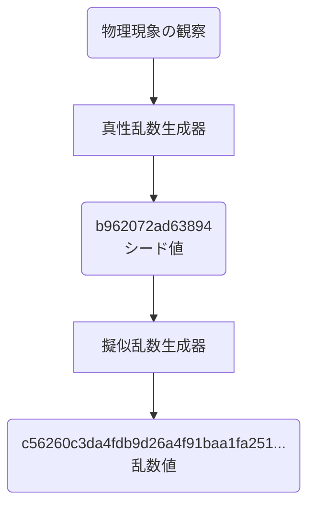
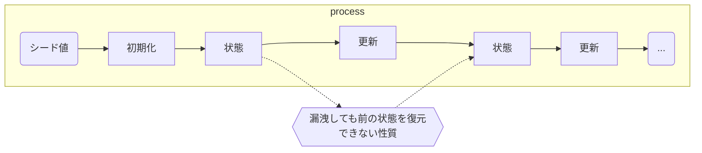
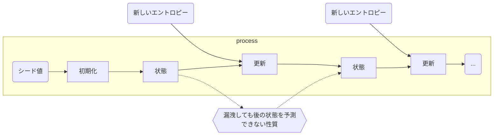

# 乱数

## 「乱数」とは何か

乱数とは、一定の範囲内で予測不可能な値を無作為に生成した数値や数列のことです。

情報通信の分野においては「ランダムビット」と呼ばれることもあります。ランダムとは「事象の発生に法則性や規則性がなく、予測が不可能な状態」のことです。

コンピューターで生成される擬似乱数の多くは、一様分布になるように生成されます。一様分布とは、すべての値が等しい確率で選ばれる分布のことです。

一様分布に従わない乱数生成器を使うと、生成された値に偏り（バイアス）が生じます。この偏りがあると、攻撃者に乱数の生成パターンを解読する際の手がかりを与えることになり、セキュリティが低下します。そのため、乱数を生成する際は一様分布を満たす乱数生成器を使用することが重要です。

### 疑似乱数

疑似乱数は、特定のアルゴリズムで処理（攪拌）することで生成される、ランダムに見える値のことです。

アルゴリズムの例:

- 線形合同法（C言語のrand関数などで使用されている）
- メルセンヌ・ツイスタ

擬似乱数は決定論的なアルゴリズムから生成されているため、周期性、予測可能性や分布の偏りがどうしても生じてしまいます。そのため、研究等で精度の高い解析を得るためには、精度の高い生成アルゴリズムを用いることが重要です。

精度の例:  
線形合同法 ＜ メルセンヌ・ツイスタ

擬似乱数生成器は外部から与えられるシード値を基にコンピューターの計算で乱数が生成されます。生成される乱数列は、**同じシード値を入力すれば同じ乱数列を再現します**。

### 真性乱数

真性乱数は、物理現象の観測から生成される値のことです。  
ハードウェア由来の不確定な現象や電子回路で発生するノイズや元素の崩壊など、挙動が予測不可能な現象（エントロピー）を元に値を生成させます。
一般的に、真性乱数は生成に非常に時間がかかるというデメリットがあります。

エントロピーの例:

- 温度や気流、環境音、静電気、熱雑音などの物理現象
- マウス操作やキーボード入力
- ネットワークトラフィック、ディスク操作、システムログ、プロセス情報

真性乱数生成器の例:

- メーカーが販売しているハードウェア乱数発生器
- `/dev/random`（Unix系OSのみ）

## 乱数の主な用途

- 暗号化
  - SSL/TLS
  - RSA
  - ECDSA
- 研究の際のシミュレーション
- ハッシュ関数
- ゲーム

## 乱数の性質

- 無作為性: 統計的な偏りがなく、規則性のない完全にランダムな数列である性質
- 予測不可能性: 過去に生成された乱数列から次の乱数を予測できない性質
- 再現不可能性: 同じ条件で再び同じ乱数列を生成できない性質

真性乱数は、無作為性、予測不可能性、再現不可能性のすべてを満たすため、暗号技術として安全に利用ができます。

擬似乱数は、暗号技術として安全に利用できるものと利用できないものがあります。  
擬似乱数生成器を使って生成する一般的な擬似乱数は、シード値と呼ばれる初期状態の値から生成されるため、再現不可能性は満たしません。ただし、真性乱数と組み合わせることで暗号技術として安全に利用できます。

## 真性乱数と擬似乱数の組み合わせ

真性乱数のメリットは、もっとも安全に乱数を生成できることですが、生成に非常に時間がかかるというデメリットもあります。  

そのため現代の暗号技術では、真性乱数の値を擬似乱数生成器のシード値として利用する方法がよく使われています。真性乱数生成器（TRNG：True Random Number Generator）と擬似乱数生成器の2つを組み合わせることで、擬似乱数であっても再現不可能性を持つ乱数を生成できる暗号論的擬似乱数生成器（CSPRNG：Cryptographically Secure Pseudo Random Number Generator）を実現できます。

疑似乱数は、同じシード値を入力すれば同じ乱数列を再現できてしまいます。その代わりに、真性乱数のみを使用する場合と比べて高速に大量に乱数の生成ができます。

暗号論的擬似乱数生成器（CSPRNG）の乱数生成方法:

## 前方秘匿性と後方秘匿性

ここまでで説明した乱数の性質に加えて、現代の暗号論的擬似乱数生成器には前方秘匿性と後方秘匿性というセキュリティ特性が求められています。

### 前方秘匿性

前方秘匿性とは、攻撃者によって現時点の擬似乱数生成器の内部状態が侵害されたとしても、それよりも前（過去）に生成された乱数の推測が困難である性質のことです。この性質により、過去の乱数列の安全性が維持されます。

### 後方秘匿性

後方秘匿性とは、攻撃者によって現時点の擬似乱数生成器の内部状態が侵害されたとしても、それよりも後（未来）に生成された乱数の予測が困難である性質のことです。この性質により、未来の乱数列の安全性が確保されます。

具体的には図のように、内部状態を定期的に新しいエントロピーで更新（再シード、リシード）することで、内部状態が漏洩されたとしても影響を最小限に抑えるようなしくみによって後方秘匿性を実現しています。

## Fortuna

Fortunaは、2003年に発表された暗号論的擬似乱数生成器で、前方秘匿性と後方秘匿性の性質を持っています。FortunaはmacOSやiOSで使用されているほか、FreeBSD 11以降の/dev/randomや/dev/urandomでも使われています。

Fortunaは次の手順で乱数生成を行います:

1. エントロピープールの更新
2. 内部状態の更新（リシード）
3. 乱数生成
4. 鍵の更新

既存の鍵Kから新しい鍵K'を作成するときに、AES暗号化を使います。暗号文からAESで使用した鍵を特定するのは困難であり、AESの鍵から暗号文への変換は一方向性関数の変換と見なすことができます。そのため、現在の鍵Kの状態が攻撃者に漏洩したとしても、過去の状態を特定するのは困難です。このことから、Fortunaは前方秘匿性を持つと言えます。

　さらに、Fortunaは後方秘匿性を維持するために、定期的にリシード（Reseed）を行います。リシードを100msなどの短い間隔で定期的に実行し、鍵Kをエントロピー源から再生成することで、仮に現在の鍵Kの状態が攻撃者に漏洩したとしても、内部状態の鍵Kが定期的に変わるため、未来に生成される乱数への影響を最小限にできます。

　また、FortunaはOS起動直後にエントロピー源が不足する問題を解決するために「シードファイル」と呼ばれるエントロピーを保存するしくみを備えています。具体的には、OSをシャットダウンする前に、現在の鍵Kと更新カウンターCを基に、AES暗号化で生成されたランダムビット列をシードファイルに保存します。このシードファイルは、次回のOS起動直後にFortunaが乱数生成するために不足するエントロピーを供給する役割を果たします。

## 安全な乱数の生成方法

### OSのAPIを使った乱数生成

#### /dev/random、/dev/urandom

LinuxやmacOSには、ファイルシステムを経由した乱数生成のAPIとして`/dev/random`と`/dev/urandom`があります。  
この2つは、暗号学的に安全な乱数生成器として機能するデバイスファイルです。デバイスファイルとは、ファイルシステム上であたかも通常のファイルのような形で使用できるデバイスドライバのインターフェイスです。通常は、周辺機器とのやりとりに使われますが、乱数生成に関しては周辺機器と接続しないため、擬似デバイスファイルと呼ぶこともあります。

#### /dev/randomと/dev/urandomの違い

`/dev/random`と`/dev/urandom`はどちらも安全な乱数を生成しますが、実行中に処理が停止（ブロック）するかしないかの違いがあります。

##### /dev/random

ブロッキング乱数生成器である`/dev/random`は、カーネルのエントロピープール（収集された環境ノイズ）からエントロピーを取得します。エントロピープールが空の場合は、追加の環境ノイズが収集されるまで処理が停止されます。もっとも安全性が必要な場合にのみ利用します。たとえば鍵のローテーションを想定していないSSH鍵などの暗号鍵の生成で使用されます。

#### /dev/urandom

ノンブロッキング乱数生成器である`/dev/urandom`は、カーネルのエントロピープールからエントロピーを取得して、ブロックせずに即時に擬似乱数を生成します。エントロピープールが枯渇しているときもブロックすることはなく、暗号論的擬似乱数生成器FortunaのようにOS再起動前に収集したエントロピーを利用するなどの工夫によって、多くの暗号用途の場面において十分な安全性を提供します。一般的な暗号用途として、セッションIDやパスワード生成、有効期限があるTLS証明書やAPIキーなどの生成で使用されます。

#### BCryptGenRandom

Windowsの`BCryptGenRandom()`は、Windowsの暗号化APIの1つで、暗号学的に安全な乱数を生成するための関数です。  
古いプログラムでは`CryptoGenRandom()`関数が使われていましたが、最新のWindowsのバージョンでは、CNG APIであるBCryptoGenRandom()に置き換わっています。

BCryptGenRandom()の第1引数には乱数生成アルゴリズムを指定できますが、NULLを指定してシステム既定の擬似乱数を使用することが推奨されています。下手に自作の擬似乱数生成器を指定すると、乱数生成における安全性が保証されなくなるためです。

### OpenSSLを使った乱数生成

安全な乱数生成は単にOSのAPIを使うだけでは十分とは言えません。たとえば、Intel CPUに搭載されているRDRAND命令はハードウェア乱数生成器からランダムな数値を取得するための命令ですが、RDRANDの内部設計はすべて公開されていないことから、過去にバックドアの可能性を指摘されたことがあります。  
そのため、OSが提供するただ一つの乱数生成APIに依存するのではなく、ソフトウェア側でもOSのAPIと他のエントロピー源を混ぜ合わせてシードを管理し、安全な乱数を生成する必要があります。

オープンソースの暗号化ライブラリとして代表的なのが「OpenSSL」です。OpenSSLは独自のしくみを用いてエントロピーの収集方法や予測不可能性を強化しており、OS固有のAPIを直接呼び出さなくても、OpenSSLが用意したAPIを呼び出すことで、より安全な乱数を生成できます。

OpenSSLはLinux、macOS、Windowsなど、さまざまなプラットフォームで利用できます。Linuxでは/dev/randomや/dev/urandom、Windowsでは暗号APIのBCryptGenRandom、CPUが対応している場合はx86ではRDSEEDやRDRAND命令を、AArch64ではRNDRRS命令を利用して、エントロピーを収集しています。

ただし、**古いバージョンのOpenSSLでは、乱数生成アルゴリズムに脆弱性がある可能性があります**。使用しているOpenSSLのバージョンが最新であることを必ず確認してください。

### プログラミング言語での乱数生成

多くのプログラミング言語で提供される標準的な乱数生成器は、シミュレーションや統計的な用途を目的としたものも含まれています。たとえば、C言語のrand()やPythonのrandomモジュールなどです。しかし、これらはシード値が推測可能な場合、生成される乱数も予測可能になるため、**暗号やセキュリティ関連の用途には適していません**。

プログラムで乱数生成器を利用するときは、プログラミング言語が提供する標準的な乱数生成器と、暗号学的に安全な擬似乱数生成器（CSPRNG）のどちらを利用しているのか意識する必要があります。

プログラミング言語で安全な乱数を生成する方法を見つけるには、公式ドキュメントを探して言語が提供している標準ライブラリやモジュールを調べる必要があります。検索するときに、プログラミング言語名と「安全な乱数」で調べると効率よく見つけられるので、検索してみてください。

## 乱数の脆弱性が世界に大きな影響を与えた例

### 擬似乱数生成器Dual_EC_DRBG（Dual Elliptic Curve Deterministic Random Bit Generator）の脆弱性

Dual_EC_DRBGは、2006年に米国の国立標準技術研究所（NIST）によって発表された擬似乱数生成器の1つです。アルゴリズムには、楕円曲線暗号を利用するという特徴があります。当時、楕円曲線暗号は高いセキュリティを提供すると考えられており、Dual_EC_DRBGはその先進的な数学理論を利用したものとされていました。

しかし、Dual_EC_DRBGが発表されて間もなく、暗号研究者からDual_EC_DRBGに対するいくつかの問題点が指摘されました。2人の研究者は2007年、Dual_EC_DRBGに米国国家安全保障局（NSA）によるバックドアの可能性があると指摘しました。彼らはDual_EC_DRBGのアルゴリズムにおける特定の楕円曲線のパラメータが意図的に選ばれた可能性があり、そのパラメータによって出力される乱数は予測できる可能性があることを示しました。

Dual_EC_DRBGは、バックドアを仕込まれている可能性がありつつも、2007年から2013年までの間、公式には「安全」とされたままNIST標準であり続けました。

Dual_EC_DRBGの削除と標準化プロセスの透明性の改善のきっかけになったのが「スノーデンの告発」と呼ばれる出来事です。暴露された機密文書の中には、NSAがNISTの標準化プロセスに影響を与え、意図的にバックドアを組み込んだ可能性があるという指摘が含まれていました。とくに擬似乱数生成器Dual_EC_DRBGについては、NSAがバックドアを仕掛け、乱数の予測が可能となるように設計されていたことが示唆されています。また、NSAが複数の企業に対し、自社製品にDual_EC_DRBGを採用させるため金銭を支払ったという疑惑もありました。

このように、NSAはシグナルインテリジェンス（通信傍受による諜報活動）で暗号化通信の基盤に介入し、国家安全保障に貢献していました。

### Dual_EC_DRBGの反省と教訓

スノーデンの告発以前は、広範囲にわたる監視はコストがかかりすぎて現実的ではないと多くのエンジニアが考えていました。しかし実際には国家レベルで広範囲にわたる監視が行われていました。擬似乱数生成器Dual_EC_DRBGの歴史は、次の重要な教訓を残しています。

- 標準化プロセスの透明性の確保
- 盗聴を前提とした設計

## 安全な社会基盤を目指して

乱数は、すべての現代暗号アルゴリズムの基本となるものです。現代の暗号アルゴリズムは、鍵生成など暗号強度に関わる部分において、利用する乱数の品質に依存しています。もし、品質の低い乱数を使用すると、安全な暗号化アルゴリズムを使用していても、鍵の長さが十分に活かされず秘匿性を確保できなくなる可能性があります。そのため、安全な乱数を生成することはセキュアなシステムを作るうえで重要です。

特別な事情がない限り、暗号技術を使うためのライブラリなどは言語の標準機能で提供されているものやOpenSSLなどの信頼できるライブラリを使いましょう。独自の暗号は一見安全そうに見えても専門家のレビューを受けていないため、多くの未知の脆弱性が含まれている可能性があります。

現在使われている暗号プロトコルは、暗号プリミティブ（基本的な暗号アルゴリズムや部品）を組み合わせることで構築されています。もし暗号プリミティブの1つである乱数生成器に脆弱性があると、それを使って構築しているすべての暗号プロトコルが脆弱になります。そのため暗号技術を選ぶときは、**透明性のある標準化プロセスによる選考の結果選ばれた暗号アルゴリズムを使うことが大切**です。

## 参考資料

- 『SoftwareDesign 2025年3月号』記事 - 第1回 暗号の鍵を握る乱数とは？
- 『SoftwareDesign 2025年4月号』記事 - 第2回 擬似乱数生成器の性質としくみ
- 『SoftwareDesign 2025年5月号』記事 - 第3回 安全な乱数の生成方法
- 『SoftwareDesign 2025年6月号』記事 - 第4回 乱数が引き起こす暗号の危機

## 余談：C言語のrand関数の精度が低い理由

C言語の`rand`関数は、その精度は低いとされています。  

主な問題点は以下の通りです：

- **周期が短い**: 周期は最大で2の31乗ですが、実際には短いことが多く、とくに小さな範囲で使用すると周期が明らかになります。
- **下位ビットの周期性**: 下位ビットは0と1が交互に現れるため、特定のビットの周期が短くなります。
- **多次元分布の非均等性**: 複数の乱数を組み合わせると、分布に特定の構造が現れることがあります。
- **移植性の問題**: `RAND_MAX`の値が環境によって異なるため、移植性が低いです。

これらの理由から、精度の高い乱数が必要な場合は、メルセンヌツイスタやXorshiftなどのアルゴリズムを使用することが推奨されます。
