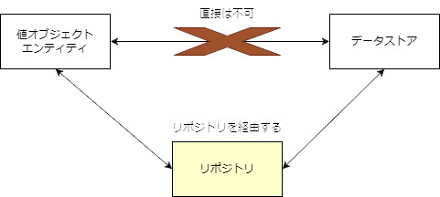

# 其の五

ここからは **「アプリケーションを実現するためのパターン」** のお話。  

## リポジトリ

「リポジトリ」は、データの保管庫を表します。  
「永続化」は、インスタンスを保存し、復元できるようにすることを表します。  

ドメイン駆動設計における「リポジトリ」は、データを永続化し再構築するといった処理を抽象的に扱うためのオブジェクトです。  
データストアに書き込み処理を依頼する、データストアからインスタンスを再構築する、などの処理を行う場合はリポジトリを経由して行います。  

  

リポジトリを経由して行うということだけのことが、ソフトウェアに驚くほどの柔軟性を与えます。  
単純にファイルにデータを保存する場合もあれば、データベースに保存する場合もあります。抽象化したリポジトリを経由すれば、開発初期にまだデータストアの種類が決まっていなくても開発が進められますし、テスト時にはテスト用のリポジトリを作ることも可能でしょう。（「依存関係逆転の原則」と関連してきますね）  

## アプリケーションサービス

アプリケーションサービスは、ドメインオブジェクトを用いてアプリケーションを構築するユースケースを実現します。つまりアプリケーションは、ユースケースの集合です。  
アプリケーションサービスを実装するときに気を付けることは、ドメインのルールが記述されないようにすることです。  

```CSharp
public class OrderApplicationService
{
    private readonly IOrderRepository m_orderRepository;
    private readonly ICustomerRepository m_customerRepository;
    private readonly IProductRepository m_productRepository;

    public OrderApplicationService(IOrderRepository orderRepository, ICustomerRepository customerRepository, IProductRepository productRepository)
    {
        m_orderRepository = orderRepository;
        m_customerRepository = customerRepository;
        m_productRepository = productRepository;
    }

    // 注文する
    public void PlaceOrder(OrderRequest orderRequest)
    {
        Customer customer = m_customerRepository.GetById(orderRequest.CustomerId);
        Product product = m_productRepository.GetById(orderRequest.ProductId);
        Order order = new Order(customer, product, orderRequest.Quantity);
        m_orderRepository.Save(order);
    }

    // 注文をキャンセルする
    public void CancelOrder(int orderId)
    {
        Order order = m_orderRepository.GetById(orderId);
        order.Cancel();
        m_orderRepository.Save(order);
    }
}
```

### メモ: ドメインサービスに入れるべきか、アプリケーションサービスに入れるべきか、区分けが難しいのでは？  

ドメインサービスに記述されたビジネスロジック（ドメインのルール）は、他のアプリケーションサービスからも利用できます。なので、同じビジネスロジックが複数のユースケースで利用される場合は、ドメインサービスに記述することが適切です。  

## ファクトリ

「複雑な道具はその生成過程も得てして複雑である」  
例えばコンピューター  

プログラムにおいても同じで、複雑なオブジェクトはその生成過程も複雑な処理になることがあります。  
求められることは複雑なオブジェクトの生成処理をオブジェクトとして定義することです。この生成を責務とするオブジェクトのことを、道具を生成する工場になぞらえて **「ファクトリ」** といいます。オブジェクトの生成に関わる知識がまとめられたオブジェクトです。  

＜メリット＞  

- まったく同じ生成処理がそこかしこに記述されることを防ぐことが出来る  
- 生成処理をカプセル化することはロジックの意図を明確にしながら、柔軟性を確保することが出来る  
