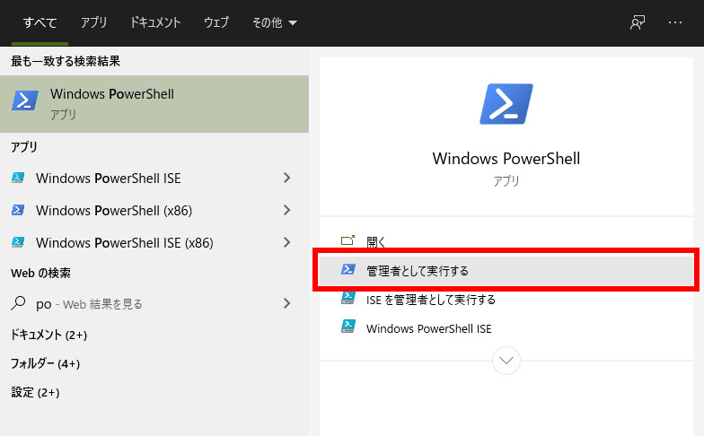
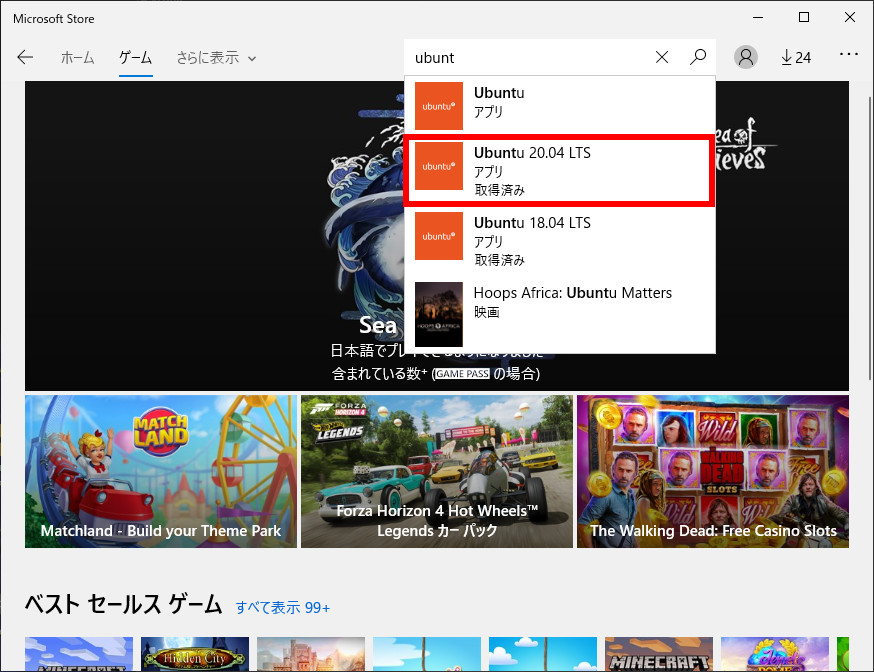
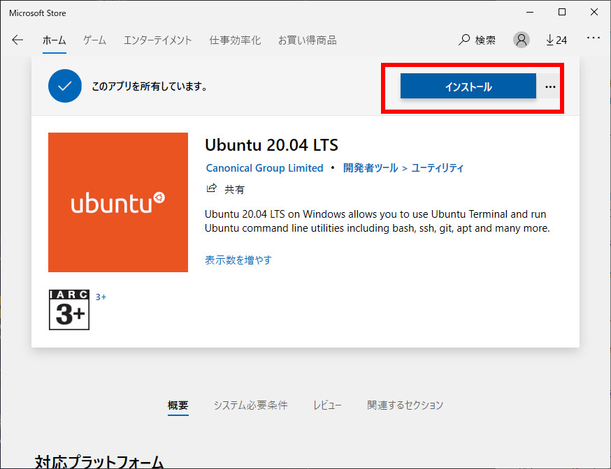
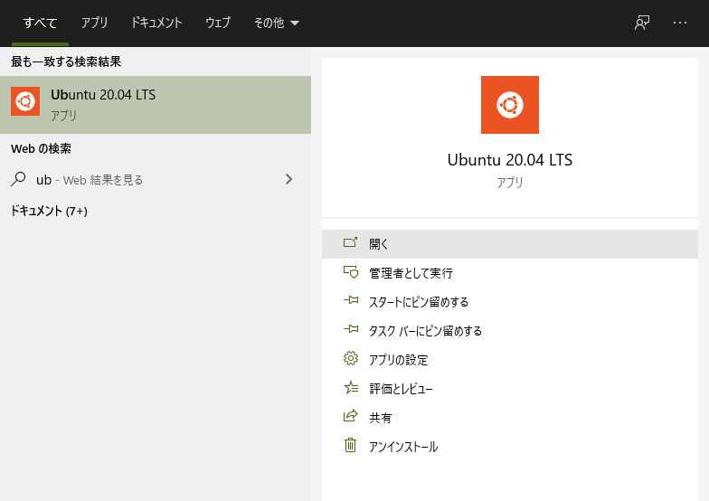
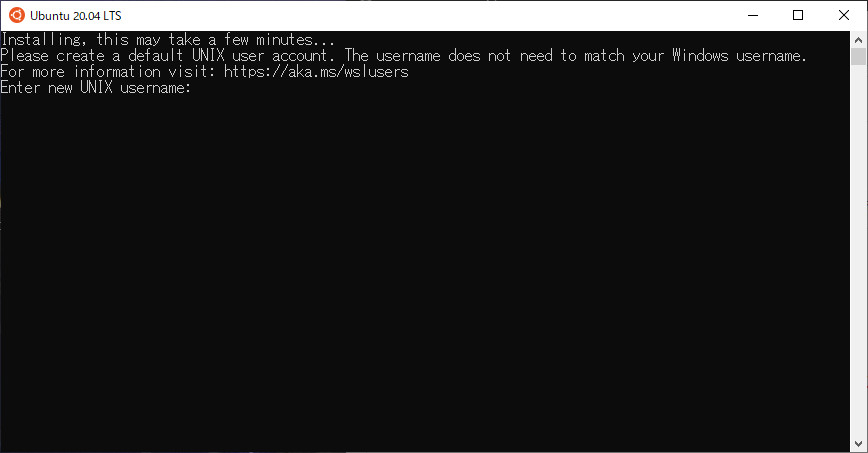
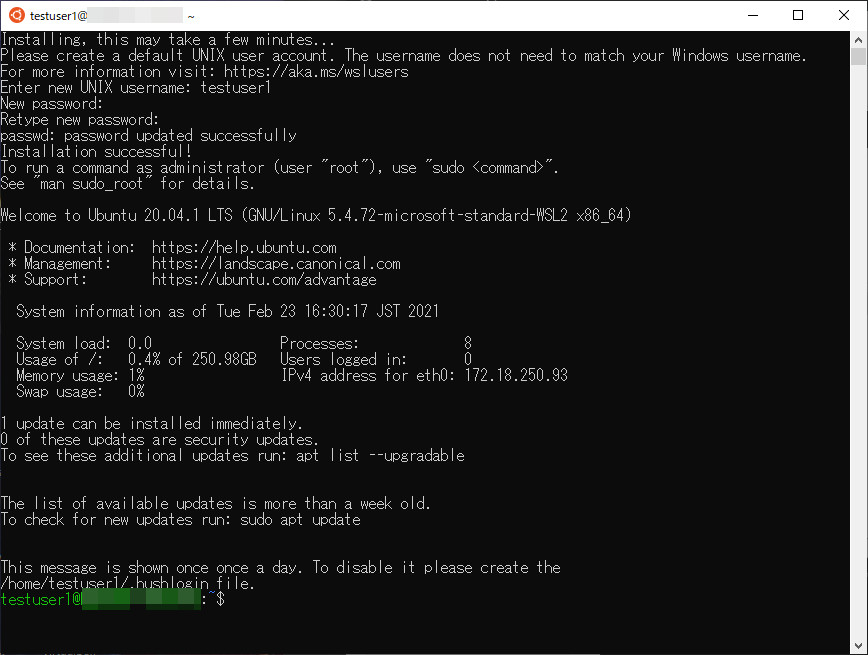
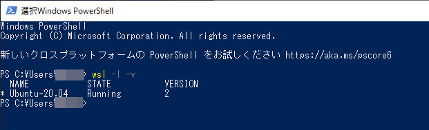

# 「WSL」って何？  

WSLとは「Windows Subsystem for Linux」の略  
簡単に言うと Windows10の上でLinuxを動かすことが可能な仕組みです。  

詳しくはこの辺の記事でもどうぞ  
[https://www.atmarkit.co.jp/ait/articles/1906/14/news019.html:embed:cite]  
<br />


# メリット

Windows上でLinuxのアプリが作れたり、Webサーバーなどを起動出来たりします。  
VirtualBox や VMWare などの仮想化ソフトウェアでも同じことが出来ますが、起動が速かったりメモリがホスト(Windows)と共有なので必要なだけしか使用しません。
WindowsとLinux間のファイル共有も簡単です。  
<br />


# 補足

ひと昔前までWSL2環境(というよりHyper-V)とVirtualBoxやVMWareの共存が出来なかったのですが、最新のVirtualBox/VMWareのバージョンを使用すれば共存が可能になっています。  
ただし、Hyper-Vを有効にするとVirtualBoxはパフォーマンスに影響がでるらしいです。VMWareに影響があるかは不明。  
<br />


# インストール  

詳しいインストール方法はMicrosoftの公式ドキュメント見て下さい。  
[https://docs.microsoft.com/ja-jp/windows/wsl/install-win10:embed:cite]  
<br />
下記には要点だけを記述しました。  
今回は Ubuntu20.04 をインストールします。  
<br />
その前に必要な環境  
OS： Windows10 (HomeでもProでも可)  
Windowsのバージョン：2004 以降、もしくは 1903/1909 以降 (※ここ重要)  
バージョンが上記より低い場合はWindows Updateでアップデートして下さい。  
<br />
それでは開始です！  
<br />
<br />
### 1：BIOS(UEFI)でCPUの仮想化を有効にする  
注) PCのメーカーごとに項目名が違います。  
私のPCでは「Intel Virtualization Technology」という項目名になっていました。  
<br />
Windows10からBIOS/UEFIに入るための手順は下記URLを参照  
[https://freesoft.tvbok.com/win10/access_uefi_bios_setup.html]  
<br />

### 2：Powershellを管理者権限で起動し、下記コマンドを実行  
   

「Linux 用 Windows サブシステム」を有効化  
```
dism.exe /online /enable-feature /featurename:Microsoft-Windows-Subsystem-Linux /all /norestart  
```

「仮想マシン プラットフォーム」を有効化  
```
dism.exe /online /enable-feature /featurename:VirtualMachinePlatform /all /norestart  
```

### 3：Windowsを再起動  

### 4：「Linux カーネル更新プログラム パッケージ」をダウンロードしてインストール  
ダウンロード  
[https://wslstorestorage.blob.core.windows.net/wslblob/wsl_update_x64.msi]  
ダウンロードした「wsl_update_x64.msi」を実行してインストールして下さい。  

### 5：Powershellを管理者権限で起動し、下記コマンドを実行
初期状態ではWSL1なのでWSL2に変更  
```
wsl --set-default-version 2
```

### 6：「Microsoft Store」を起動し「Ubuntu 20.04 LTS」 をインストール
Microsoft Storeを起動して検索  
   
<br />
「Ubuntu 20.04 LTS」を選択してインストール  
   

### 7：「Ubuntu 20.04 LTS」 を起動し、ユーザー名とパスワードを設定  
「Ubuntu 20.04 LTS」を起動  
   
<br />
ユーザー名とパスワードを設定  
   

### 7：Ubuntu 起動しました  
   

### 8：WSLのバージョンが2になっているか一応確認  
Powershellを起動し、下記コマンドを実行   
```
wsl -l -v
```
   
VERSION の欄が2になっていれば成功です。  
<br />
以上  
<br />
<br />
