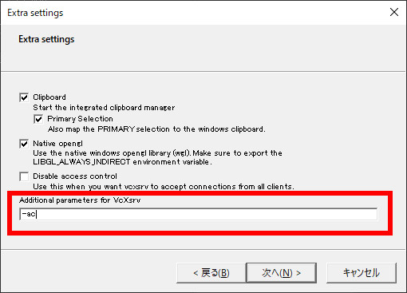
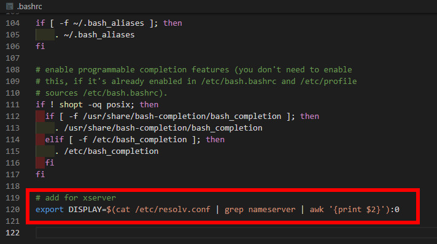
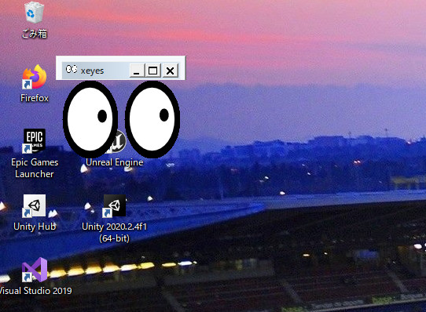

# WSL2でGUIアプリケーションを使用する

# 概要  

WSL2はそのままだとCUIのコンソールやアプリしか使用できないので、GUIのアプリケーションを使用できるようにします。  
CUI環境のみで事足りる場合は必要ありません。  

X Serverのアプリは今回は「VcXsrv」を使用します。  
<br />

# インストール/設定

### 1：「VcXsrv」をダウンロードしてWindows10にインストール  
下記サイトからダウンロード  
[https://sourceforge.net/projects/vcxsrv/]  
ダウンロードしたらWindows10にインストールして下さい。  
設定はデフォルトのままで構いません。  
<br />

### 2：「VcXsrv」を起動して設定  
Windowsのスタートメニューから VcXsrv - XLanch で起動するか、インストールしたフォルダ内から xlaunch.exe を起動  
<br />
起動すると設定画面がいくつか表示されます。  
基本はデフォルトのままで大丈夫ですが、Extra setting画面のAdditional parameters for VcXsrvのところに -ac を記入  
   
<br />
完了すると VcXsrv が起動し、常駐します  
<br />

### 3：WSL2(Ubuntu 20.04 LTS)を起動してディスプレイの設定  
.bashrc に下記の設定を記述  
```
export DISPLAY=$(cat /etc/resolv.conf | grep nameserver | awk '{print $2}'):0
```
参考  
   

### 4：WSL2(Ubuntu 20.04 LTS)を再起動したら完了
<br />
<br />

# 動作テスト

### 1：Ubuntu 20.04 LTSにXアプリケーションをインストール

```
$ sudo apt install x11-apps
```
<br />

### 2：サンプルアプリとして xeyes を起動
```
$ xeyes
```
Windowsの画面上に xeyes のアプリが表示されたら成功です！  
   

<br />
以上
<br />
<br />
