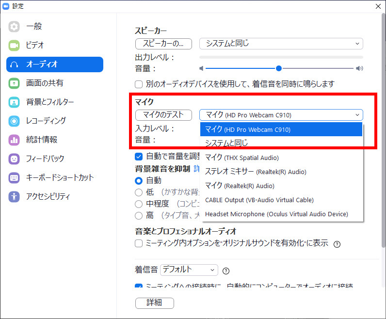
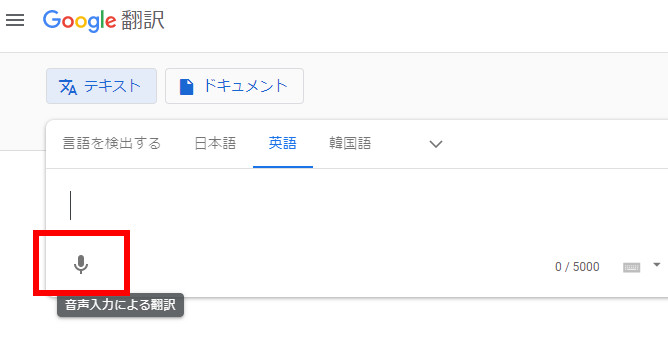
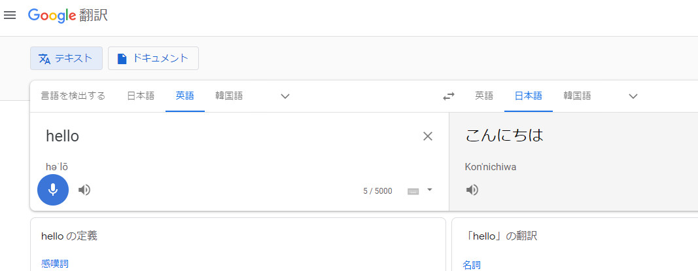

Zoom会議でリアルタイム翻訳してみた  

# 概要

Zoom会議でリアルタイム翻訳出来ないかなと思い、試してみました。  
先に結論を書いておくと、環境や話すスピードに左右され、現状ではあまり使えないかなという感じです。今後Google翻訳で使われている音声認識の精度が上がる、もしくは別の音声認識のサービスが使えれば使用に値するかもしれませんので、メモがてら残してみました。  
音声入力が出来るアプリケーションやWebサービスであれば今回のテストと同じように別のアプリケーションからの音声入力を使用することが可能です。(Googleドキュメントとか)  
 

# 試した環境

- Windows10 Home (注：Macだと後述するミキサー設定が有料もしくはお試し版のものしかないみたい？)  
- Google Chrome  
- Google翻訳   
- Zoom アプリ  
 

# 実現方法

Google翻訳への入力をループバック音源にする  
 

# 準備

### 1：入力をループバック(ステレオミキサー)に設定

Windowsの音声入力の設定を「ステレオミキサー」に設定します。  

設定方法は、この辺のサイトを参照  
[https://freesoft.tvbok.com/win10/general/stereo_mixer.html]  
ステレオミキサーが表示されない場合  
[https://freesoft.tvbok.com/win10/general/stereo_mixer.html]  
 
余談ですが、ここで私が一つハマった事があります。  
音声の出力先をHDMI接続でスピーカー付きのディスプレイにしていたんですが、その場合にステレオミキサーへの入力がされませんでした。PC内蔵のスピーカー(私の環境では Realtek(R) Audio)に設定したらステレオミキサーに入力がされるようになりました。  
 

### 2：Zoomのマイクの設定

入力がループバック(ステレオミキサー)のままだと自分の声がZoomに入らなくなってしまうので、Zoomのマイク設定を自分が使っているマイクデバイスに設定します。個々の環境によって違いますので、自分の環境に合わせて設定して下さい。  
セミナーなど自分の音声が必要ない場合は設定の必要はありません。  
 
私の環境の例：Webカメラのマイクに設定  
  
 
マイクで喋った自分の音声はZoomから再生されないので、設定のマイクのテストかレコーディングして再生して確認してみると良いかと思います。  
 
 

# リアルタイム翻訳をしてみる

### 1：Google ChromeでGoogle翻訳を開く

Google ChromeでGoogle翻訳のページを開きます。  
尚、Chrome以外のWebブラウザではGoogle翻訳の音声入力が出来ないようです。  
 

### 2：音声入力を開始

Google翻訳の入力欄の左下辺りにあるマイクのマークをクリックして音声入力を開始します。  

 
 
設定が上手くいっていればZoomで話された音声が左側にリアルタイムで表示され、右側にも翻訳された文章が表示されます。  
 

 
 

以上  
 
 
