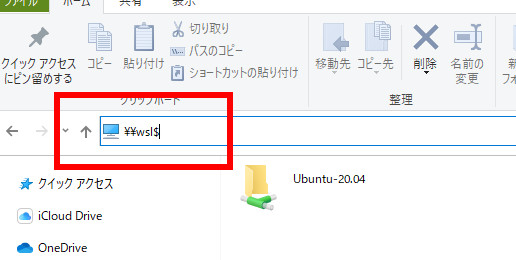
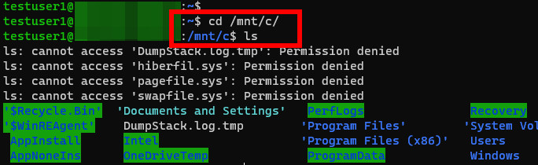


# WSL2 と Windows10 間のファイル/フォルダアクセス

### WindowsからWSLへのアクセス方法  

エクスプローラーで \\\wsl$ にアクセス  
   
 

### WSL(Ubuntu 20.04 LTS)からWindowsのCドライブにアクセス  

/mnt/c/ にアクセス  
   
 
 

※その他いろいろ出来るようなので検索してみてください  

参考URL  
[https://qiita.com/Uchitaso/items/6e0a7859e87bb8bdb527]

 
 
